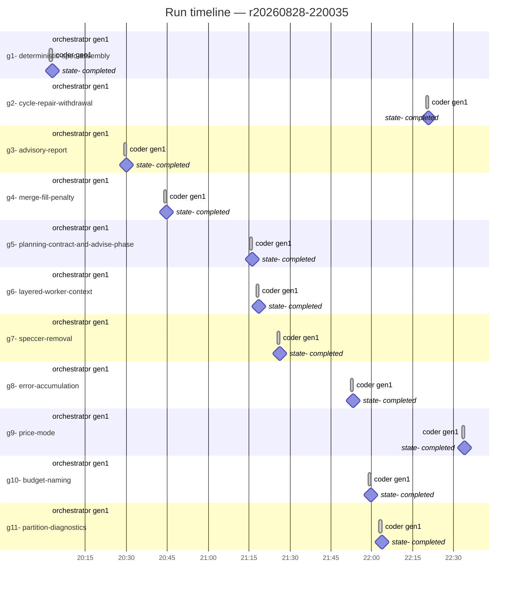
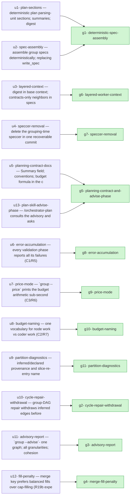
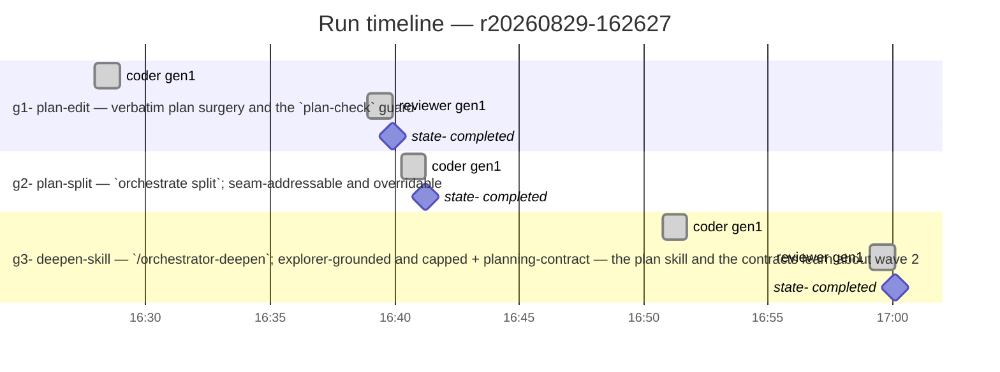
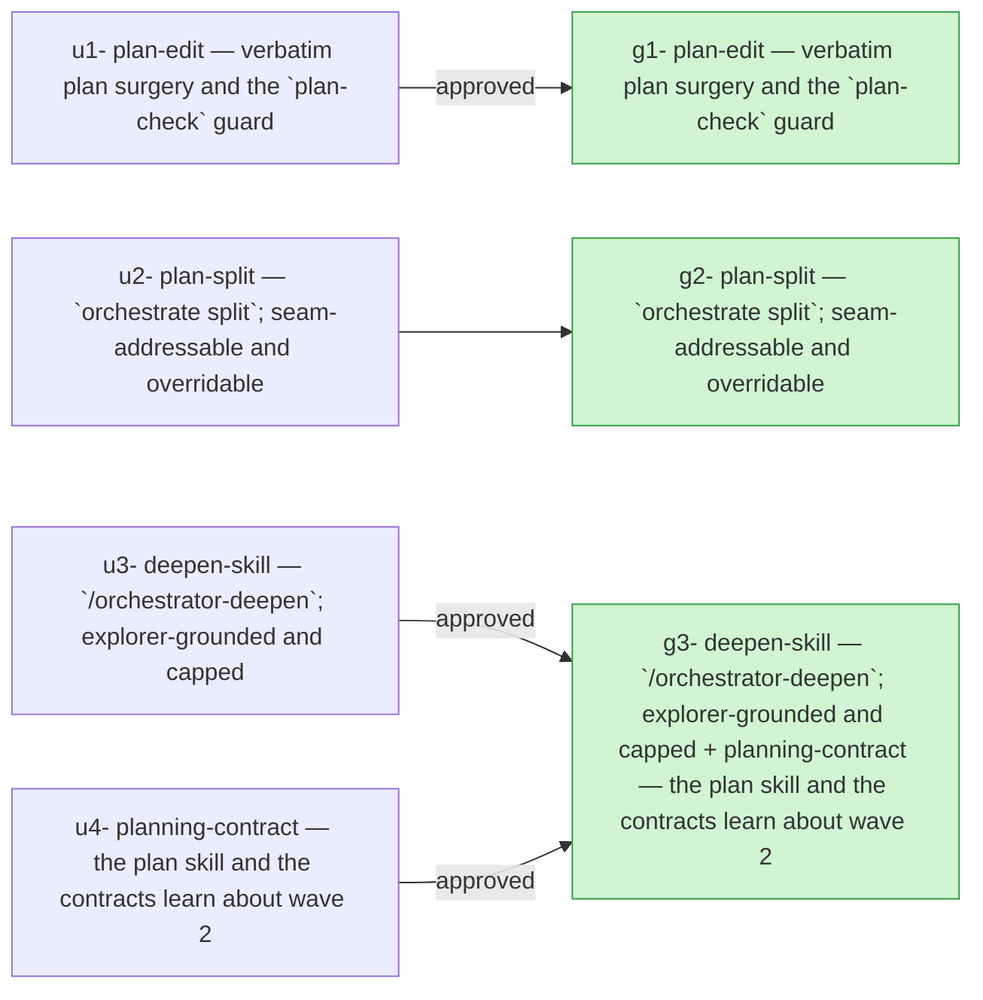

# Run log

<!-- run:r20260828-220035 -->
## 2026-08-28 — r20260828-220035 — Deterministic spec assembly, validation legibility, and the advisory grouper

- **Outcome**: 11/11 groups completed, 13/13 units landed (`state.json`)
- **Scope**: 35 files changed, +4424/-419 lines (`a2098a08..93dadc02`)
- **Cost**: 116097732 tokens across 22 session(s) (claude-opus-5=590282, sonnet=115507450) (`manifest.json`)

### g1: deterministic-spec-assembly — state: completed
- **Summary**: Implemented U1 (deterministic plan-section parser) and U2 (deterministic spec assembly replacing write_specs) with zero LLM calls in the grouping-time path.… (`g1`)
- **Verification**: 7/7 pass (`g1`)
- **Surprises**: none recorded (`g1`)
- **Required changes**: none (`g1`)
- **Escalations**: none (`g1`)
- **Tokens**: 26150875 total across 2 session(s) (claude-opus-5=53662, sonnet=26097213) (`g1`)
- **Elapsed**: 0m (`g1`)

| item | status | evidence |
| --- | --- | --- |
| g1-1 | pass | tests/test_plan_sections.py::TestParsePlanSections::test_one_section_per_task_map_entry_verbatim and test_digest_has_every_summary_line_and_no_unit_bodies |
| g1-2 | pass | test_missing_single_unit_heading_names_it and test_two_missing_unit_headings_reported_together |
| g1-3 | pass | test_byte_stable_across_two_parses and test_task_map_absent_from_digest_and_sections |
| g1-4 | pass | tests/test_grouper_pipeline.py::TestTaskMapRegimes::test_premapped_plan_never_calls_the_llm_runner (StubLlm asserts on any non-mapper schema) plus full run_grouping/GroupingResult round-trip in TestPipeline |
| g1-5 | pass | tests/test_assembler.py::test_spec_contains_member_unit_sections_verbatim and test_relational_header_names_upstream_and_downstream_groups / test_regenerating_after_changed_partition_changes_the_header |
| g1-6 | pass | test_verification_ids_match_pattern_and_cover_every_bullet and test_missing_unit_verification_fails_naming_the_unit |
| g1-7 | pass | test_byte_deterministic_across_two_calls plus test_premapped_output_is_byte_deterministic in test_grouper_pipeline.py |

### g2: cycle-repair-withdrawal — state: completed
- **Summary**: Implemented U10: repair_cycles now withdraws inferred precedence edges (banked as affinity already, never declared ones) on a group-DAG cycle before… (`g2`)
- **Verification**: 2/2 pass (`g2`)
- **Surprises**: none recorded (`g2`)
- **Required changes**: none (`g2`)
- **Escalations**: none (`g2`)
- **Tokens**: 7681434 total across 2 session(s) (claude-opus-5=53662, sonnet=7627772) (`g2`)
- **Elapsed**: 0m (`g2`)

| item | status | evidence |
| --- | --- | --- |
| g2-1 | pass | test_cycle_closed_only_by_an_inferred_edge_withdraws_instead_of_merging: group count unchanged, withdrawal recorded in trace repairs with action=withdraw and edge named |
| g2-2 | pass | test_cycle_of_solely_declared_edges_still_merges_and_never_withdraws: merge+re-split path taken, declared edges never withdrawn |

### g3: advisory-report — state: completed
- **Summary**: Found the group's implementation (advisory.py, cli.py wiring, pipeline.py graph-build seam, test_advisory.py) already substantially written from a prior session. Fixed two… (`g3`)
- **Verification**: 4/4 pass (`g3`)
- **Surprises**: none recorded (`g3`)
- **Required changes**: none (`g3`)
- **Escalations**: none (`g3`)
- **Tokens**: 4027985 total across 2 session(s) (claude-opus-5=53662, sonnet=3974323) (`g3`)
- **Elapsed**: 0m (`g3`)

| item | status | evidence |
| --- | --- | --- |
| g3-1 | pass | TestOneGraphBuild covers single-build call counting and full per-preset metric+Pareto coverage; confirmed live via CLI smoke test |
| g3-2 | pass | TestCohesionShapes covers disjoint sets, pure chain, and clique fixtures |
| g3-3 | pass | TestPreviewIsolation + live smoke test confirm advisory.json under preview/ and groups.json untouched |
| g3-4 | pass | TestDeterminism (two-run byte-identical) and TestOneGraphBuild.test_zero_llm_calls (raising runner stub) |

### g4: merge-fill-penalty — state: completed
- **Summary**: Added a fill/balance term to merge_small_groups' merge key (orchestrator/grouping/partition.py), a new target_fill_ratio config knob (orchestrator/config.py) with an in-code justified default… (`g4`)
- **Verification**: 2/2 pass (`g4`)
- **Surprise (other)**: A literal reading of the plan's 'candidate merge work lands inside a target band, preferred over one landing at the cap' is mathematically a no-op if implemented as a boolean in/out-of-band bucket ranked above merged_work: bucket-then-value sorting is always identical in outcome to sorting by value alone when the bucket is a threshold on that same value. Implemented as a distance-from-target-fill term instead (genuinely non-redundant, verified with a synthetic fixture). Worth knowing if U12 gets revisited or tuned in the eval harness — the boolean framing in the plan prose doesn't survive contact with the algorithm's per-round global-argmin selection. (`groups/g4/report-g1-r1.json`)
- **Required changes**: none (`g4`)
- **Escalations**: none (`g4`)
- **Tokens**: 20733361 total across 2 session(s) (claude-opus-5=53662, sonnet=20679699) (`g4`)
- **Elapsed**: 0m (`g4`)

| item | status | evidence |
| --- | --- | --- |
| g4-1 | pass | TestFillPenalty.test_fill_term_lowers_group_size_variance_without_breaking_invariants in tests/test_partition.py: synthetic two-hub fixture shows strictly lower pvariance under the new key, no group over cap, acyclic DAG (build_group_dag succeeds). |
| g4-2 | pass | test_fill_term_is_deterministic_across_runs (5 runs, identical); full suite run twice (1444 passed) confirms no invariant regressions across existing slice/budget-cap tests. |

### g5: planning-contract-and-advise-phase — state: completed
- **Summary**: Implemented U5 and U13: docs/orchestrator-task-map.md gained a new 'Pricing a task's node work' section with the exact node_work/cap formula and… (`g5`)
- **Verification**: 4/4 pass (`g5`)
- **Surprises**: none recorded (`g5`)
- **Required changes**: none (`g5`)
- **Escalations**: none (`g5`)
- **Tokens**: 1112309 total across 2 session(s) (claude-opus-5=53662, sonnet=1058647) (`g5`)
- **Elapsed**: 0m (`g5`)

| item | status | evidence |
| --- | --- | --- |
| g5-3 | pass | Phase 7 runs --advise after --no-spec, instructs presenting diagnostics, and phrases the choice as a question with proceed-as-one as an explicit option |
| g5-4 | pass | No auto-split/regenerate instruction added; the single 'deepen command' mention only states it doesn't exist yet, not that it's runnable |
| g5-1 | pass | docs/orchestrator-task-map.md states node_work = source_bytes/4.0 × 1.3 + per-file allowance, cap = 200,000 − head, names all multipliers, and points at group --price |
| g5-2 | pass | SKILL.md Phase 2 replaces the unconditional symbols instruction with the dense-codebase trade-off; Units section states Summary: requirement and Verification-bullet convention; template shows Summary: field |

### g6: layered-worker-context — state: completed
- **Summary**: Implemented U3 layered worker context: compile_base_context (orchestrator/grouping/base_context.py) now embeds the U1 plan digest (preamble + per-unit Summary lines + implements/consumes… (`g6`)
- **Verification**: 3/3 pass (`g6`)
- **Surprise (other)**: The U2 assembler's existing upstream/downstream contract labels were derived only from graph.dependencies (depends_on) edges, so a pure implements/consumes tag relationship with no direct dependency edge between the two specific tasks (common: both depend on a shared ancestor rather than on each other) would have produced no contracts line at all. Added a separate tag-matching pass for this rather than modifying the existing DAG-based Upstream/Downstream sections, to avoid breaking g1's R2 test (header must change when the DAG changes). (`groups/g6/report-g1-r1.json`)
- **Required changes**: none (`g6`)
- **Escalations**: none (`g6`)
- **Tokens**: 4502247 total across 2 session(s) (claude-opus-5=53662, sonnet=4448585) (`g6`)
- **Elapsed**: 0m (`g6`)

| item | status | evidence |
| --- | --- | --- |
| g6-1 | pass | test_base_context_has_no_marker_or_heading and test_base_context_carries_digest_not_full_sections verify digest content, no full section bodies, no task-map marker, byte-identical on repeat compile |
| g6-2 | pass | test_cross_group_contract_names_tag_and_task_not_neighbor_section (assembler) verifies contracts line names tag + implementing task id and excludes the neighbor's full section text |
| g6-3 | pass | test_group_spec_plus_base_context_covers_its_own_sections_exactly_once verifies union contains each group's own unit sections exactly once and no other group's bodies |

### g7: speccer-removal — state: completed
- **Summary**: Deleted the grouping-time speccer per U4/ADR 0006 (speccer.py, prompts/speccer.md, the grouping-form model_speccer knob in launch.py/Launch.tsx/types.ts). The tricky part: write_specs and… (`g7`)
- **Verification**: 4/4 pass (`g7`)
- **Surprise (other)**: ADR 0006 (docs/adr/0006-delete-the-grouping-time-speccer.md), referenced by my spec as required reading, does not exist in the repo — proceeded using the plan document's own Decisions section instead, which fully covers the rationale. (`groups/g7/report-g1-r1.json`)
- **Surprise (interface_mismatch)**: The plan/spec's file list implied orchestrator/grouping/speccer.py could be deleted outright, but write_specs()/GroupSpec were still live dependencies of the mid-run rewrite speccer and (via GroupSpec) the deterministic assembler from U2/U3. Resolved by relocating the shared pieces (GroupSpec to model.py, the LLM-calling function inlined/renamed in cli.py) rather than deleting functionality still in use — worth knowing if another unit assumed speccer.py's removal was a pure deletion with no code to preserve. (`groups/g7/report-g1-r1.json`)
- **Required changes**: none (`g7`)
- **Escalations**: none (`g7`)
- **Tokens**: 17238147 total across 2 session(s) (claude-opus-5=53662, sonnet=17184485) (`g7`)
- **Elapsed**: 0m (`g7`)

| item | status | evidence |
| --- | --- | --- |
| g7-1 | pass | grep finds zero references; both files confirmed absent |
| g7-2 | pass | GroupJobBody has no model_speccer field/argv; ExecutionOptions (run) keeps it; test_observatory_launch.py (33 tests) and full UI vitest suite (199 tests) green |
| g7-3 | pass | test_review_loop.py + test_rewrite_observability.py green (100 tests total with test_observatory_launch.py); run-form model_speccer knob and SpeccerCalls viewer untouched |
| g7-4 | pass | docs/orchestrator-grouping.md records commit d57c5cf as the removal commit |

### g8: error-accumulation — state: completed
- **Summary**: Implemented U6 error accumulation: added a shared ErrorAccumulator (orchestrator/grouping/errors.py) used by _check_slice_overflow in pipeline.py (collects every over-cap slice before raising)… (`g8`)
- **Verification**: 3/3 pass (`g8`)
- **Surprises**: none recorded (`g8`)
- **Required changes**: none (`g8`)
- **Escalations**: none (`g8`)
- **Tokens**: 3991401 total across 2 session(s) (claude-opus-5=53662, sonnet=3937739) (`g8`)
- **Elapsed**: 0m (`g8`)

| item | status | evidence |
| --- | --- | --- |
| g8-1 | pass | test_three_over_cap_slices_all_named_in_one_error asserts all three slice labels, sums, and overshoots appear in one GrouperError |
| g8-2 | pass | test_two_unknown_key_tasks_reported_together and test_fixing_unknown_keys_then_reveals_both_size_hints_problems_together verify the two-phase behavior |
| g8-3 | pass | existing tests/test_plan_reader.py and tests/test_grouper_pipeline.py pass unmodified; added test_single_over_cap_slice_wording_is_unchanged asserts exact original message text |

### g9: price-mode — state: completed
- **Summary**: Implemented `group --price <plan>` (U7/C3/R6): a sub-second, zero-codegraph, zero-graph-build pricing mode. Added `parse_task_map_for_pricing` to plan_reader.py (filesystem-only task-map parse, no CodegraphClient,… (`g9`)
- **Verification**: 3/3 pass (`g9`)
- **Surprises**: none recorded (`g9`)
- **Required changes**: none (`g9`)
- **Escalations**: none (`g9`)
- **Tokens**: 13574908 total across 2 session(s) (claude-opus-5=53662, sonnet=13521246) (`g9`)
- **Elapsed**: 0m (`g9`)

| item | status | evidence |
| --- | --- | --- |
| g9-1 | pass | TestOverCapSliceCli.test_exits_nonzero_and_prints_member_detail |
| g9-2 | pass | TestPriceNeverTouchesCodegraph — raising-runner stub never invoked; output states cap approximation |
| g9-3 | pass | TestRealPlanCrossCheck.test_price_is_subsecond_and_matches_the_real_trace against docs/plans/2026-08-26-...-plan.md |

### g10: budget-naming — state: completed
- **Summary**: Implemented U8: `_check_slice_overflow` in orchestrator/grouping/pipeline.py now takes coder_slack_multiplier, computes both the unscaled `node work` and the already-coder-scaled `coder work` per… (`g10`)
- **Verification**: 2/2 pass (`g10`)
- **Surprises**: none recorded (`g10`)
- **Required changes**: none (`g10`)
- **Escalations**: none (`g10`)
- **Tokens**: 2230397 total across 2 session(s) (claude-opus-5=53662, sonnet=2176735) (`g10`)
- **Elapsed**: 0m (`g10`)

| item | status | evidence |
| --- | --- | --- |
| g10-1 | pass | overflow message now includes 'node work', 'coder work', and 'coder_slack_multiplier=<value>' per offending slice; verified in tests/test_grouper_pipeline.py::TestSliceOverflowAccumulation |
| g10-2 | pass | dry-run listing already said 'node work'; fixed the remaining bare 'work fraction of cap' in cli.py's scorecard print to 'node work fraction of cap' |

### g11: partition-diagnostics — state: completed
- **Summary**: Implemented U9: (a) the degenerate-partition GrouperError now reports declared-vs-inferred edge counts and inferred signal kinds for the offending SCC, sourced… (`g11`)
- **Verification**: 2/2 pass (`g11`)
- **Surprises**: none recorded (`g11`)
- **Required changes**: none (`g11`)
- **Escalations**: none (`g11`)
- **Tokens**: 14854668 total across 2 session(s) (claude-opus-5=53662, sonnet=14801006) (`g11`)
- **Elapsed**: 0m (`g11`)

| item | status | evidence |
| --- | --- | --- |
| g11-1 | pass | test_run10_shape_names_slice_path_and_both_remedies in test_grouper_pipeline.py reproduces u1->u2->u3 with u1/u3 slice-mates through compute_partition and asserts the slice name, full path, both remedies, and absence of 'saturated'/'degenerate' generic wording. |
| g11-2 | pass | test_two_independent_reentrant_slices_reported_together asserts both slice names and both paths appear in one GrouperError ('2 problems found'). |

## Diagrams

### Run timeline

### Plan → outcome

## ADR delta

- **ADR delta**: no ADR changes (`a2098a08..93dadc02`)

## Postmortem

### Impact

- **Impact**: every unit landed despite the trouble below (`r20260828-220035`)

### Timeline

- **session_start**: orchestrator at 2026-08-28T20:01:43.533025+00:00 (`g1`)
- **session_start**: orchestrator at 2026-08-28T20:01:43.533025+00:00 (`g2`)
- **session_start**: orchestrator at 2026-08-28T20:01:43.533025+00:00 (`g3`)
- **session_start**: orchestrator at 2026-08-28T20:01:43.533025+00:00 (`g4`)
- **session_start**: orchestrator at 2026-08-28T20:01:43.533025+00:00 (`g5`)
- **session_start**: orchestrator at 2026-08-28T20:01:43.533025+00:00 (`g6`)

### Root-cause candidates

- **Surprise (g4, other)**: A literal reading of the plan's 'candidate merge work lands inside a target band, preferred over one landing at the cap' is mathematically a no-op if implemented as a boolean in/out-of-band bucket ranked above merged_work: bucket-then-value sorting is always identical in outcome to sorting by value alone when the bucket is a threshold on that same value. Implemented as a distance-from-target-fill term instead (genuinely non-redundant, verified with a synthetic fixture). Worth knowing if U12 gets revisited or tuned in the eval harness — the boolean framing in the plan prose doesn't survive contact with the algorithm's per-round global-argmin selection. (`groups/g4/report-g1-r1.json`)
- **Surprise (g6, other)**: The U2 assembler's existing upstream/downstream contract labels were derived only from graph.dependencies (depends_on) edges, so a pure implements/consumes tag relationship with no direct dependency edge between the two specific tasks (common: both depend on a shared ancestor rather than on each other) would have produced no contracts line at all. Added a separate tag-matching pass for this rather than modifying the existing DAG-based Upstream/Downstream sections, to avoid breaking g1's R2 test (header must change when the DAG changes). (`groups/g6/report-g1-r1.json`)
- **Surprise (g7, other)**: ADR 0006 (docs/adr/0006-delete-the-grouping-time-speccer.md), referenced by my spec as required reading, does not exist in the repo — proceeded using the plan document's own Decisions section instead, which fully covers the rationale. (`groups/g7/report-g1-r1.json`)
- **Surprise (g7, interface_mismatch)**: The plan/spec's file list implied orchestrator/grouping/speccer.py could be deleted outright, but write_specs()/GroupSpec were still live dependencies of the mid-run rewrite speccer and (via GroupSpec) the deterministic assembler from U2/U3. Resolved by relocating the shared pieces (GroupSpec to model.py, the LLM-calling function inlined/renamed in cli.py) rather than deleting functionality still in use — worth knowing if another unit assumed speccer.py's removal was a pure deletion with no code to preserve. (`groups/g7/report-g1-r1.json`)

### Follow-ups

- **Follow-ups**: none open (`r20260828-220035`)
<!-- /run:r20260828-220035 -->

<!-- run:r20260829-162627 -->
## 2026-08-29 — r20260829-162627 — Mechanical plan split and the deepen skill

- **Outcome**: 3/3 groups completed, 4/4 units landed (`state.json`)
- **Scope**: 13 files changed, +1874/-10 lines (`5eca4f14..a76fec68`)
- **Cost**: 21377899 tokens across 5 session(s) (sonnet=21377899) (`manifest.json`)

### g1: plan-edit — verbatim plan surgery and the `plan-check` guard — state: completed
- **Summary**: Implemented orchestrator/grouping/plan_edit.py as the single verbatim-surgery module: extract_task_map_entries/render_task_map_block for byte-exact task-map entry slicing, split_units for byte-exact unit-section slicing, validate_plan for… (`g1`)
- **Verification**: 5/5 pass (`g1`)
- **Verdict**: approved (`g1`)
- **Surprises**: none recorded (`g1`)
- **Required changes**: none (`g1`)
- **Escalations**: none (`g1`)
- **Tokens**: 6369936 total across 2 session(s) (sonnet=6369936) (`g1`)
- **Elapsed**: unknown (`g1`)

| item | status | evidence |
| --- | --- | --- |
| g1-1 | pass | test_all_units_reassembled_yield_byte_identical_map_and_sections + test_real_plan_round_trips_byte_identical (36-unit real plan) |
| g1-2 | pass | test_accepts_added_bullets_inside_a_unit_body, test_rejects_and_names_altered_depends_on_size_hints_and_task_id |
| g1-3 | pass | test_reports_all_three_altered_entries_in_one_call, test_reports_three_separately_altered_entries |
| g1-4 | pass | test_exits_zero_on_well_formed_plan, test_exits_nonzero_naming_offending_unit_missing_section, test_exits_nonzero_naming_offending_unit_missing_map_entry |
| g1-5 | pass | test_completes_under_a_second_on_the_repos_largest_plan (~0.8ms), test_never_touches_codegraph_or_llm |

### g2: plan-split — `orchestrate split`, seam-addressable and overridable — state: completed
- **Summary**: Implemented `orchestrate split`: added `assign_tasks`, `split_plan`, `add_frontmatter_field`, and `add_predecessor_note` to `orchestrator/grouping/plan_edit.py` for verbatim, byte-safe plan partitioning; added `finding_task_groups` to `orchestrator/grouping/advisory.py`… (`g2`)
- **Verification**: 7/7 pass (`g2`)
- **Surprises**: none recorded (`g2`)
- **Required changes**: none (`g2`)
- **Escalations**: none (`g2`)
- **Tokens**: 8187634 total across 1 session(s) (sonnet=8187634) (`g2`)
- **Elapsed**: unknown (`g2`)

| item | status | evidence |
| --- | --- | --- |
| g2-1 | pass | Manually verified _print_advisory_report numbers every finding stably across two calls on the same report and prints task_sets (disconnected) or the tasks_before/tasks_after cut (serial). |
| g2-2 | pass | tests/test_plan_split.py::TestSplitPlan::test_two_way_split_is_byte_identical_combined and test_no_unit_lost_or_duplicated verify combined task ids/unit ids equal the original's with no loss/duplication, and each entry's/section's bytes are found verbatim in its document. |
| g2-3 | pass | test_tasks_overrides_seam_when_both_given confirms --tasks wins when both flags are given. |
| g2-4 | pass | assign_tasks raises naming every unassigned and doubly-assigned task id in one error; test_missing_or_double_assigned_tasks_named_and_rejected and TestAssignTasks cover both cases plus combined. |
| g2-5 | pass | test_produced_documents_pass_plan_check and test_produced_documents_price_under_cap run `plan-check` and `group --price` against split output documents. |
| g2-6 | pass | test_serial_seam_writes_predecessor_note_only_on_downstream confirms the note appears only in part2, referencing part1's filename. |
| g2-7 | pass | test_original_plan_text_is_never_mutated and the CLI tests assert the source plan's bytes are unchanged after a split. |

### g3: deepen-skill — `/orchestrator-deepen`, explorer-grounded and capped + planning-contract — the plan skill and the contracts learn about wave 2 — state: completed
- **Summary**: Implemented U3 (deepen-skill) and U4 (planning-contract) for group g3. Confirmed via new tests in tests/test_plan_sections.py that Edge cases/Non-goals/Run:/Pass: bullets already… (`g3`)
- **Verification**: 12/12 pass (`g3`)
- **Verdict**: approved (`g3`)
- **Surprises**: none recorded (`g3`)
- **Required changes**: none (`g3`)
- **Escalations**: none (`g3`)
- **Tokens**: 6820329 total across 2 session(s) (sonnet=6820329) (`g3`)
- **Elapsed**: unknown (`g3`)

| item | status | evidence |
| --- | --- | --- |
| g3-1 | pass | test_known_fields_unchanged_by_new_bullets in tests/test_plan_sections.py |
| g3-2 | pass | test_digest_carries_only_tagged_summary_no_edge_case_text and test_new_bullets_appear_verbatim_in_assembled_group_spec |
| g3-3 | pass | TestRunPassVerificationBullet in tests/test_plan_sections.py |
| g3-4 | pass | SKILL.md Phase 3 + Non-negotiable rules |
| g3-5 | pass | SKILL.md Phase 4 + explorer-prompt.md step 5 |
| g3-6 | pass | SKILL.md Phase 4 + Non-negotiable rules |
| g3-7 | pass | explorer-prompt.md step 2 lists all ten categories; step 3 restricts reporting to fired ones |
| g3-8 | pass | grep confirms 'wave-2'/'does not exist yet' sentence removed; Phase 7 now offers split and prints deepen command |
| g3-9 | pass | unit template gains optional Edge cases / Non-goals slots and Run:/Pass: convention note |
| g3-10 | pass | new 'split and plan-check' section in docs/orchestrator-grouping.md |
| g3-11 | pass | new 'Mechanical split' section in docs/orchestrator-task-map.md |
| g3-12 | pass | verified group/run/split/plan-check --help output matches every command/flag named in the three docs |

## Diagrams

### Run timeline

### Plan → outcome

## ADR delta

- **ADR delta**: no ADR changes (`5eca4f14..a76fec68`)
<!-- /run:r20260829-162627 -->
