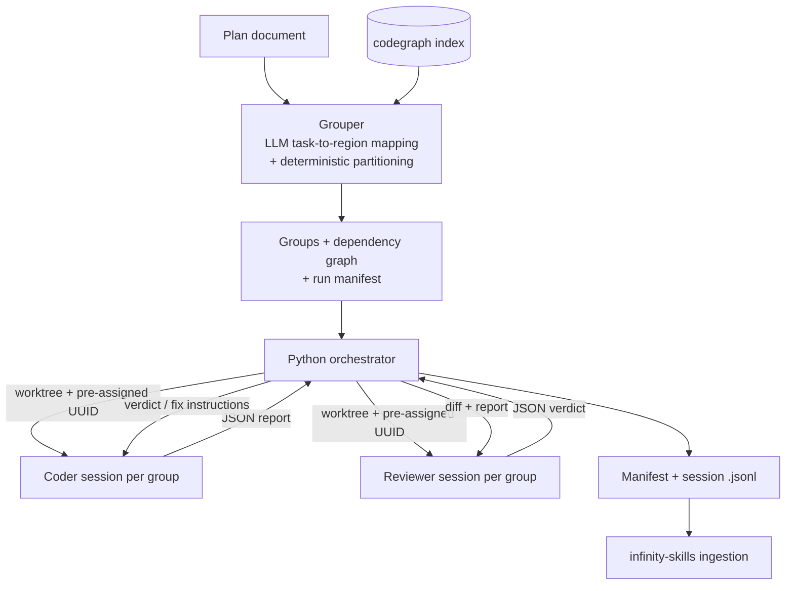

# Multi-Agent Plan Orchestrator — Requirements

## Summary

A Python orchestration system in smart_mcps that takes an existing plan document, splits it into the fewest well-sized vertical execution groups (one group is a valid answer), and runs each group as a warm `claude` CLI worker session in its own worktree with a paired reviewer. Every session gets a pre-assigned UUID and a run-manifest entry so infinity-skills can join runs to sessions and mine procedural behavior.

______________________________________________________________________

## Problem Frame

Executing a large plan with today's tools fails in opposite directions. Compound-engineering runs the whole plan monolithically — perfect when the plan happens to be one well-sized group, but it overflows context on big plans and its review swarm is often overkill. Superpowers splits small related tasks across separate subagents, paying a fresh-context tax on every fragment. In both cases the granularity policy is baked into prompt behavior and cannot be tuned.

A prior attempt to orchestrate purely with Claude Code skills in this repo did not work: an LLM scheduler drifts, burns tokens tracking state, and respawns agents instead of reusing cached context. When a reviewer finds a problem, the fix should go back to the worker that already holds the relevant context — not to a fresh agent that must rebuild it.

A second system, infinity-skills (`../infinity-skills`), analyzes Claude Code session `.jsonl` transcripts to infer procedural behaviors across runs. It can only do that if orchestrated sessions carry stable, joinable structure — today its data model has no cross-session "run" concept at all.

______________________________________________________________________

## Key Decisions

- **External Python orchestrator, not native Agent/SendMessage orchestration.** Scheduling, dependency tracking, and session lifecycle live in deterministic code that costs zero tokens and cannot drift. Workers are `claude` CLI sessions driven via `--bg`, `--resume`, and pre-assigned `--session-id` (flags verified against the installed CLI, 2026-07-15).
- **Deterministic grouping core, LLM at the edges.** An LLM maps plan tasks to code regions (verified via codegraph); Python computes task-affinity edges and decides group boundaries using ported CoCoder policies (hub isolation, size-bounded merging) under a hard per-group token budget; an LLM then writes group names, summaries, and specs. Granularity is a tunable threshold, not prompt behavior — the exact axis where the incumbents fail.
- **Port CoCoder's partitioning policies; discard the rest.** Its ~600-LOC partitioning core is clean and framework-independent; its graph-construction layer is LLM-authored for generate-from-spec benchmarks and is replaced outright by codegraph. Its reactive scheduler and reviewer-loop patterns serve as design reference only. Apache-2.0, so porting is clean. (Porting note: its `detect_roles()` labels in/out hubs inverted from the paper's terminology — port from code behavior, not docstrings.)
- **Warm coder+reviewer pairs with a circuit breaker.** Review rounds go back to the same cached sessions until a context-token or round-count threshold trips; then the orchestrator retires the session and spawns a fresh one with a condensed handoff. Warm reuse is the default, respawn the exception.
- **Review intensity defaults from difficulty, with manual override.** The grouper's difficulty score picks self-verify / paired reviewer / reviewer plus extra passes per group; a run-level or group-level override exists. The dial lives in data, consistent with the deterministic-core philosophy.
- **Analyzer-first observability contract.** The run manifest, first-prompt metadata block, and final-message JSON report are product requirements, not conveniences — infinity-skills ingestion depends on each (see Dependencies).
- **Home: smart_mcps.** Packaged like `codegraph_mcp/` — a Python package with a CLI entry point, prompt templates distributed through the plugin.

______________________________________________________________________

## Actors

- A1. Operator — provides the plan, launches runs, sets overrides, resolves escalations the orchestrator cannot.
- A2. Orchestrator — the Python CLI: computes groups (with A3), schedules, manages session lifecycle and worktrees, ferries JSON between sessions, writes the manifest.
- A3. Grouper session — LLM session that maps plan tasks to code regions and writes group names/summaries/specs around the deterministic partition.
- A4. Coder session — one warm `claude` CLI session per group (per generation), running gather → implement → verify in its worktree.
- A5. Reviewer session — the paired warm session reviewing a group's output, holding its own accumulated review context.
- A6. infinity-skills — downstream analyzer that joins the manifest to session transcripts.

______________________________________________________________________

## Requirements

**Grouping**

- R1. Input is an existing plan document; the system does not author plans.
- R2. The grouper maps each plan task to code regions, using codegraph evidence to verify the mapping.
- R3. Group boundaries are computed deterministically from task-affinity edges (shared files, call-graph proximity, impact overlap from codegraph) using ported CoCoder policies: hub isolation and size-bounded merging.
- R4. The output is the fewest groups whose estimated context fits a hard per-group token budget; a single group is a valid and ideal result.
- R5. Splits are forced by difficulty score and token-budget thresholds, never by file counts; thresholds are configuration.
- R6. Each group carries a stable `id`, a human-readable `name`, a short `summary` (analyzer-facing tldr), a full `spec` (worker-facing), a difficulty score, dependencies on other groups, and verification/acceptance items.

**Execution and sessions**

- R7. Independent groups run in parallel; dependent groups wait for upstream completion.
- R8. Each worker runs as a `claude` CLI session with a pre-assigned session UUID, in its own git worktree.
- R9. Worktree paths keep the base repo name as a path substring (pattern: `<repo>/.worktrees/<group>/`), so analyzer ingestion does not silently drop the sessions.
- R10. The first user prompt of every coder and reviewer session embeds run id, group id, group name, and summary in a parseable tagged block.
- R11. Workers receive a stable shared base-context prefix plus their group spec, and end each round with a structured JSON report as the final assistant message.
- R12. When a worker reports a surprise (interface mismatch, missing dependency), the orchestrator may rewrite unfinished groups and the downstream dependency graph before launching them.

**Review loop**

- R13. Default review is a paired warm reviewer session per group; verdicts are JSON, ferried by the orchestrator, and fixes go back to the same coder session.
- R14. Circuit breaker: when a session's context exceeds a token threshold or the coder↔reviewer loop exceeds a round threshold, the orchestrator retires it and spawns a fresh session with the shared prefix plus a condensed handoff, recorded as a new generation.
- R15. Review intensity per group defaults from its difficulty score (self-verify only / paired reviewer / reviewer plus extra passes) and is overridable per run and per group.
- R16. When the reviewer judges a group structurally wrong or too hard, the loop escalates to the orchestrator for a group rewrite instead of more rounds.

**Analyzer contract**

- R17. Every run writes a manifest — run → groups → session UUIDs with role (coder/reviewer), generation number and retirement reason, plus group name and summary — to its own file outside `~/.claude/projects/`.
- R18. Session display names follow a stable convention embedding run, group, and role.
- R19. A finished group's final assistant message is its structured outcome report (status, verification results, surprises), serving as the analyzer's outcome signal.

**Packaging**

- R20. Lives in smart_mcps as a Python package with a CLI entry point, following the `codegraph_mcp/` pattern; grouper/coder/reviewer prompt templates ship with the plugin.
- R21. Runs on the Claude subscription via the `claude` CLI; no direct Anthropic API usage.

______________________________________________________________________

## Key Flows

- F1. Group and run

  - **Trigger:** Operator runs the CLI against a plan document.
  - **Steps:** Grouper maps tasks to code regions; partitioner computes groups and dependency graph; orchestrator writes the manifest, creates worktrees, launches coder sessions for all ready groups in parallel; dependent groups launch as upstreams complete.
  - **Outcome:** All groups completed and verified, manifest closed out.
  - **Covers:** R1–R8, R17.

- F2. Warm review round

  - **Trigger:** Coder session emits its report for a group with reviewer-level intensity.
  - **Steps:** Orchestrator sends diff and report to the paired reviewer; reviewer returns a JSON verdict; on `changes_required`, orchestrator resumes the same coder session with the verdict; coder fixes and re-reports; reviewer re-checks with its accumulated context.
  - **Outcome:** Verdict `approved`, or escalation per F4/R16.
  - **Covers:** R13, R15, R19.

- F3. Circuit-breaker respawn

  - **Trigger:** A session crosses the context-token threshold, or the coder↔reviewer loop crosses the round threshold.
  - **Steps:** Orchestrator retires the session, records retirement reason, condenses state into a handoff, launches a fresh session (shared prefix + handoff) under a new pre-assigned UUID, and updates the manifest with the new generation.
  - **Outcome:** Work continues in a clean context; the analyzer sees both generations linked to the group.
  - **Covers:** R14, R17.

- F4. Surprise-driven replanning

  - **Trigger:** A worker report contains surprises affecting other groups, or a reviewer escalates a group as structurally wrong.
  - **Steps:** Orchestrator rewrites the affected unfinished group specs and dependency edges; already-completed groups are untouched; rewritten groups launch when their dependencies clear.
  - **Outcome:** The graph reflects reality without restarting the run.
  - **Covers:** R12, R16.

______________________________________________________________________

## Acceptance Examples

- AE1. **Covers R4.** Given a plan whose whole estimated context fits the per-group budget, when grouped, then the output is exactly one group and no split occurs.
- AE2. **Covers R4, R5.** Given a candidate group whose estimate exceeds the budget, when partitioning runs, then it splits at the lowest-affinity boundary and every resulting group fits the budget.
- AE3. **Covers R13, R14.** Given a `changes_required` verdict and a coder session under both thresholds, when the fix round starts, then the same session is resumed and no new session appears in the manifest.
- AE4. **Covers R14, R17.** Given a coder↔reviewer loop that crosses the round threshold, when the breaker trips, then a generation-2 session with a fresh UUID takes over and the manifest records generation 1 with its retirement reason.
- AE5. **Covers R7, R12.** Given G2 depends on G1 and G1's report contains an interface surprise affecting G2, when G1 completes, then G2's spec is rewritten before G2 launches.
- AE6. **Covers R9, R10, R17.** Given a completed run, when infinity-skills ingests, then every session in the manifest is present (none dropped by the project allowlist) and joins by UUID with its group name and summary available from the first-prompt block.
- AE7. **Covers R15.** Given a group scored below the reviewer difficulty threshold and no override, when it executes, then no reviewer session is created and the coder self-verifies against the group's verification items.

______________________________________________________________________

## Success Criteria

- Deterministic grouping: the same plan, repo state, and configuration produce identical groups.
- Token profile: a fix round costs a cached-prefix resume plus the delta — never a full-context rebuild unless the breaker trips. Per-round cost stays strictly below the respawn-per-round pattern this replaces.
- No group exceeds its token budget; group count is minimized subject to the budget.
- An infinity-skills ingest of an orchestrated run yields joined, named, outcome-labeled sessions with zero manual correlation.
- ce-plan can produce an implementation plan from this document without inventing behavior or scope.

______________________________________________________________________

## Scope Boundaries

Deferred for later:

- Plan authoring — v1 consumes plans produced elsewhere (ce-plan, plan-to-plan, hand-written).
- An escalation hatch to compound-engineering-style persona review swarms for the hardest groups; "harder" in v1 means more reviewer passes and stricter gates inside this framework.
- Any API/server interface — v1 is a CLI and library.
- Cross-run procedural learning and auto skill generation — infinity-skills' domain; this system only emits the structure that enables it.
- Non-Claude agent runtimes.

______________________________________________________________________

## Dependencies / Assumptions

- codegraph is indexed and available in target repos (already standard across the operator's projects).
- `claude` CLI capabilities verified 2026-07-15 against the installed version: `--bg`, `-r/--resume`, `--session-id <uuid>`, `--fork-session`, `-n/--name`. A version bump changing these is a breaking risk.
- infinity-skills ingestion behavior per docs/research/infinity-skills-analysis.md: project allowlist substring-matches directory names (drives R9); the first user prompt is the only content channel that survives ingestion into titles/summaries/graph nodes (drives R10); sessions have no outcome field (drives R19); no run concept exists (drives R17). The manifest join on its side does not exist yet and is a small follow-up in that repo.
- CoCoder findings per docs/research/cocoder-analysis.md: partitioning core is portable and framework-independent; everything above it is welded to the OpenHands SDK. Apache-2.0.
- Unverified assumption: resuming a `--bg` session while it is mid-turn behaves sanely (queue or reject). The orchestrator's completion-detection design must confirm this during planning.

______________________________________________________________________

## Outstanding Questions

Deferred to planning:

- Base-context delivery: a compiled base document injected per session vs `--fork-session` from a prepared base session — decide by benchmarking cache hit and cost.
- Token-budget estimator heuristic and difficulty-score formula (candidate signals: fan-in/out, hub touch, verification surface, cross-service edges).
- Default threshold values for the circuit breaker (context tokens, round count) and how context size is measured (analyzer-derived vs CLI-reported).
- Worker completion detection: polling session logs vs blocking resume calls.
- Branch and merge strategy across group worktrees: who merges, in what order, and how conflicts between dependent groups are handled.
- Manifest schema and file-location convention.
- Whether reviewer sessions get codegraph access or review diff-only.
- Prompt-template shapes for grouper, coder, and reviewer (the two research docs at repo root contain starting-point schemas).

______________________________________________________________________

## Sources / Research

- GENERAL_FLOW_MULTIAGENT.md — architecture research: three-layer design, difficulty-based splitting, cache-friendly shared prefix, candidate JSON schemas.
- IMPLEMENTATION_FLOW_MULTIAGENT.md — implementation research: sessions-as-workers pattern, resume-based warm loops, orchestrator loop sketch.
- docs/research/cocoder-analysis.md — CoCoder repo analysis with file:line pointers; grounds the port-the-partitioning-core decision.
- docs/research/infinity-skills-analysis.md — infinity-skills ingestion analysis with file:line pointers; grounds R9, R10, R17–R19.
- CoCoder upstream: https://github.com/Flitternie/CoCoder (Apache-2.0).
