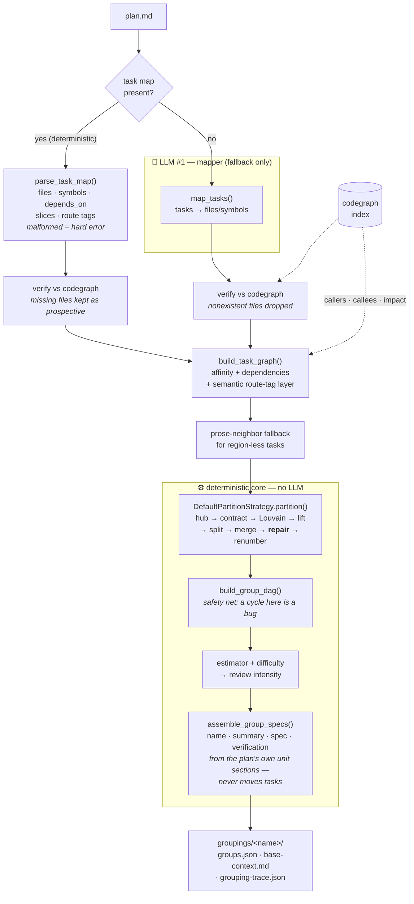
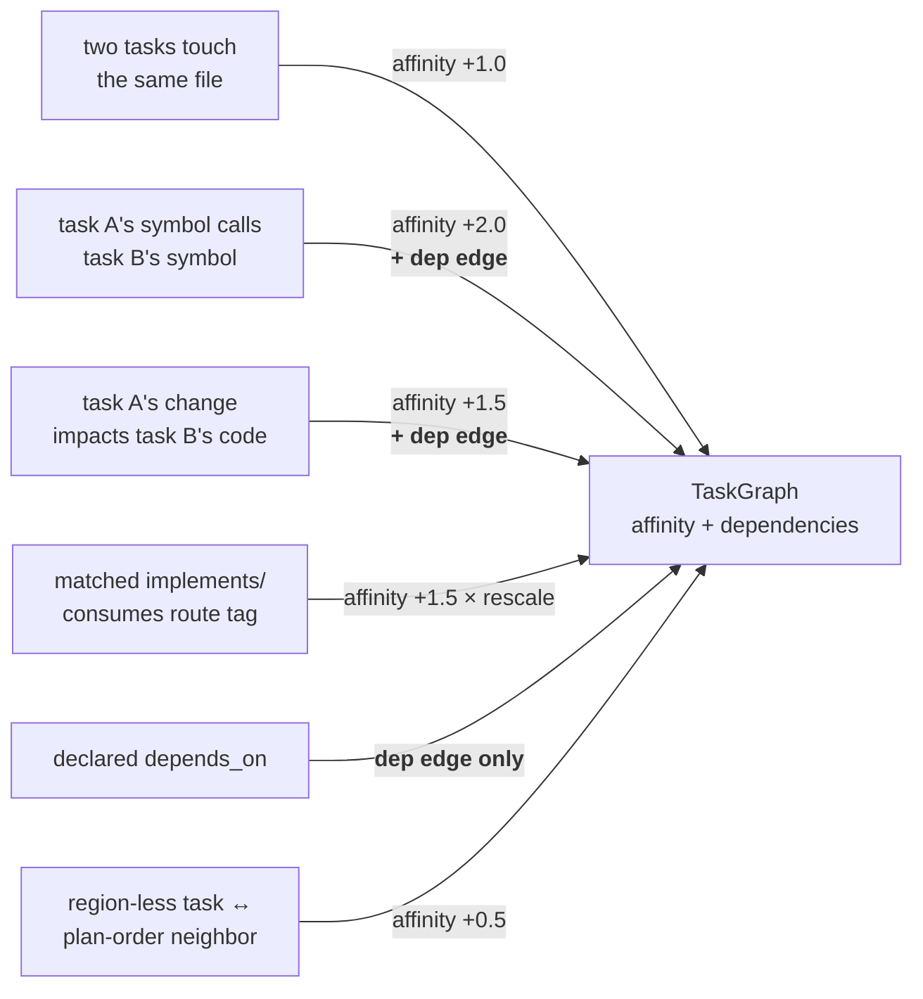
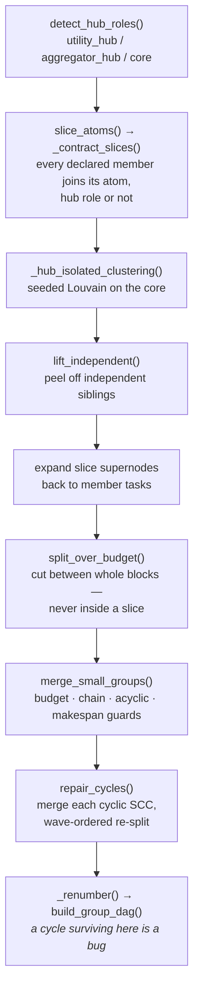

# How grouping works

`smart-mcps-orchestrate group <plan>` turns a plan document into a named grouping
under `.orchestrator/groupings/<name>/` — `groups.json` (the DAG of execution
groups that `run` drives), `base-context.md`, and `grouping-trace.json`.

Companion docs:
[configuration reference](orchestrator-grouping-config.md) ·
[task-map format](orchestrator-task-map.md)

Entry points: [`compute_partition()`](../orchestrator/grouping/pipeline.py)
(`pipeline.py:189`, the deterministic prefix) and
[`run_grouping()`](../orchestrator/grouping/pipeline.py) (`pipeline.py:309`, the
full pipeline).

______________________________________________________________________

## The mental model

Grouping answers three different questions. **They are different relations, with
different shapes, from different sources** — and most confusion about the grouper
comes from conflating them.

| Question                       | Relation shape      | Where the answer comes from                          | What it drives      |
| ------------------------------ | ------------------- | ---------------------------------------------------- | ------------------- |
| **What belongs together?**     | symmetric, weighted | codegraph (shared files, calls, impact) + route tags | Louvain clustering  |
| **What must run first?**       | directed, acyclic   | the plan's declared `depends_on`                     | the group DAG       |
| **What must not run at once?** | symmetric, boolean  | *(not modelled today — see limitation 4)*            | scheduler exclusion |

The critical asymmetry: **codegraph answers the first question well and the second
one not at all.** A call edge is a fact about how code references code *today*. A
task dependency is a fact about the *intended change* — which edit must land
first. Those are different graphs that happen to share the same nodes.

Everything else in this document is machinery serving those three rows.

**At most one LLM call; everything else is deterministic** (plan U4/ADR 0006 —
the grouping-time speccer that used to sit at the output edge is gone). The
model sits only at the input edge: the mapper, and only as a fallback. Plans
carrying an embedded [task map](orchestrator-task-map.md) skip the mapper
too, so `group` on such a plan makes **zero** LLM calls end to end — naming,
summaries, specs, and verification are all assembled from the plan's own
unit sections. The whole pipeline — graph building, partitioning, sizing,
difficulty, spec assembly — is pure Python over codegraph data plus the plan
text, seeded and byte-stable.

Intended authoring flow:
`/orchestrator-brainstorm` → `/orchestrator-plan` → `group <plan> --no-spec`
(zero-token checkpoint) → `group <plan>` → `run`.

______________________________________________________________________

## Pipeline at a glance



In code (`pipeline.py:189` and `:309`):

```python
client.sync()                                                   # R13: stale index drops real symbols
codegraph_files = client.files_overview()
mapper_out = parse_task_map(plan_text, client)                  # deterministic fast path
if mapper_out is None:
    mapper_out = map_tasks(plan_text, llm_runner, client, ...)  # LLM #1 (fallback)
graph = build_task_graph(mapper_out.mappings, client, weights)  # codegraph + plan-time signals
graph = _with_prose_fallback(graph, mapper_out, ...)            # region-less edges
partition = DefaultPartitionStrategy(...).partition(graph)      # deterministic
dag = build_group_dag(graph, partition)                         # safety net
specs = assemble_group_specs(inputs)                            # deterministic — zero LLM calls
```

A malformed task map raises `GrouperError` **before any LLM call** — never a silent
fallback, which would hide drift between the plan prose and the map. An absent map
keeps foreign plans on the mapper path unchanged.

### Index fingerprint: content hash, plus a quiescence handshake

Before any of the above runs, `client.sync()` refreshes the codegraph index, then
[`await_index_quiescence()`](../orchestrator/grouping/graphing.py) polls
[`index_fingerprint()`](../orchestrator/grouping/graphing.py) (`graphing.py:74`)
until it reads identical across several consecutive reads. The fingerprint itself
is a sha256 over a **canonical logical export** — sorted symbol ids, sorted file
paths, sorted edges — not over `codegraph status -j`'s operational counters (queue
depth, uptime, cache size), which is what used to churn it several times in
fifteen minutes at one unchanged commit while `sync` reported "already up to
date." A fingerprint that keeps changing across the poll fails the grouping
loudly, naming every distinct value observed, rather than partitioning against a
moving index. The recorded `ProvenanceEntry` carries the settled fingerprint
alongside the Louvain seed and resolution, so a partition's exact key is
reconstructable later.

> ⚠️ **Index-stable is not reproducible.** Pinning the index makes the
> deterministic core (Louvain seed `42`, sorted iteration) reproduce
> byte-identically given the same content — but the **mapper** is an LLM call
> with no temperature or seed control, so a task→region mapping can still differ
> against a byte-identical index. On `resume`/reuse of a named grouping, the
> recorded fingerprint is compared against the current index and a mismatch is a
> hard failure (`--allow-index-drift` downgrades it to a loud warning and forces
> a re-partition); a **fresh** `group` invocation never fails on mismatch. The
> mapper's output is not content-addressed today — that remains the honest
> residual gap, not something this fingerprint work closes.

______________________________________________________________________

## Stage 1 — plan → code regions

### The deterministic path: task map

[`parse_task_map()`](../orchestrator/grouping/plan_reader.py) (`plan_reader.py:47`)
reads the embedded YAML block. Every task contributes:

| Field                     | Feeds                                                      |
| ------------------------- | ---------------------------------------------------------- |
| `files`                   | shared-file affinity · token pricing · `Group.files`       |
| `symbols`                 | codegraph queries → affinity, precedence, fan/hub metadata |
| `depends_on`              | **directed precedence only — never affinity**              |
| `slice`                   | must-link: node contraction, a hard output invariant       |
| `implements` / `consumes` | matched route tags → semantic affinity layer               |
| `size_hints`              | per-class pricing of prospective files                     |

Declared `depends_on` cycles are a hard `TaskMapError` at parse time
([`_check_acyclic`](../orchestrator/grouping/plan_reader.py), `plan_reader.py:233`) —
so **the plan-declared precedence layer is always acyclic by the time the graph is
built.**

Files that don't exist yet are kept as **prospective files** rather than dropped:
they carry full shared-file affinity, appear in `Group.files`, and cost the
per-file allowance. This is what makes greenfield plans group at all.

### The fallback path: mapper LLM

[`map_tasks()`](../orchestrator/grouping/mapper.py) (`mapper.py:70`) extracts tasks
from plan prose and maps each to files/symbols, then every region is verified
deterministically (`mapper.py:99-112`):

```python
if (client.repo_root / file).is_file(): files.append(file)
else: flags.append("... mapped nonexistent file — dropped")
if client.symbol_exists(symbol):        symbols.append(symbol)
else: flags.append("... mapped unknown symbol — dropped")
```

> ⚠️ **This drop step is the mapper path's greenfield weak point.** On a plan for
> code that doesn't exist yet, *every* mapped file is dropped, tasks become
> region-less, and only the weak prose-neighbor edge survives. Pre-mapped plans
> avoid this entirely (prospective files); foreign plans still hit it.

Mapper-produced mappings **never set** `depends_on`, `slice`, or route tags — those
are task-map-only fields. A foreign plan therefore has *no declared precedence at
all*.

______________________________________________________________________

## Stage 2 — the task graph

[`build_task_graph()`](../orchestrator/grouping/graphing.py) (`graphing.py:230`)
queries codegraph per mapped symbol and assembles a
[`TaskGraph`](../orchestrator/grouping/partition.py) (`partition.py:47`) carrying
**two maps**: symmetric `affinity` and directed `dependencies`.



The edge-building loop (`graphing.py:265-313`), abridged:

```python
for _file, owners in sorted(file_owner.items()):          # symmetric only
    for a, b in pairs(sorted(owners)):
        edges.add_symmetric(a, b, weights.shared_file)

for mapping in mappings:                                   # symmetric only
    for upstream in sorted(set(mapping.depends_on)):
        edges.add_dependency(upstream, mapping.task_id, DECLARED_DEP_WEIGHT)

for symbol in mapping.symbols:                             # BOTH affinity and precedence
    for caller in client.callers(symbol):
        for other in owners_of(caller) - {task}:
            edges.add(upstream=task, downstream=other, weight=weights.call)
    for callee in client.callees(symbol):
        for other in owners_of(callee) - {task}:
            edges.add(upstream=other, downstream=task, weight=weights.call)
    for affected in client.impact(symbol):
        for other in owners_of(affected) - {task}:
            edges.add(upstream=task, downstream=other, weight=weights.impact)
```

Two behaviours worth knowing before you reason about any partition:

**`owners_of` matches by symbol *or* file.** A task that maps a whole file owns
every symbol in it (`graphing.py:258-261`). Sensible for cohesion; see limitation 4
for what it does to precedence.

**`edges.add()` writes to both maps; `add_symmetric` and `add_dependency` write to
one each.** `depends_on` is deliberately precedence-only — "mixing precedence into
cohesion produces incoherent groups" (`graphing.py:223`). The converse rule is the
one that isn't enforced yet.

### The semantic layer's rescale

Matched route tags are the cross-stack signal codegraph cannot see (there is no
edge between a TS `fetch("/api/x")` and its Python route). The whole layer is
scaled by `clamp(Σw_struct / Σw_sem, floor, ceil)`
([`_add_semantic_layer`](../orchestrator/grouping/graphing.py), `graphing.py:341`)
so it self-balances per regime: greenfield floors the scale and semantics dominate
a near-empty structural layer; edit-heavy hits the ceiling so semantics refine but
never override real reference edges.

Weights and bounds: [configuration reference → `[edge_weights]`](orchestrator-grouping-config.md#edge_weights--how-strongly-each-signal-pulls-tasks-together).

______________________________________________________________________

## Stage 3 — the partition

[`DefaultPartitionStrategy.partition()`](../orchestrator/grouping/partition.py)
(`partition.py:302`). A fixed sequence ported from CoCoder (Apache-2.0) behind a
swappable `PartitionStrategy` protocol:



| Stage                              | Where              | What it does                                                                                                    |
| ---------------------------------- | ------------------ | --------------------------------------------------------------------------------------------------------------- |
| `detect_hub_roles`                 | `partition.py:355` | degree-thresholded: `utility_hub` (most depend on it) → own group, first; `aggregator_hub` → one trailing group |
| `slice_atoms` / `_contract_slices` | `:399` / `:418`    | declared slice members contract into one supernode; **a slice outranks an inferred hub role**                   |
| `_hub_isolated_clustering`         | `:499`             | seeded Louvain (`LOUVAIN_SEED = 42`) over affinity, self-loops preserved                                        |
| `lift_independent`                 | `:533`             | splits siblings that only depend on internal hubs                                                               |
| `split_over_budget`                | `:621`             | cuts groups over the token cap, at block boundaries only                                                        |
| `merge_small_groups`               | `:788`             | merges undersized groups; refuses any merge creating a cycle or regressing makespan                             |
| `repair_cycles`                    | `:1085`            | **last resort**: merges each cyclic group-SCC, then re-splits by dependency wave                                |
| `build_group_dag`                  | `:178`             | lifts task edges to group edges; raising `GroupCycleError` here means repair failed                             |

**Where cycle handling actually lives.** Prevention is spread across `merge_small_groups`
(refuses cycle-creating merges) and `repair_cycles` (fixes what Louvain/lift/split
introduced). `build_group_dag` is only the **safety net** — by the time it runs,
acyclicity is already an internal invariant, so a `GroupCycleError` escaping it is
an orchestrator bug, not an expected outcome.

**Slices are a hard output invariant, not just a clustering-time hint.**
`split_over_budget` cuts between whole blocks; `merge_small_groups` respects them;
`_resplit_by_wave` (`:1001`) never breaks one. A slice whose own summed work
exceeds the cap is a named `GrouperError` listing every member and its work — or,
with `--allow-oversized-slice`, one flagged group. Never a silent split.

> **What the partition actually optimizes:** affinity modularity, subject to a
> token budget, a makespan no-regression check, and the slice must-link as a hard
> constraint. It is **not** choosing "independently shippable units" from first
> principles — it clusters everything the plan didn't explicitly bind, and never
> splits what it did.

______________________________________________________________________

## Stage 4 — estimator, difficulty, review tier

Two deterministic scorers in
[`estimator.py`](../orchestrator/grouping/estimator.py), both returning plain
numbers so the partitioner takes them as injected hooks.

**Token work and the cap** (`estimator.py:44` and `:70`):

```
node_work = source_bytes / bytes_per_token * slack_multiplier
          + files × per_file_tool_allowance
          + prospective files priced by size_hints class (or the flat rate)

head      = (base_tokens + spec_tokens_allowance) * slack_multiplier
cap       = max(token_budget - head, 0)
```

`base_tokens` is measured from the compiled base context at grouping time, so
**the cap moves when your plan or CLAUDE.md grows.** In this repo it lands ≈84,000.

**Difficulty → review intensity** (`estimator.py:99` and `:126`): a weighted sum of
saturating-normalized signals (files touched, max fan, hub touches, cross-group
edges, verification count) mapped to a tier:

```python
if difficulty < d_review: return SELF_VERIFY   # no reviewer session at all
if difficulty < d_hard:   return PAIRED        # one reviewer
return PAIRED_PLUS                             # + one mandatory extra pass
```

All weights, scales, and thresholds:
[configuration reference](orchestrator-grouping-config.md#difficulty--which-groups-get-a-reviewer).

### Prior art and known limits of the dial

Two stages are named algorithms rather than local inventions, worth knowing before
changing either: `merge_small_groups` + `_simulate_makespan` is **Sarkar's
edge-zeroing** with a makespan-non-regression acceptance test (Sarkar, *Partitioning
and Scheduling Parallel Programs for Multiprocessors*, MIT Press 1989), and
`chain_compatible` is the **linear-clustering** admissibility test (Kim & Browne,
ICPP 1988). Relaxing them in order is "keep Sarkar, drop linearity" — plan U4's
`balanced` level drops `chain_compatible` first and keeps the makespan check;
`monolithic` drops both. This is not the more obvious reading of "in order" (drop
Sarkar first); it is the one the register's fixtures verify actually changes
anything: on every acyclic graph this partitioner produces, `chain_compatible`
passing already implies the makespan check passes too (that total-order
condition is exactly Sarkar's sufficient condition for a non-regressing merge),
so dropping the makespan check alone while keeping `chain_compatible` is
observably a no-op — see `tests/fixtures/grouping/granularity-ladder.md` and
`orchestrator-grouping-config.md`'s `[partition] granularity` entry.

Two limits of `louvain_resolution` that a granularity flag cannot fix:

- **Resolution limit.** Modularity absorbs communities below a size threshold
  regardless of internal cohesion — more visible at 8–9 tasks than at scale.
- **Disconnected communities.** networkx's Louvain can return internally disconnected
  communities (the defect motivating Leiden; Traag, Waltman & van Eck, *Sci. Rep.* 2019).
  Here that is a group whose coder sees two unrelated code regions. `leiden` is not in
  networkx; the guarantee needs `igraph`/`leidenalg` or a post-hoc connectivity split.

### ⚠️ The cap shrinks as the plan document grows

`base_tokens` is measured from the compiled base context, **which includes the plan
itself**, and `cap = token_budget - (base_tokens + spec_allowance) × slack`. So adding
prose to a plan lowers that plan's own budget cap. This is not hypothetical: on
2026-07-29 adding ~1.4 KB of context to one unit moved the cap 80,576 → 80,175 and
pushed an 80,216-work slice over it, failing the grouping by **41 tokens**.

Consequences worth internalising:

- A plan near its cap is *fragile to its own edits*. Check the margin (`--no-spec`
  prints each group's work against the cap) before adding narrative.
- Long-form context belongs in a doc the plan **links to**, not inlines — linked docs
  are not in the base context and cost nothing against the cap.
- A slice at >95% of the cap should be treated as over budget, not as fitting.

### Recorded evidence: pricing is not the slice-integrity lever

It is tempting to read slice dissolution as a pricing bug — greenfield `node_work`
is nearly pure file count, so `tsconfig.json` costs what a 400-line module costs.
Sweeping `per_file_tool_allowance` from 2000 → 100 through `group --no-spec` on
both real plans in this repo falsifies that:

| `per_file_tool_allowance` | observatory (greenfield, ~50 prospective files) | run-hardening (brownfield, real files) |
| ------------------------- | ----------------------------------------------- | -------------------------------------- |
| 2000 (default)            | 2 of 3 slices split, cycles                     | both slices intact                     |
| 1000                      | split, cycles                                   | **1 slice split**                      |
| 600 / 400                 | split, cycles                                   | split                                  |

Lowering the rate never restored a dissolved slice, and it **dissolved one that had
survived** — cheaper nodes let `merge_small_groups` build larger clusters that then
breach the cap and get cut. Pricing buys **precision, not integrity**;
`size_hints` is the precision fix that ships. The mechanisms that actually dissolve
or cycle a slice are structural.

______________________________________________________________________

## Stage 5 — spec assembly

> **Removed: the grouping-time speccer.** Through plan U4 (2026-08-28, ADR
> 0006), grouping used an LLM ("the speccer") to write each group's
> `name`/`summary`/`spec`/`verification` from a per-group skeleton. It was
> deleted (see the commit sha at the end of this section) in favor of the
> deterministic assembler below — the paraphrase it added was cost and drift
> surface, not information. The **mid-run rewrite speccer** (a separate,
> execution-time call site, `orchestrator/cli.py`'s `_rewrite_provider`) was
> not touched; it still runs the same kind of LLM call, one-shot, only when a
> surprise forces a spec rewrite after launch. Recovery, if the deterministic
> approach ever needs to be abandoned, is a cherry-pick of that commit.

[`assemble_group_specs()`](../orchestrator/grouping/assembler.py) builds every
group's `name`, `summary` (≤120 chars), worker-facing `spec`, and
`verification` with **zero LLM calls**: name/summary come from the member
plan units' titles, the spec is a generated relational header (member list,
intra-group `depends_on` order, upstream/downstream groups with the
contract tags exchanged) followed by the member units' plan sections
verbatim, and verification items are the units' own Verification bullets
with ids `<group_id>-<n>`. A lint after assembly requires every unit's
Verification bullet to land in exactly one group, or grouping fails naming
the unit. `groups.json` records the flag
`specs: assembled from plan — speccer LLM skipped`.

The **mapper** (Stage 1's fallback path, for a plan with no embedded task
map) and the **mid-run rewrite speccer** (an escalation-triggered spec
rewrite, `orchestrator/cli.py`'s `_rewrite_provider`) are the two LLM calls
left in the grouping/execution surface. Both run under
`[session] speccer_model`, which defaults to Opus (`claude-opus-5`) —
independent of the worker model coder/reviewer forks get (default Sonnet).
`--model-speccer` and `[session] speccer_model` in config override it; see
[configuration reference → `[session]`](orchestrator-grouping-config.md). The
run launch form still exposes this knob (labeled "rewrite speccer model");
the grouping launch form does not, since grouping itself makes no speccer
call to configure.

Both LLM call sites go through one seam,
[`call_llm_json()`](../orchestrator/grouping/llm.py) (`llm.py:67`) — the only
place grouping/execution talks to a model, which is why tests inject a stub
runner and spend zero tokens. It validates, retries up to twice with the
error appended, then raises `LlmError` and saves the raw output to
`.orchestrator/failures/`.

**Grouping-time speccer removed:** the commit that deleted
`orchestrator/grouping/speccer.py` and `orchestrator/prompts/speccer.md` (plan
U4) is `d57c5cf` — recorded here for cherry-pick recovery per ADR 0006.

______________________________________________________________________

## Output

A grouping is a **named, self-contained directory**, not an overwritable slot
(ADR 0003). `group --name <tag>` writes it; `run --grouping <tag>` selects one
(auto-selecting only when exactly one exists); `groupings` lists them all.

- **`groups.json`** — the canonical `GroupingResult`: each `Group` with id, name,
  summary, spec, difficulty, intensity, dependencies, verification, tasks, files,
  estimated_tokens, plus `flags`. This is what `run` consumes.
- **`base-context.md`** — worker ground rules (`orchestrator/prompts/worker_ground_rules.md`,
  hoisted here so every forked coder/reviewer session pays for them once, from the
  cached prefix, instead of per group) + repo conventions (`CLAUDE.md`/`AGENTS.md`)
  - codegraph architecture summary + the plan, compiled once
    ([`base_context.py:18`](../orchestrator/grouping/base_context.py)).
- **`grouping-trace.json`** — every stage's output and every decision: hub scores
  vs. threshold, slice atoms, Louvain communities, each cut/merge/repair with its
  reason and quantitative context. *"Why is this task in this group"* answered from
  the file, without a debugging session. Written on **every** invocation — including
  `--dry-run`, `--no-spec`, and failures (a partial trace records the failure).
  Carries no timestamp, so re-running the same plan is byte-identical.
- **`edge-provenance.json`** — *why an edge has the weight it has*. Two ledgers
  mirroring the graph's two weight maps: every contribution carries its signal kind
  (`shared_file`, `call`, `impact`, `declared_depends_on`, `semantic`,
  `prose_neighbor`), a declared-vs-inferred flag, the files/symbols that justified
  it, and the `scaled_weight` it actually added — so a pair's contributions sum back
  to exactly the weight the partitioner saw. Plus `withdrawn`: the inferred
  precedence edges `_drop_inferred_cycles` took back, as records with endpoints, a
  reason (`mutual_reference` / `reference_cycle`) and the cycle's members, rather
  than the prose flag string that was the only trace of them before. At most
  `max_contributions_per_edge` (20) contributions are kept per edge; the remainder
  is *counted* (`total_contributions`, `truncated_contributions`,
  `truncated_weight`), never silently dropped. Written on every mode including
  `--no-spec`. Purely observational — nothing in it is ever read back into a
  grouping decision.

`run` copies the directory into `.orchestrator/runs/<run_id>/` at launch, so a later
`group --name <same>` cannot rewrite an in-flight run's DAG (ADR 0002/0003);
`resume` reads the snapshot, not the live directory.

______________________________________________________________________

## Where the tokens go

| Stage                               | LLM? | Count per `group`                                              |
| ----------------------------------- | ---- | -------------------------------------------------------------- |
| Task-map parse                      | ❌   | 0                                                              |
| Mapper                              | ✅   | 1 (+ up to 2 retries) — **skipped when a task map is present** |
| Build graph / partition / estimator | ❌   | 0 (codegraph CLI + pure Python)                                |
| Speccer                             | ✅   | 1 (+ up to 2 retries)                                          |

**Two model calls on the happy path; one for a pre-mapped plan; zero for
`--no-spec`.** Everything structural is deterministic and offline. The `run`
command that follows is where the coder/reviewer sessions and their tokens live.

______________________________________________________________________

## Known limitations

1. **Greenfield loses structure — ✅ resolved for pre-mapped plans.** The mapper
   drops mappings to files that don't exist yet, collapsing a greenfield plan to
   region-less tasks with only prose-neighbor affinity. A task map keeps them as
   prospective files and its `depends_on` restores ordering. Foreign plans are
   unchanged. Fixture: `tests/test_grouper_pipeline.py::TestTaskMapRegimes`.

2. **No vertical-slice objective — ✅ resolved for pre-mapped plans.** Grouping is
   structural affinity, and codegraph has no edge between a TS `fetch()` and its
   Python route, so cross-stack halves of one feature used to fragment. `slice`
   must-links plus matched route tags hold them together. Plans without a task map
   still have no semantic signal.

3. **LLM non-determinism — ✅ resolved for pre-mapped plans.** The mapper is
   the only model call left in `group` (plan U4/ADR 0006 removed the
   grouping-time speccer). A pre-mapped plan removes the mapper's share too —
   the parse and the deterministic spec assembly are both byte-stable, so
   `group` on such a plan is fully reproducible end to end.

4. **Derived precedence saturated the graph — ✅ FIXED 2026-07-29.**
   `build_task_graph` turns every `callers`/`callees`/`impact` relation into a
   *directed* precedence edge. Measured on the 2026-07-29 correctness plan (8
   tasks): **52 of 56 possible directed edges — one SCC containing every task.**

   | edge source                       | edges | task SCCs > 1 |
   | --------------------------------- | ----- | ------------- |
   | declared `depends_on` only        | 4     | none          |
   | derived, `call` only              | 30    | [7]           |
   | derived, `impact` only            | 52    | **[8]**       |
   | declared + derived (**shipping**) | 52    | **[8]**       |

   No partition other than the degenerate one-group one can be acyclic, so
   `repair_cycles` correctly collapses all 8 tasks into a single group at 3.8× the
   cap — and `group` **exits 0**, because the overshoot is only a `flags` entry.
   Saturation also breaks hub detection: all 8 nodes classified `aggregator_hub`.

   Amplifiers, over 1,969 edge instances: `impact -d 2` contributes 1,690 (it is
   transitive reverse-reachability); `owners_of`'s file-ownership fallback matched
   1,781 vs. only 188 by symbol.

   **The conceptual error:** a structural reference is *coupling*, not *ordering*.
   Two tasks editing mutually-referencing modules belong together (affinity) but
   have no precedence between them. The change-impact-analysis literature makes
   the same distinction as **change set** vs **impact set** (Bohner & Arnold
   1996): an impact set guides review and retesting, it is not a set of mandatory
   edits and carries no order. Edges that constrain a schedule without reflecting
   real precedence have a name in DAG scheduling — **pseudo-edges** or
   **fictitious dependencies** — and their documented cost is exactly what was
   measured here: a longer critical path and lost parallelism.

   **The fix** ([`_drop_inferred_cycles`](../orchestrator/grouping/graphing.py)):
   inferred precedence is *withdrawn* until `dependencies` is a DAG — first every
   mutual pair, then any residual SCC. Declared `depends_on` is never withdrawn.
   Withdrawal is free, because `_EdgeAccumulator.add` already banked the weight in
   `affinity`; only the ordering claim is dropped. On the plan above: 52 → 9 edges
   (4 declared + 5 surviving inferred), 6 balanced groups all under cap, `repair`
   never fires, hub roles recover from 8/8 to 3/8.

   Note this is deliberately narrower than "route all reference edges to affinity".
   Keeping one-directional inferred precedence is what stops the dependency graph
   from going *too* sparse, which would starve `lift_independent` (it splits
   hub-less groups by dependency components) and `merge_small_groups`
   (`chain_compatible` requires pairs to be dependency-reachable).

   Full measurements: `.orchestrator/notes-grouper-derived-dependency-cycle.md`.

5. **Two silent-success holes made 4 hard to notice — ✅ FIXED 2026-07-29.**

   - `TaskGraph.assert_acyclic_dependencies()` is now the **builder-output
     contract**, called at the end of `build_task_graph` and again in
     `compute_partition`. Deliberately *not* in `__post_init__`: slice contraction
     legitimately creates cycles absent at task level (contracting `a1+a2` and
     `b1+b2` turns an acyclic `a1→b1`, `b2→a2` into `s1⇄s2`), and that is exactly
     what `repair_cycles` is for.
   - A degenerate partition is no longer a legal success.
     `_check_degenerate_partition` turns a repair overshoot into a `GrouperError`
     by default, with `--allow-degenerate-partition` / `[partition] allow_degenerate_partition` as the escape hatch — mirroring
     `_check_slice_overflow`.

6. **The derived layer had no test coverage — ✅ FIXED 2026-07-29.**
   The register used to exclude `symbols` from every fixture *by construction*, so
   the codegraph-derived edge layer — the one that shipped limitation 4 — had zero
   coverage. Now `tests/fixtures/grouping/hub-file-symbols.md` declares symbols and
   is served by a cassette (`tests/fixtures/codegraph_hub/`) via
   `cassette_codegraph_runner`, still at zero tokens with no live codegraph. A
   `test_task_precedence_is_a_dag` property runs over **every** fixture, and
   `TestInferredPrecedenceIsWithdrawnOnCycles` covers the mechanism directly:
   mutual pair, 3-cycle with no mutual pair, one-directional survival, declared
   edges never withdrawn, and a declared-only cycle failing loudly.

7. **Conflict is not modelled at all — ❌ OPEN, design gap.**
   The third row of [the mental model](#the-mental-model) has no implementation.
   Two groups editing the same file are not prevented from running concurrently:
   `Scheduler._blocked_by_failure` strands only transitive *DAG* dependents, and the
   DAG is logical, not file-based. In run `r20260726-grouping`, g7 ran while g5 was
   in flight even though both edit `cli.py`, `pipeline.py`, and `partition.py`.
   Conflict is symmetric and derivable from `Group.files` with no planner input —
   modelling it would remove most of the reason to derive precedence at all.
