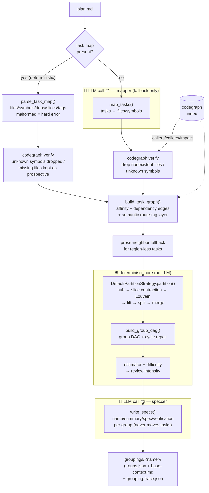
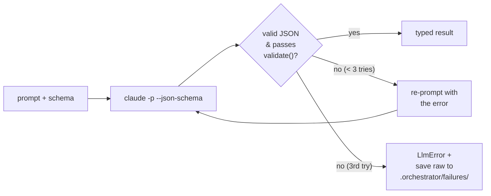
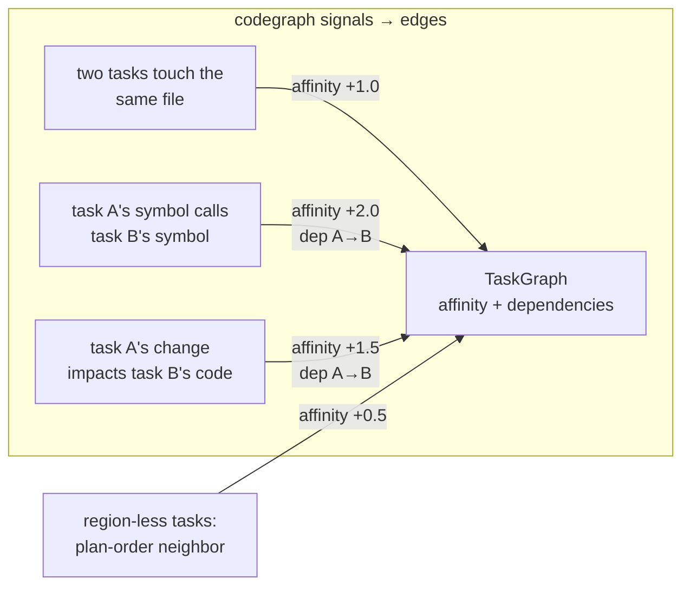
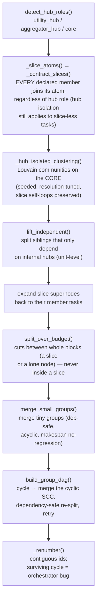

# How grouping works

How `smart-mcps-orchestrate group <plan>` turns a plan document into a named
grouping — `.orchestrator/groupings/<name>/`, holding `groups.json` (the DAG of
execution groups `run` later drives), `base-context.md`, and
`grouping-trace.json` (see [Output](#output)).

**At most two LLM calls, everything else deterministic.** The LLM sits only at
the two *edges* (mapper in, speccer out); the whole middle — graph building,
partitioning, sizing, difficulty — is pure Python over codegraph data, seeded
and byte-stable. Plans carrying an embedded **task map**
([`docs/orchestrator-task-map.md`](orchestrator-task-map.md)) skip the mapper
entirely: the planning session already knew the files (including not-yet-existing
ones), symbols, ordering, and slice membership, so LLM #1 becomes a
deterministic parse and only the speccer remains.

The intended authoring flow: `/orchestrator-brainstorm` (requirements doc with
R-IDs) → `/orchestrator-plan` (plan with task map, verifier-checked) →
`smart-mcps-orchestrate group <plan> --dry-run` (human checkpoint) → `run`.

Entry point: [`run_grouping()`](../orchestrator/grouping/pipeline.py) —
`orchestrator/grouping/pipeline.py:54`.

______________________________________________________________________

## Pipeline at a glance



The sequence in code ([`pipeline.py:54`](../orchestrator/grouping/pipeline.py)):

```python
codegraph_files = client.files_overview()
mapper_out = parse_task_map(plan_text, client)                  # deterministic fast path
if mapper_out is None:
    mapper_out = map_tasks(plan_text, llm_runner, client, ...)  # LLM #1 (fallback)
graph = build_task_graph(mapper_out.mappings, client, weights)  # codegraph + plan-time signals
graph = _with_prose_fallback(graph, mapper_out, ...)            # region-less edges
strategy = DefaultPartitionStrategy(work_fn=..., budget_cap=...)
partition = strategy.partition(graph)                           # deterministic
dag = build_group_dag(graph, partition)
specs = write_specs(plan_text, skeletons, llm_runner, ...)      # LLM #2
# ... assemble Group objects with difficulty/intensity/estimates ...
```

A malformed task map raises `GrouperError` before any LLM call — never a silent
fallback (that would hide drift between the plan prose and the map). An absent
map keeps foreign plans on the mapper path unchanged.

______________________________________________________________________

## The LLM call — what / where / how

Both LLM stages go through **one seam**:
[`call_llm_json()`](../orchestrator/grouping/llm.py) —
`orchestrator/grouping/llm.py:53`. This is the *only* place grouping talks to a
model, which is why tests inject a stub runner and spend zero tokens.

### How the call is physically made

The production runner shells the `claude` CLI in plain print mode with a JSON
schema ([`llm.py:31`](../orchestrator/grouping/llm.py)):

```python
def claude_json_runner(prompt: str, schema: dict) -> str:
    result = subprocess.run(
        ["claude", "-p", prompt,
         "--output-format", "json",
         "--json-schema", json.dumps(schema)],
        capture_output=True, text=True,
    )
    ...
    envelope = json.loads(result.stdout)   # {"result": "...", ...}
    return str(envelope["result"])         # the model's text (JSON string)
```

- **`-p` (print mode):** one blocking, stateless call — no session, no resume.
  Grouping calls are one-shots; the *execution* engine (`sessions.py`) owns the
  session/fork lifecycle, not this.
- **`--json-schema`:** asks the CLI for schema-constrained structured output.
- **`--output-format json`:** the CLI wraps the answer in an envelope; we pull
  `envelope["result"]` (itself a JSON string that we then parse).
- **`JsonRunner`** is a `Callable[[str, dict], str]` — tests pass a canned
  function instead of `claude_json_runner`, so the whole pipeline runs offline.

### Validate → retry → fail-loud

`call_llm_json` parses the returned text, validates it, and retries with a
corrective nudge on failure — capped, then aborts with the raw output saved
([`llm.py:53`](../orchestrator/grouping/llm.py)):

```python
for _attempt in range(1 + max_retries):          # default 1 + 2 = 3 tries
    last_raw = runner(attempt_prompt, schema)
    try:
        return validate(json.loads(last_raw))
    except (json.JSONDecodeError, KeyError, TypeError, ValueError) as exc:
        attempt_prompt = f"{prompt}\n\nYour previous output failed validation: {exc}.\n" \
                         "Return ONLY valid JSON matching the schema — no prose, no fences."
# persistent failure → raise LlmError, raw output saved to .orchestrator/failures/
```



______________________________________________________________________

## LLM #1 — the mapper (plan → code regions)

[`map_tasks()`](../orchestrator/grouping/mapper.py) —
`orchestrator/grouping/mapper.py:70`. **What it does:** extract implementation
tasks from the plan and map each to the files/symbols it will touch.

- **Prompt:** [`orchestrator/prompts/mapper.md`](../orchestrator/prompts/mapper.md),
  filled with `$plan_text` and `$codegraph_files` (the repo's file/symbol
  overview from `client.files_overview()`). It instructs: one task per unit of
  work, in plan order, kebab-case `task_id`, and *"only name files/symbols you are
  confident about — the orchestrator verifies every path and drops misses."*
- **Schema:** `MAPPER_SCHEMA` — `tasks[]` of `{task_id, description, files[], symbols[]}`.
- **Then, deterministically, every region is verified against codegraph and the
  working tree** ([`mapper.py:94`](../orchestrator/grouping/mapper.py)):

```python
for file in entry["files"]:
    if (client.repo_root / file).is_file(): files.append(file)
    else: flags.append(f"... mapped nonexistent file {file} — dropped")
for symbol in entry["symbols"]:
    if client.symbol_exists(symbol): symbols.append(symbol)
    else: flags.append(f"... mapped unknown symbol {symbol} — dropped")
if not files and not symbols:
    flags.append(f"... task {task_id} has no verifiable regions — carried as region-less node ...")
```

> ⚠️ **This drop step is the greenfield weak point of the mapper path.** On a
> plan for code that doesn't exist yet, *every* mapped file is "nonexistent →
> dropped", so tasks become region-less and lose all structural signal.
> **Resolved for pre-mapped plans:** the task-map parser keeps such files as
> *prospective files* instead of dropping them — they contribute shared-file
> affinity, appear in `Group.files`, and count in the per-file token allowance.
> See [Known limitations](#known-limitations).

______________________________________________________________________

## The task graph (deterministic, codegraph-driven)

[`build_task_graph()`](../orchestrator/grouping/graphing.py) —
`orchestrator/grouping/graphing.py:162`. It queries codegraph for every mapped
symbol and assembles a [`TaskGraph`](../orchestrator/grouping/partition.py) with
**two relations**:

| Relation                    | Kind      | Weight (default)                              | Source                                                  |
| --------------------------- | --------- | --------------------------------------------- | ------------------------------------------------------- |
| **affinity** (clustering)   | symmetric | `shared_file` 1.0 · `call` 2.0 · `impact` 1.5 | tasks touching same file / calling / impact-overlapping |
| **dependencies** (ordering) | directed  | same edges, kept directed                     | caller-task ⟶ callee-task, impacted ⟶ impacting         |

Pre-mapped plans add three **plan-time signals** on top
([`docs/orchestrator-task-map.md`](orchestrator-task-map.md)):

| Signal                | Becomes                                                                              | Notes                                                                                                                                                                                |
| --------------------- | ------------------------------------------------------------------------------------ | ------------------------------------------------------------------------------------------------------------------------------------------------------------------------------------ |
| **prospective files** | shared-file affinity (union with real files)                                         | the greenfield fix — planned-but-nonexistent files cluster like real ones; 0 source bytes, full per-file allowance                                                                   |
| **`depends_on`**      | directed dependency edge only — **never affinity**                                   | feeds the group DAG, hub detection (a scaffold everyone depends on → `utility_hub` → own group, scheduled first), merge-direction guards                                             |
| **route tags**        | symmetric **semantic affinity** between matched `implements`/`consumes` (weight 1.5) | the cross-stack fix (TS `fetch("/api/x")` ↔ Python route); the whole layer is scaled by `clamp(Σw_struct/Σw_sem, semantic_floor 0.5, semantic_ceil 3.0)` so it rebalances per regime |

The clamp is the regime balancer (multilayer-modularity practice): pure
greenfield (Σstruct≈0) floors the scale and semantics dominate the near-empty
structural layer; edit-heavy plans hit the ceiling so semantics refine but never
override real reference edges; mixed plans land between. Knobs: `semantic`,
`semantic_floor`, `semantic_ceil` on `EdgeWeightsConfig`.



The edge-building loop ([`graphing.py:193`](../orchestrator/grouping/graphing.py)):

```python
# Shared-file affinity: weight scales with the number of files two tasks share.
for _file, owners in sorted(file_owner.items()):
    for a, b in pairs(sorted(owners)):
        edges.add_symmetric(a, b, weights.shared_file)

for symbol in mapping.symbols:                    # per mapped symbol
    for caller in client.callers(symbol):         # call proximity (directed)
        for other in owners_of(caller) - {task}:
            edges.add(upstream=task, downstream=other, weight=weights.call)
    for affected in client.impact(symbol):        # impact overlap (directed)
        for other in owners_of(affected) - {task}:
            edges.add(upstream=task, downstream=other, weight=weights.impact)
```

**Region-less fallback.** Tasks the mapper couldn't map get one weak edge to
their plan-order neighbor — the *only* non-codegraph signal
([`pipeline.py:175` `_with_prose_fallback`](../orchestrator/grouping/pipeline.py),
weight `prose_neighbor` = 0.5). This is all that survives for a greenfield plan.

Edge weights live in config ([`EdgeWeightsConfig`](../orchestrator/config.py),
`config.py:16`) — all overridable.

______________________________________________________________________

## The partition (deterministic, CoCoder-ported)

[`DefaultPartitionStrategy.partition()`](../orchestrator/grouping/partition.py) —
`orchestrator/grouping/partition.py:157`. A fixed sequence of policies ported from
CoCoder (Apache-2.0), behind a swappable `PartitionStrategy` interface (R22):



**Slice contraction** (task-map must-links): after hub roles are computed, every
declared slice member — core or hub — contracts into one `slice::<label>`
supernode; a declared slice outranks an inferred hub role, so hub isolation only
ever removes slice-*less* tasks (sorted iteration, parallel edge weights summed,
intra-slice affinity kept as a Louvain self-loop; Rey et al. 2022:
contracted-graph modularity ≡ constraint-respecting original modularity).
Clustering and sibling-lifting run at unit level, then membership expands. From
here the must-link is a **hard output invariant, not just a clustering-time
one**: `split_over_budget` computes its cut candidates between whole blocks (a
slice or a lone node), never inside a slice, and `merge_small_groups` rejects
any candidate merge that would create a group-level cycle alongside its
existing budget/chain/makespan guards. A slice whose own summed work exceeds
the cap is a named `GrouperError` (or, with `--allow-oversized-slice`, one
flagged group) — never a silent split; see
[`docs/orchestrator-task-map.md`](orchestrator-task-map.md). A group-DAG cycle
that survives merge-time prevention (it can still originate at Louvain/lift/
split) is repaired at `build_group_dag`: the cyclic SCC is merged deterministically,
then a dependency-safe re-split brings it back inside the cap without
reintroducing a cycle. Acyclicity is now an internal invariant — a
`GroupCycleError` that still escapes is an orchestrator bug, not an expected
outcome — and the plan skill's verifier still requires inter-slice `depends_on`
acyclicity up front, since prevention is cheaper than repair.

- **Hub roles** ([`partition.py:171`](../orchestrator/grouping/partition.py)):
  degree-thresholded — a node most others depend on (`utility_hub`) is isolated as
  its own group; a node depending on most others (`aggregator_hub`) trails in one
  shared group; the rest are `core`. Applies only to tasks carrying no slice label.
- **Louvain** ([`partition.py:201`](../orchestrator/grouping/partition.py)):
  `networkx` directed Louvain over the affinity weights, **seeded** (`LOUVAIN_SEED = 42`) with deterministic community numbering → stable across runs.
- **lift / split / merge** ([`partition.py:261/328/462`](../orchestrator/grouping/partition.py)):
  peel off independent siblings, split any group whose summed **token work**
  exceeds the budget cap ([estimator hook](#estimator--difficulty--review-tier))
  at a block boundary (never inside a slice), merge undersized groups without
  creating a dependency cycle or regressing makespan.
- **DAG + cycle check** ([`build_group_dag()` `partition.py:91`](../orchestrator/grouping/partition.py)):
  lifts task dependencies to group-level edges; a cycle triggers SCC-merge +
  dependency-safe re-split repair before it would ever reach the operator as
  `GroupCycleError` (CoCoder silently wedged here — we fail loudly only if
  repair itself cannot produce an acyclic result).

> **What the partition optimizes: affinity modularity + a token budget + makespan
> no-regression, subject to the slice must-link as a hard constraint.** Grouping
> is not choosing "independently-shippable/testable units" from first principles —
> it is affinity-clustering everything the plan didn't explicitly bind together,
> and never splitting what it did. See [Known limitations](#known-limitations).

______________________________________________________________________

## Estimator → difficulty → review tier

Two deterministic scorers ([`orchestrator/grouping/estimator.py`](../orchestrator/grouping/estimator.py)),
both reading plain numbers so the partitioner consumes them as injected hooks:

- **Token estimate / budget** — `node_work()` (per-task tokens from source bytes +
  per-file allowance) feeds the partition's `budget_cap`; `estimate_group_tokens()`
  sizes the final group (`estimator.py:19/36/47`).
- **Difficulty → review intensity** — `difficulty_score()` is a normalized weighted
  sum of saturating signals (files touched, max fan, hub touches, cross-group
  edges, verification count); `intensity_for()` maps it to a tier
  ([`estimator.py:76/103`](../orchestrator/grouping/estimator.py)):

```python
if difficulty < config.d_review:  return SELF_VERIFY   # no reviewer session
if difficulty < config.d_hard:    return PAIRED        # one reviewer
return PAIRED_PLUS                                      # + mandatory extra pass
```

Thresholds/weights all live in [`DifficultyConfig`](../orchestrator/config.py)
(`config.py:45`).

### The pricing sweep — recorded evidence that pricing isn't the slice-integrity lever

It is tempting to read slice dissolution as a pricing bug: greenfield
`node_work` is almost pure file-count (`per_file_tool_allowance` × file count,
since prospective files carry 0 source bytes), so a `tsconfig.json` costs the
same as a 400-line module, and a cheaper rate looks like it should let more
slices fit. Sweeping `per_file_tool_allowance` over `2000 → 100` through the
partition-only path (`group --no-spec`) on both real plans in this repo falsifies
that:

| `per_file_tool_allowance` | observatory (greenfield, ~50 prospective files) | run-hardening (brownfield, real files) |
| ------------------------- | ----------------------------------------------- | -------------------------------------- |
| 2000 (default)            | 2 of 3 slices split, cycles                     | both slices intact                     |
| 1000                      | split, cycles                                   | **1 slice split**                      |
| 600                       | split, cycles                                   | split                                  |
| 400                       | split, cycles                                   | split                                  |

Lowering the rate never restores a slice on the plan where slices were already
dissolving, and it **dissolves a slice that had survived** on the
brownfield plan — cheaper nodes let `merge_small_groups` build larger clusters,
which then exceed the budget cap and get cut. (The same sweep against the six
grouping fixtures shows every cycling fixture still cycling at every value down
to 100 — pricing does not touch the merge-time cycle mechanism either.) Pricing
is real — a flat rate that charges `tsconfig.json` like a 400-line module is
dishonest in both directions — but it buys **precision, not integrity**: see
`size_hints` in [`docs/orchestrator-task-map.md`](orchestrator-task-map.md) for
the fix that ships, priced by declared size (`small`/`medium`/`large` at
500/2000/5000) rather than by a single global rate. The mechanisms that
actually dissolve or cycle a slice — hub-role exclusion before contraction,
merges that invert a dependency edge, and the splitter cutting inside an
expanded slice — are structural, and are what the slice-atoms, acyclic-merge,
and slice-aware-splitter changes above fix. See
[`docs/orchestrators_improvements.md`](orchestrators_improvements.md) (D2/D3/D4)
for the full mechanism write-up.

______________________________________________________________________

## LLM #2 — the speccer (prose about fixed groups)

[`write_specs()`](../orchestrator/grouping/speccer.py) —
`orchestrator/grouping/speccer.py:62`. **What it does:** for each already-decided
group, write the `name`, `summary` (≤120 chars, the analyzer title), worker-facing
`spec`, and `verification` items. **It never moves tasks or invents groups.**

- **Prompt:** [`orchestrator/prompts/speccer.md`](../orchestrator/prompts/speccer.md),
  filled with `$plan_text` and `$groups_json` (the skeleton: each group's tasks,
  descriptions, files).
- **Schema:** `SPECCER_SCHEMA` — `groups[]` of `{group_id, name, summary, spec, verification[]}`.
- **Validation** ([`speccer.py:79`](../orchestrator/grouping/speccer.py)) rejects a
  summary over 120 chars (never truncates) and requires the output to cover
  *exactly* the given group ids.

> **Note for the next session:** the speccer can *see* cross-group ordering in its
> prose (in the live smoke it wrote *"this group builds on the scaffold group"*),
> but that understanding is **not fed back into the DAG** — the structural
> `dependencies` were already fixed upstream. Bridging that prose→DAG gap is one
> lever for the greenfield problem.

______________________________________________________________________

## Output

A grouping is a **named, self-contained directory** —
`.orchestrator/groupings/<name>/` — not a single overwritable slot: grouping a
second plan used to destroy the first grouping with no record (ADR 0003).
`group --name <tag>` (default: the plan's filename stem) writes it; `run --grouping <tag>` selects one (auto-selecting only when exactly one exists, and
otherwise erroring with every candidate's name and plan path — never "the
newest"); `groupings` lists every one with its plan path and group count.
[`serialize_grouping()`](../orchestrator/grouping/pipeline.py) writes three
artifacts into it:

- **`groups.json`** — the canonical `GroupingResult`: every `Group` with id,
  name, summary, spec, difficulty, intensity, **dependencies**, verification,
  tasks, files, estimated_tokens, plus `flags` (dropped mappings, budget
  warnings, accepted slice overshoots). This is what `run` consumes.
- **`base-context.md`** — repo conventions (`CLAUDE.md`/`AGENTS.md`) +
  codegraph architecture summary + the plan, compiled once as the base session's
  shared context ([`base_context.py:16`](../orchestrator/grouping/base_context.py)).
- **`grouping-trace.json`** — the versioned record of every partition stage's
  output and every decision (hub scores vs. threshold, slice atoms, Louvain
  communities, each cut/merge/repair with its reason and quantitative context)
  — "why is this node in this group" answered from the file, without a
  debugging session. Written on **every** invocation, including `--dry-run` and
  `--no-spec`, and even when the run fails (a partial trace records the
  failure) — explaining a partition you chose not to materialize, or one that
  failed, is the main iteration loop. Carries no timestamp, so re-running the
  same plan produces byte-identical bytes; file mtime and the run snapshot
  supply time instead.

`--dry-run` and `--no-spec` print the report and write only
`grouping-trace.json` — the human checkpoint before any session launches, or
before deciding to materialize a grouping at all.

`run` never reads the live `groupings/<name>/` directory again once it starts:
it copies the directory's files into `.orchestrator/runs/<run_id>/` at launch
and records the grouping's name in `manifest.json`, so a later `group --name <same>` against a different plan cannot rewrite a finished or in-flight run's
DAG (ADR 0002, ADR 0003); `resume` reads the snapshot, not the live directory.

______________________________________________________________________

## Where the tokens go

| Stage                               | LLM? | Call                                         | Count per `group`                                              |
| ----------------------------------- | ---- | -------------------------------------------- | -------------------------------------------------------------- |
| Task-map parse                      | ❌   | pure Python (pyyaml + codegraph verify)      | 0                                                              |
| Mapper                              | ✅   | `claude -p --json-schema` (`MAPPER_SCHEMA`)  | 1 (+ up to 2 retries) — **skipped when a task map is present** |
| Build graph / partition / estimator | ❌   | codegraph CLI + pure Python                  | 0                                                              |
| Speccer                             | ✅   | `claude -p --json-schema` (`SPECCER_SCHEMA`) | 1 (+ up to 2 retries)                                          |

So a `group` run is **two model calls** on the happy path — **one** for a
pre-mapped plan; everything structural is deterministic and offline. (The `run`
command that follows is where the many coder/reviewer sessions and their tokens
live.)

______________________________________________________________________

## Known limitations

These drove the next-session focus — full write-up in
[`docs/handoffs/2026-07-16-multiagent-orchestrator-phase-d-and-grouping-next.md`](handoffs/2026-07-16-multiagent-orchestrator-phase-d-and-grouping-next.md).

1. **Greenfield loses structure — ✅ resolved for pre-mapped plans.** The mapper
   drops mappings to files that don't exist yet, so a plan for new code collapses
   to region-less tasks → only the weak prose-neighbor affinity survives → no
   clustering, no dependency ordering. (Observed live: 3 independent groups that
   actually needed a scaffold→consumer chain.) A task map retains those files as
   **prospective files** (full affinity + `Group.files` + per-file allowance) and
   its `depends_on` restores ordering; the mapper path keeps the old behavior for
   foreign plans. Regression fixture:
   `tests/test_grouper_pipeline.py::TestTaskMapRegimes`.
2. **No testability / vertical-slice objective — ✅ resolved for pre-mapped
   plans.** Grouping is purely structural affinity; codegraph has no edge between,
   say, a TS `fetch()` and its Python route, so cross-stack halves of one feature
   fragment into separately-reviewed groups. A task map's `slice` labels
   (must-link node contraction) plus matched `implements`/`consumes` route tags
   (semantic affinity layer) keep a feature's halves together. Plans without a
   task map still have no semantic signal.
3. **LLM non-determinism.** Mapper + speccer are model calls, so group boundaries
   can differ run-to-run for the same plan (dry-run made 3 groups, the real run
   made 2). A pre-mapped plan removes the mapper's share of this entirely (the
   parse is byte-stable); the speccer still writes prose but **never moves
   tasks**. `--dry-run` is the intended human checkpoint.

```
```
