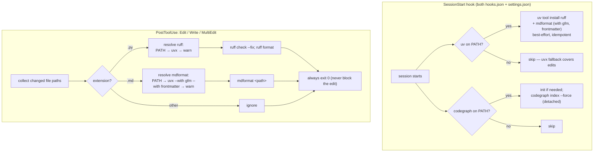

# fix: Make AI-edit auto-formatting and codegraph reliable

## Summary

The plugin advertises "automatic formatting after AI edits" and "codegraph
auto-indexing," but empirical testing proved **both are broken**: the format
hook silently no-ops, the local lint hook never fires, and the codegraph index
goes stale and serves results for deleted files. This plan makes the
deterministic tooling actually deterministic — every AI edit gets formatted
(Python via ruff, Markdown via mdformat+plugins), codegraph auto-indexes
correctly on session start, and the docs stop describing broken behavior as
correct.

Scope is repair-and-complete, not greenfield: `hooks/scripts/lint_after_edit.py`
already exists with the right *shape* (correct ruff ordering); it just never
runs. The work is fixing the wiring, the tool resolution, the Markdown
formatter, the session-start event, and the docs.

---

## Problem Frame

Verified findings (all reproduced this session; see Sources & Research):

1. **The format hook is a silent no-op.** `lint_after_edit.py` calls bare
   `ruff` and `markdownlint-cli2`; neither is on PATH, so `subprocess.run`
   raises `FileNotFoundError`, which the script's `try/except … pass` swallows.
   Proof: 2 of the repo's own Python files are currently not ruff-formatted.
2. **The local lint hook never fires.** `.claude/settings.json` uses matcher
   `edit|write|multiedit` (lowercase). Claude Code matchers are
   **case-sensitive**; the tools are `Edit`/`Write`/`MultiEdit`, so the matcher
   matches nothing. `CLAUDE.md` documents this lowercase convention as
   intentional — that guidance is actively wrong.
3. **codegraph auto-index never runs in real sessions.** The hook uses the
   `Setup` event, which per the docs fires only under `--init`/`--maintenance`/CI
   — not on interactive session start. The index was 5 weeks stale and returned
   deleted `.mjs` files as live symbols. `codegraph index` is incremental and
   does **not** prune deletions; only `codegraph index --force` cleared the
   ghosts. The Setup hook is also missing from `hooks/hooks.json` (plugin
   consumers never get it), and `skills/codegraph/SKILL.md` falsely claims it
   "runs on session start."
4. **The "file not read yet" premise did not reproduce.** On this harness, a
   codegraph-surfaced snippet in tool output was accepted by Edit with no Read
   required ("file state is current in your context"). The rare-failure contour
   is cheap: Read only the snippet's line range.
5. **The IDE "problems" are mostly cSpell spelling hints** for domain words
   (noise). Ruff reports zero lint errors on the real code. cSpell is handled
   out-of-band (user removes the extension).

**Why now:** every broken piece wastes AI turns — unformatted diffs get
re-touched, codegraph sends the agent to files that no longer exist, and the
docs mislead the next contributor.

---

## Requirements

| ID | Requirement | Success criterion |
|----|-------------|-------------------|
| R1 | Python auto-formats after any AI edit | After Edit/Write/MultiEdit of a `.py` file, `ruff check --fix` then `ruff format` have run; `ruff format --check` is clean |
| R2 | Markdown auto-formats without corruption | After editing a `.md` file, mdformat runs **with `mdformat-gfm` + `mdformat-frontmatter`**; YAML frontmatter and GFM tables are preserved intact |
| R3 | The format hook actually runs in local dev AND for plugin consumers | Matchers are PascalCase in both registration files; tools resolve via PATH or uvx fallback |
| R4 | codegraph is fresh and never serves deleted files | On real interactive session start, the index is (re)built with deletions pruned |
| R5 | The agent can edit codegraph-surfaced code reliably | No spurious "not read" failures for shown regions; SKILL.md documents the line-range contour for the rare case |
| R6 | Docs reflect the fixed behavior | `CLAUDE.md` and `skills/codegraph/SKILL.md` corrected; no false claims remain |
| R7 | Deterministic problems fixed deterministically | Formatting drift removed via one-time baseline; per-tool-call hook overhead reduced |

---

## Key Technical Decisions

- **KTD1 — Hybrid tool resolution (never bare-call).** The hook resolves each
  tool as: PATH binary (`shutil.which`) → `uvx <tool>` fallback → graceful
  warning. This is robust for both local dev and plugin consumers, and it
  matches the confirmed **Hybrid** delivery choice: a SessionStart hook warms
  the tools so the common path is the fast installed binary; uvx is the safety
  net. Both `uvx` and `npx` are available in this environment.

- **KTD2 — mdformat with mandatory plugins.** Markdown uses `mdformat` (confirmed
  choice over markdownlint-cli2 — single uv/Python toolchain, no Node). **Plain
  mdformat is unsafe**: it was proven to convert `---` YAML frontmatter into a
  horizontal rule + mangled heading, which would break every skill/agent file.
  The hook and bootstrap must always use `mdformat-gfm` (tables, task lists,
  strikethrough) **and** `mdformat-frontmatter` (YAML passthrough). Default
  `wrap = "keep"` avoids reflowing prose.

- **KTD3 — SessionStart, registered in both files.** Both the codegraph reindex
  and the formatter warm move to the **`SessionStart`** event (the correct
  interactive-start event), registered in **both** `hooks/hooks.json`
  (PascalCase, `${CLAUDE_PLUGIN_ROOT}`) and `.claude/settings.json`
  (`$CLAUDE_PROJECT_DIR`) per the repo's "register in both places" rule — which
  the codegraph hook currently violates.

- **KTD4 — `codegraph index --force`, detached.** Incremental indexing leaves
  ghost nodes for deleted files; `--force` prunes them (proven). Run it detached
  (`( … & )`) so session start is not blocked; codegraph's WAL journal makes
  concurrent reads safe during the rebuild. Very large repos may prefer
  incremental-plus-periodic-force (noted as a tuning knob, not built here).

- **KTD5 — PascalCase matchers everywhere; fix the docs.** `.claude/settings.json`
  lint matcher becomes `Edit|Write|MultiEdit`. `CLAUDE.md`'s claim that local
  matchers use lowercase is corrected to: matchers are case-sensitive and
  PascalCase in both files.

- **KTD6 — "Not read" handled by guidance only.** No hook can inject Claude
  Code's internal read-state. Since the failure did not reproduce, add one line
  to `SKILL.md`: if an Edit is ever rejected as not-read, Read just the
  snippet's line range via `offset`/`limit` (codegraph gives `file:line`) — not
  the whole file.

- **KTD7 — Deterministic config + one-time baseline.** Add `[tool.ruff]` to
  `pyproject.toml` (pinned `line-length`, `target-version = "py312"`) so
  formatting is stable, and baseline-format the repo once (Python + Markdown) so
  future edits produce minimal, reviewable diffs instead of surprise churn.

- **KTD8 — Scope `save_research.py` to Bash.** It early-exits on non-Bash tools
  but currently spawns `python3` on *every* PostToolUse. Add a `Bash` matcher to
  eliminate that per-tool-call overhead (deterministic efficiency win).

---

## High-Level Technical Design

Two flows change. Session start warms tools and refreshes the index; each edit
resolves the right formatter and applies it, never blocking.

*Directional — the diagram shows control flow and decision points, not final code.*

---

## Implementation Units

### U1. Rewrite the format hook with a hybrid resolver and safe mdformat

**Goal:** Make `lint_after_edit.py` actually format Python and Markdown after
edits, resolving tools robustly and never corrupting frontmatter or blocking.

**Requirements:** R1, R2, R3

**Dependencies:** none

**Files:**
- `hooks/scripts/lint_after_edit.py` (rewrite `_lint`, add resolver)
- `tests/test_lint_after_edit.py` (new)

**Approach:**
- Add `_resolve(tool: str) -> list[str] | None`: return `[which(tool)]` if on
  PATH; else `["uvx", tool]` if `uvx` present; else `None`.
- `.py`: `<ruff> check --fix --quiet <path>` then `<ruff> format --quiet <path>`
  (order preserved from current code).
- `.md`: resolve mdformat, but the **uvx fallback must be**
  `["uvx", "--with", "mdformat-gfm", "--with", "mdformat-frontmatter", "mdformat"]`;
  the PATH branch assumes the SessionStart bootstrap installed the
  plugin-equipped mdformat (see Risks for the foreign-binary edge). Invoke
  `<mdformat> <path>`.
- If a resolver returns `None`, print one concise warning to stderr and continue.
  Always `sys.exit(0)`.
- Keep MultiEdit path-collection and the outer exception guard.

**Patterns to follow:** the existing `_collect_paths` / `main` structure and
"always exit 0" contract in the current `lint_after_edit.py`.

**Test scenarios** (`tests/test_lint_after_edit.py`, pytest, subprocess mocked or
tools present):
- Happy path: an Edit payload for a badly-formatted `.py` file results in ruff
  `check --fix` + `format` being invoked in that order on that path.
- Happy path: a `.md` payload invokes mdformat with the gfm + frontmatter plugin
  args in the uvx branch.
- Frontmatter safety (integration): running the hook on a copy of a real skill
  `.md` leaves the `---` YAML block byte-identical (guards against the
  plain-mdformat corruption).
- Resolver: with tool on PATH, the PATH form is used; with only `uvx`, the uvx
  form is used; with neither, a single stderr warning is emitted and exit is 0.
- MultiEdit: a payload with two `edits[*].file_path` entries formats both.
- Edge: non-`.py`/`.md` path is ignored; nonexistent path is ignored; malformed
  JSON on stdin exits 0.

**Verification:** feeding a synthetic Edit payload for an unformatted `.py`
leaves it ruff-formatted; the same for `.md` normalizes it while preserving
frontmatter; missing-tool case leaves the file untouched with exit 0.

---

### U2. Add the formatter bootstrap script

**Goal:** Best-effort install of the plugin-equipped formatters at session start
so the hook's fast PATH branch is populated.

**Requirements:** R1, R2, R3

**Dependencies:** none (consumed by U3's registration)

**Files:**
- `hooks/scripts/ensure_formatters.sh` (new)

**Approach:**
- Guard: `command -v uv >/dev/null 2>&1 || exit 0`.
- `uv tool install ruff` (idempotent; no-op if already installed).
- `uv tool install mdformat --with mdformat-gfm --with mdformat-frontmatter`
  (plugins baked into the installed entry point).
- Best-effort: redirect output, never fail the session (`exit 0`). Optionally run
  the whole body detached so a cold install never delays session start.

**Patterns to follow:** the guard style of the existing codegraph Setup command
(`command -v … || exit 0`).

**Test scenarios:**
- With `uv` present: after running, `mdformat` and `ruff` resolve and
  `mdformat --version` lists the gfm/frontmatter plugins.
- Guard: with `uv` absent (PATH stubbed), the script exits 0 and installs
  nothing.
- Idempotency: a second run is a no-op and still exits 0.

**Verification:** post-run, `shutil.which("ruff")` and `shutil.which("mdformat")`
succeed; `mdformat` on a frontmatter+table doc preserves both.

---

### U3. Repair and complete all hook wiring (both registration files)

**Goal:** Fix the matcher-case bug, move codegraph to `SessionStart` with
`--force`, restore plugin/local parity, and register the formatter bootstrap.

**Requirements:** R3, R4, R7

**Dependencies:** U1, U2 (their scripts must exist before registration)

**Files:**
- `.claude/settings.json`
- `hooks/hooks.json`

**Approach:**
- **Lint matcher:** change `.claude/settings.json` PostToolUse lint matcher from
  `edit|write|multiedit` to `Edit|Write|MultiEdit`. (`hooks.json` is already
  correct.)
- **codegraph:** replace the `Setup` block with a `SessionStart` block running
  `command -v codegraph … || exit 0; [ -d .codegraph ] || codegraph init;
  ( codegraph index --force >/dev/null 2>&1 & )`. Add the **same** SessionStart
  hook to `hooks/hooks.json` (currently absent) using `${CLAUDE_PLUGIN_ROOT}`
  semantics — closing the parity gap.
- **formatter bootstrap:** register `ensure_formatters.sh` as a SessionStart
  hook in **both** files (alongside the codegraph hook), using
  `${CLAUDE_PLUGIN_ROOT}` in `hooks.json` and `$CLAUDE_PROJECT_DIR` in
  `.claude/settings.json`.
- **save_research efficiency:** add matcher `Bash` (PascalCase) to the
  `save_research.py` PostToolUse registration in both files.

**Patterns to follow:** the two-file registration convention documented in
`CLAUDE.md` (PascalCase in `hooks.json`, `$CLAUDE_PROJECT_DIR` in settings).

**Test scenarios:**
- Integration: after an `Edit` to a `.py` file in a real local session, the file
  is ruff-formatted (proves the PascalCase matcher now fires).
- Integration: seed a stale `.codegraph` with a deleted-file node, start a
  session, and confirm `codegraph query` no longer returns the ghost (proves
  `SessionStart` + `--force`).
- JSON validity: both files parse; `hooks.json` and `.claude/settings.json` carry
  matching SessionStart entries (parity check).
- `save_research.py` is not invoked on a non-Bash tool call (matcher scoping).

**Verification:** `python3 -c "import json,sys; json.load(open(f))"` passes for
both files; a live edit formats; a session start prunes a planted ghost.

---

### U4. Deterministic formatting config + one-time baseline

**Goal:** Pin formatting so it is stable, and format the repo once so future
hook runs produce minimal diffs.

**Requirements:** R1, R2, R7

**Dependencies:** U1 (defines the exact tools/plugins used)

**Files:**
- `pyproject.toml` (add `[tool.ruff]`, optional `[tool.ruff.format]`)
- optional `.mdformat.toml` (`wrap = "keep"`)
- `pplx/cli.py`, `hooks/scripts/*.py` (ruff-format baseline)
- repo `*.md` under `skills/`, `agents/`, root docs (mdformat baseline)

**Approach:**
- Add `[tool.ruff]` with `line-length` (pick to minimize churn against current
  style — inspect with `ruff format --diff` before committing) and
  `target-version = "py312"` (matches `requires-python`).
- Run ruff format across the repo's own Python once.
- Run mdformat (with gfm + frontmatter) across the repo's Markdown once. Note:
  table alignment produces a **one-time** larger diff — commit it separately and
  review that frontmatter/tables survive.

**Test scenarios:** none behavioral. `Test expectation: none — config +
formatting only.` Verification is `ruff format --check` and
`mdformat --check` returning clean, and `ruff check` passing.

**Verification:** `uvx ruff format --check pplx hooks` reports all formatted;
`uvx --with mdformat-gfm --with mdformat-frontmatter mdformat --check <md>`
reports clean; a spot-check confirms skill frontmatter is intact.

---

### U5. Correct the documentation

**Goal:** Stop the docs from describing broken behavior as correct, and record
the codegraph edit contour.

**Requirements:** R5, R6

**Dependencies:** U3 (docs must describe the final wiring)

**Files:**
- `skills/codegraph/SKILL.md`
- `CLAUDE.md`

**Approach:**
- `SKILL.md`: change the "Setup hook runs codegraph index automatically on
  session start" line to reference the **SessionStart** hook and
  `codegraph index --force`; update the "Index lag" note to say deletions are
  pruned on session start. Add one line under usage rules: if an Edit is
  rejected as "not read," Read only the snippet's line range with `offset`/
  `limit` — do not re-read the whole file.
- `CLAUDE.md`: correct the "Adding hooks" section — matchers are case-sensitive
  and PascalCase (`Edit|Write|MultiEdit`) in **both** files; remove the
  lowercase-for-local guidance. Note that `SessionStart` hooks (codegraph,
  formatter bootstrap) must also be registered in both places.

**Test scenarios:** none. `Test expectation: none — documentation only.`

**Verification:** no doc references `Setup` for interactive session start or
lowercase matchers; the not-read contour is present.

---

## Scope Boundaries

**In scope:** U1–U5 above — the format hook, the bootstrap, the hook wiring
(both files), deterministic config + baseline, and the doc corrections.

### Deferred to Follow-Up Work
- Pre-commit hook and/or CI job that runs the same ruff + mdformat checks (edit-
  time hook is the requested surface; commit/CI parity is a natural next step).
- Broader ruff rule-set adoption (enabling more lint categories beyond defaults).
- A staleness-heuristic for very large repos (incremental index with periodic
  `--force`) instead of always-force-detached.

### Out of Scope (user-owned)
- **cSpell.** AI-only diagnostic filtering is not achievable (shared VS Code
  diagnostics collection; the `getDiagnostics` tool takes only a `uri`). Per the
  confirmed decision, the user removes the cSpell extension themselves; this plan
  adds no cSpell config.

### Non-goals
- Changing codegraph itself or adding new skills/agents.
- Reworking `save_research.py` beyond the matcher scoping in U3.

---

## Risks & Mitigations

- **mdformat baseline churn (U4).** Aligning tables across many `.md` files is a
  large one-time diff. *Mitigate:* commit the baseline separately; review that
  every frontmatter block and table round-trips (the gfm+frontmatter plugins
  were proven to preserve them).
- **Foreign PATH `mdformat` without plugins.** If some other `mdformat` (no
  plugins) is on PATH, the hook's PATH branch could corrupt frontmatter.
  *Mitigate:* the bootstrap installs the plugin-equipped mdformat via
  `uv tool install`; if robustness matters more than speed, always use the
  uvx-with-plugins form for Markdown regardless of PATH.
- **SessionStart latency.** A cold `uv tool install` could delay session start.
  *Mitigate:* best-effort + detached; uvx fallback means edits work even before
  the install completes.
- **codegraph `--force` on large repos.** Full rebuild every session is CPU.
  *Mitigate:* detached (WAL-safe reads); tuning knob deferred above.
- **PostToolUse in subagent contexts.** Whether the hook fires for Task-subagent
  tool calls is unconfirmed by docs. *Mitigate:* the main-agent path is the
  requested surface; note for follow-up if subagent formatting is needed.

---

## Sources & Research

- **Ruff formatter docs** (user-provided, https://docs.astral.sh/ruff/formatter/):
  confirmed `ruff format <file>` formats in place; recommended order is
  `ruff check --select I --fix` (or `check --fix`) **before** `ruff format`;
  config via `[tool.ruff]` / `[tool.ruff.format]`; suppression via `# fmt: off`
  / `# fmt: skip`. The existing hook's ordering already matches.
- **Claude Code hooks docs** (https://code.claude.com/docs/en/hooks): `Setup`
  fires only with `--init`/`--maintenance`/CI, **not** interactive start
  (`SessionStart` is the correct event); tool-name matchers are **case-
  sensitive**; a lowercase matcher does not match `Edit`/`Write`/`MultiEdit`.
- **Empirical subagent test** (this session): codegraph-shown region → Edit
  succeeded with no Read ("file state is current in your context"); the hook
  silently no-ops (bare `ruff`/`markdownlint-cli2` FileNotFoundError swallowed);
  `uvx ruff` and `uvx mdformat`/`npx markdownlint-cli2` all work manually.
- **Direct verification** (this session): `codegraph index` leaves deleted-file
  ghosts; `codegraph index --force` prunes them; plain mdformat corrupts YAML
  frontmatter while `mdformat-gfm` + `mdformat-frontmatter` preserve frontmatter
  and tables; `uv`/`uvx` and `npx` are available; `ruff check` is clean on repo
  code but 2 files need `ruff format`.
