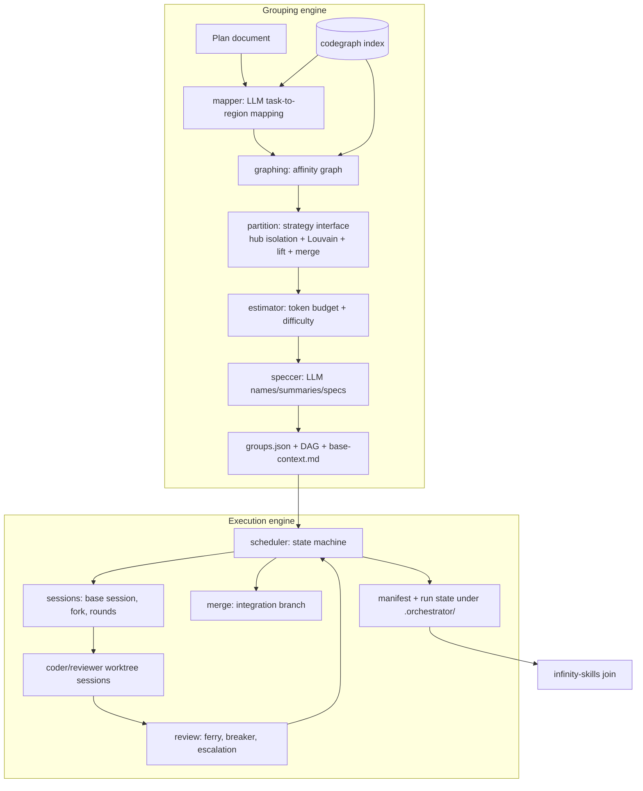
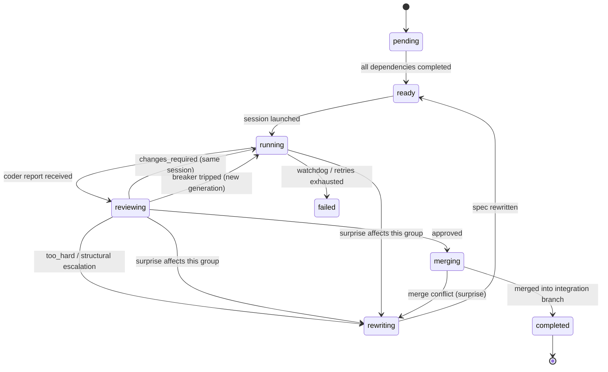
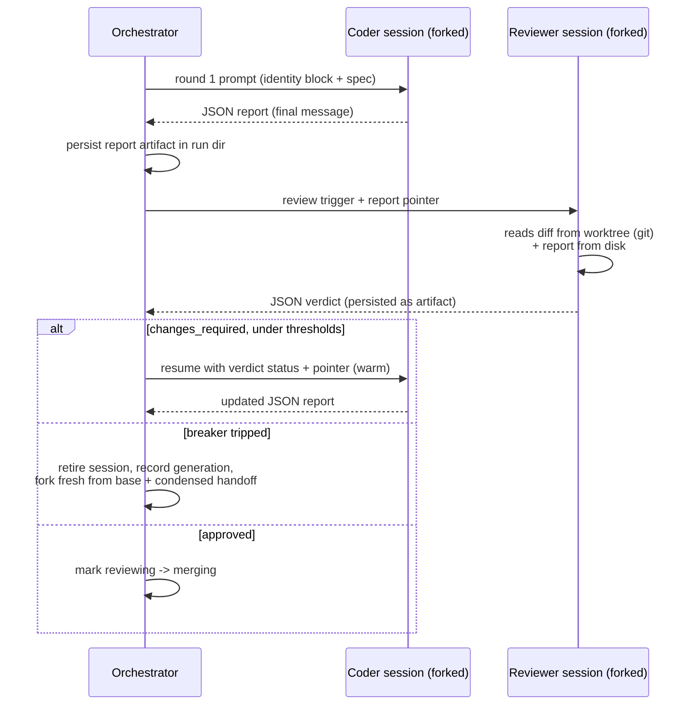

# feat: Multi-agent plan orchestrator

## Summary

Build a new `orchestrator/` Python package in this repo: a deterministic grouping engine (codegraph-fed affinity graph + ported CoCoder partitioning policies behind a pluggable strategy interface) and an execution engine that runs each group as a warm, forked `claude` CLI session with difficulty-scaled review (self-verify, paired reviewer, or paired plus an extra pass), a circuit breaker, and an analyzer-first run manifest. Ships as the `smart-mcps-orchestrate` console script; all orchestration tests run against a stubbed `claude` binary.

______________________________________________________________________

## Problem Frame

The origin document (see origin: docs/brainstorms/2026-07-15-multiagent-orchestrator-requirements.md) established the product shape: existing tools fail at granularity in opposite directions (monolithic vs over-fragmented), LLM-driven orchestration drifts and wastes tokens, and the infinity-skills analyzer needs stable joinable structure that no current tool emits. This plan turns those requirements into an implementation: what gets built, in what order, on which mechanics.

______________________________________________________________________

## Requirements

The plan implements origin R1–R21 in full; traceability is per-unit below. Plan-level additions:

- R22. The partitioning/grouping stage is swappable: partition strategies implement a small interface over generic graph shapes (nodes, weighted edges, node metadata → group mapping), so the grouper/splitter DAG can be replaced without touching the rest of the pipeline.
- R23. A deviations document (docs/research/design-deviations.md) records where the implementation departs from the three source documents (GENERAL_FLOW_MULTIAGENT.md, IMPLEMENTATION_FLOW_MULTIAGENT.md, CoCoder), including InfoMap's deferral, and is kept current during implementation.
- R24. The automated test suite spends zero LLM tokens: orchestration behavior is tested against a stubbed `claude` executable; live runs are manual verification.
- R25. A sequential execution mode runs groups one at a time in deterministic topological order over the same graph and lifecycle — selectable per run, intended as the first-debug mode.

______________________________________________________________________

## Key Technical Decisions

- **Worker rounds are blocking print-mode calls, not interactive background sessions.** Each round is one `claude -p` invocation — first round creates the session, later rounds `--resume` it — with `--output-format json`. Process exit is round completion (no polling, no mid-turn-resume hazard), and the JSON result carries usage metadata that feeds the circuit breaker. Resolves the origin's completion-detection question and its unverified `--bg` assumption; `--bg` is not used in v1.
- **Fork-first shared prefix.** The orchestrator builds one base session per run (loading the compiled base-context document), then forks it for every coder and reviewer session. Forking makes the shared prefix byte-identical including harness injections (git status, system reminders) that would differ across fresh sessions and silently break prompt-cache equality. The manifest records observed session IDs, so the analyzer join key holds whether or not fork honors pre-assigned UUIDs. Fork calls are serialized behind an orchestrator lock: Claude Code's session store has no documented locking or atomicity guarantees and practitioner reports show shared-state races under concurrent access (research 2026-07-15) — forking is fast, so serializing forks does not serialize the groups themselves.
- **The orchestrator ferries control, not content.** Round messages carry triggers, statuses, and artifact pointers only; heavy artifacts stay on disk. The coder's parsed report and the reviewer's verdict persist under the run directory; the reviewer computes the diff itself from the shared worktree and reads the report from disk. Artifact-centric systems (MetaGPT-style blackboards) outperform chat-ferrying on exactly this design's goals — token efficiency, cache-stable prompt templates, auditability (research 2026-07-15).
- **Clustering is networkx Louvain wrapped in CoCoder's policies; InfoMap is dropped for v1.** At 7–20 task nodes, flow-based community detection adds native dependencies (infomap/igraph/leidenalg) without quality gain; the levers that matter are the ported policies — hub isolation, lift-independent, size-bounded merging. InfoMap is recorded in the deviations doc as a future strategy behind the R22 interface. Porting note: CoCoder's `detect_roles()` labels in/out hubs inverted from its own docstrings — port behavior, not names.
- **Size-bounded merging is always on.** CoCoder gates `merge_small_groups` behind an env var, off by default; unbounded clustering output is exactly the over-fragmentation failure this system exists to prevent. The merge keeps CoCoder's two guards: dependency-direction respect and simulated-makespan no-regression.
- **Affinity edges come from real codegraph relations, not symbol-name cosine.** CoCoder's cosine weighting was a proxy needed because its code didn't exist yet at graph time. This system has real reference counts, call proximity, and impact overlap from codegraph — strictly better ground truth.
- **Merge policy: per-run integration branch.** Approved group branches merge into `orchestrator/run-<run_id>` in dependency order; a conflict escalates as a surprise (pausing dependents) rather than attempting auto-resolution. Final merge to the main branch is manual.
- **Worker permissions default to `--permission-mode acceptEdits` plus an explicit allowed-tools list.** Worktree isolation bounds the blast radius; per-run config can escalate. Workers must run fully headless — a permission prompt would stall a round until the watchdog trips.
- **Circuit breaker reads cumulative usage from CLI JSON output**, not from parsing session transcripts. Defaults (config-overridable): 120k context tokens per session, 3 coder↔reviewer rounds per generation, and a maximum of 3 generations per group — exceeding the cap fails the group and surfaces it to the operator instead of respawning.
- **Review intensity tiers from the difficulty score**: below `d_review` → coder self-verify only; between thresholds → paired reviewer; above `d_hard` → paired reviewer plus one mandatory extra verification round. Run- and group-level overrides.
- **Packaging follows the repo's existing pattern**: new top-level `orchestrator/` package added to the hatchling wheel, console script `smart-mcps-orchestrate`, one new dependency (`networkx`). Prompt templates ship as package data so plugin consumers get them.
- **All run artifacts live in the target repo under `.orchestrator/`** (manifest, run state, logs, compiled base context) — never under `~/.claude/projects/`, whose glob would ingest stray `.jsonl` files as malformed transcripts.

______________________________________________________________________

## High-Level Technical Design

Component and data flow:



Group lifecycle state machine (scheduler-owned):



Round loop for one group at paired-reviewer intensity:



______________________________________________________________________

## Output Structure

New package layout (per-unit `Files:` lists remain authoritative):

```text
orchestrator/
├── __init__.py
├── cli.py                 # group / run / status / resume commands
├── config.py              # config load, thresholds, weights, defaults
├── model.py               # Group, RunManifest, reports (pydantic) + JSON schemas
├── grouping/
│   ├── __init__.py
│   ├── mapper.py          # LLM task→region mapping + codegraph verification
│   ├── graphing.py        # affinity graph from codegraph output
│   ├── partition.py       # strategy interface + ported CoCoder policies
│   ├── estimator.py       # token budget + difficulty score
│   ├── speccer.py         # LLM group naming/summary/spec writer
│   └── base_context.py    # compiled base-context document assembly
├── execution/
│   ├── __init__.py
│   ├── sessions.py        # claude CLI wrapper: base session, fork, rounds, reports
│   ├── worktrees.py       # worktree lifecycle under <repo>/.worktrees/
│   ├── manifest.py        # manifest + run state persistence
│   ├── scheduler.py       # dependency state machine + async pool
│   ├── review.py          # review ferry, intensity, breaker, respawn, escalation
│   └── merge.py           # integration-branch merges
└── prompts/               # templates: identity block, coder, reviewer, mapper, speccer, handoff
tests/
├── fake_claude.py         # scripted stub `claude` executable
├── fixtures/              # codegraph outputs, toy plan docs, stub scripts
└── test_*.py              # per-unit test files listed below
```

______________________________________________________________________

## Implementation Units

### Phase A — Grouping engine

### U1. Partition core: ported CoCoder policies behind a strategy interface

- **Goal:** A pure library that turns a weighted task graph into bounded groups, with the partition strategy swappable.
- **Requirements:** Origin R3, R4, R5; R22.
- **Dependencies:** None.
- **Files:** `orchestrator/grouping/partition.py`, `tests/test_partition.py`.
- **Approach:** Define a `PartitionStrategy` protocol over generic shapes (node set, weighted directed edges, per-node metadata → node→group mapping). Default strategy ports CoCoder's pipeline: hub isolation by degree thresholding (correcting the inverted in/out-hub naming), networkx Louvain on the core subgraph (pinned seed — networkx shuffles node order by default, which would break determinism), lift-independent splitting, then always-on size-bounded merging with dependency-direction and simulated-makespan guards. Add explicit cycle detection on the resulting group DAG (CoCoder has none; cycles must fail loudly with the offending edges named). Estimator hooks (work per node, budget cap) are injected, not imported, to keep the module pure.
- **Patterns to follow:** docs/research/cocoder-analysis.md §3 and §7 — `detect_roles` (common.py:43-63, note the naming inversion), `lift_independent` (post_processing.py:36-105), `merge_small_groups` (post_processing.py:295-401), generic dict/set interfaces per the reusability assessment.
- **Test scenarios:**
  - Hub node touched by most tasks is isolated before clustering and reattached as its own group.
  - Sibling tasks sharing only a hub dependency are lifted into separate groups.
  - Merge combines small groups only when dependency direction allows and simulated makespan does not regress; a merge that would regress is refused.
  - Covers AE1: a fully cohesive graph under budget yields exactly one group.
  - Covers AE2: a graph over budget splits at the lowest-affinity boundary and every resulting group fits.
  - A dependency cycle in the group DAG raises an error naming the cycle members.
  - A second trivial strategy (e.g., single-group passthrough) plugs in via the protocol, proving R22.
- **Verification:** Unit tests pass; the module imports without networkx-unrelated dependencies; strategy swap requires no changes outside the strategy.

### U2. codegraph affinity adapter

- **Goal:** Build the weighted task-affinity graph from codegraph output for a set of task→region mappings.
- **Requirements:** Origin R2, R3.
- **Dependencies:** None (parallel with U1).
- **Files:** `orchestrator/grouping/graphing.py`, `tests/test_graphing.py`, `tests/fixtures/` (captured codegraph CLI outputs).
- **Approach:** Given each task's mapped code regions (files/symbols), query the codegraph CLI for callers/callees and impact, then compute pairwise task edges weighted by shared-file count, call-graph proximity, and impact overlap (weights configurable). Caller/callee queries always pass an explicit high `--limit` — the CLI defaults to 20 results, which would silently truncate hub fan-in counts; codegraph lives in this repo, so extend it directly when the adapter needs more than the CLI exposes. Emit the generic graph shapes U1 consumes plus per-node metadata the estimator needs (region source sizes, symbol counts, fan-in/out). Capture real codegraph output from this repo as fixtures.
- **Patterns to follow:** codegraph invocation per `skills/codegraph/` conventions; edge-weight rationale per docs/research/cocoder-analysis.md §7 point 3 (real edges over cosine proxy).
- **Test scenarios:**
  - Two tasks touching the same file get a shared-file edge; weight scales with overlap count.
  - Tasks whose regions call each other get a proximity edge; unrelated tasks get none.
  - Impact overlap between one task's write surface and another's read surface produces an edge.
  - Malformed or empty codegraph output fails with a clear error, not a silent empty graph.
- **Verification:** Fixture-driven tests pass; adapter output feeds U1 without shape adaptation.

### U3. Data models, token estimator, difficulty score

- **Goal:** The typed contract every stage shares: groups, manifest, reports, budgets, difficulty, intensity.
- **Requirements:** Origin R4, R5, R6, R15; R22.
- **Dependencies:** None (parallel with U1, U2).
- **Files:** `orchestrator/model.py`, `orchestrator/grouping/estimator.py`, `orchestrator/config.py`, `tests/test_estimator.py`, `tests/test_model.py`.
- **Approach:** Pydantic models: `Group` (id, name, summary, spec, difficulty, dependencies, verification items), `RunManifest` (run → groups → session entries with role, generation, retirement reason), coder report and reviewer verdict schemas (status, verification results, surprises). Token estimator: base-head tokens + spec tokens + mapped-region source bytes/4, times a slack multiplier, plus per-file tool-output allowance; budget default 100k. Difficulty: normalized weighted sum of files touched, max fan-in/out of touched symbols, hub touches, cross-group edges, verification-item count — weights and tier thresholds (`d_review`, `d_hard`) in config. Directional formulas; defaults tuned during implementation against real plans.
- **Patterns to follow:** Origin R6 field contract; schema sketches in GENERAL_FLOW_MULTIAGENT.md (starting points, not binding).
- **Test scenarios:**
  - Estimator flags a group over budget; under-budget groups pass.
  - Difficulty score orders an obviously-hard group (many hubs, wide impact) above an obviously-easy one.
  - Covers AE7 (mapping half): difficulty below `d_review` maps to self-verify intensity; above `d_hard` maps to reviewer-plus-extra-pass.
  - Manifest round-trips to JSON with multiple generations per group and retirement reasons intact.
  - Report/verdict schemas reject missing status or malformed surprises.
- **Verification:** All models serialize/deserialize losslessly; config defaults load without a config file present.

### U4. Grouper pipeline: LLM at the edges, dry-run command

- **Goal:** End-to-end grouping: plan document in → validated `groups.json` + DAG + compiled base context out, inspectable before any execution.
- **Requirements:** Origin R1, R2, R6.
- **Dependencies:** U1, U2, U3.
- **Files:** `orchestrator/grouping/mapper.py`, `orchestrator/grouping/speccer.py`, `orchestrator/grouping/base_context.py`, `orchestrator/prompts/` (mapper and speccer templates), `tests/test_grouper_pipeline.py`.
- **Approach:** Two LLM calls via `claude -p` with `--json-schema`: (1) mapper — plan tasks → code regions, each mapping verified against codegraph (hallucinated symbols dropped and flagged; unmappable tasks carried as region-less nodes with prose-affinity fallback); (2) speccer — group names, analyzer-facing summaries (short: downstream session titles cap at 120 chars), worker-facing specs, verification items. Between them, the deterministic core (U2 → U1 → U3) decides boundaries. `base_context.py` compiles the shared context document (repo conventions from CLAUDE.md/AGENTS.md, codegraph architecture summary, the plan document) byte-stably. Invalid LLM JSON retries with a corrective nudge, capped. Keep partition computation and execution strictly separate (CoCoder fused them; we deliberately do not).
- **Execution note:** Test-first on the pipeline seams — LLM calls stubbed, determinism asserted.
- **Patterns to follow:** docs/research/cocoder-analysis.md §8 points 1 and 7 (separate compute-partition from execute; deterministic spec-in); IMPLEMENTATION_FLOW_MULTIAGENT.md prompt sketches as prose inspiration.
- **Test scenarios:**
  - Covers AE1: a small cohesive plan produces exactly one group and the pipeline short-circuits cleanly.
  - Mapper output referencing a nonexistent symbol is dropped, flagged in the dry-run output, and the task still lands in a group.
  - Speccer JSON failing schema validation triggers a retry nudge; persistent failure aborts with the raw output saved for inspection.
  - Same plan + same fixtures → byte-identical `groups.json` and base-context document (determinism).
  - Summaries exceeding the length bound are rejected at validation, not truncated downstream.
- **Verification:** `smart-mcps-orchestrate group <plan.md> --dry-run` prints groups, DAG, estimates, and flags against a fixture plan using stubbed LLM calls.

### Phase B — Execution engine

### U5. Session runner, worktrees, manifest

- **Goal:** The claude CLI wrapper: fork-first sessions, blocking rounds, structured reports, worktrees, and the analyzer-facing manifest.
- **Requirements:** Origin R8, R9, R10, R11, R17, R18, R19; R24.
- **Dependencies:** U3.
- **Files:** `orchestrator/execution/sessions.py`, `orchestrator/execution/worktrees.py`, `orchestrator/execution/manifest.py`, `orchestrator/prompts/` (identity block, coder, reviewer, handoff templates), `tests/test_sessions.py`, `tests/fake_claude.py`.
- **Approach:** Preflight verifies the installed CLI supports the flags this design pins (`-p`, `--output-format json`, `--resume`, `--fork-session`, `--session-id`, `-n`) and fails with a versioned message otherwise. Base session per run loads the compiled base context; every coder/reviewer session forks from it. First worker prompt opens with the identity block — tag names checked against infinity-skills' injected-prefix patterns so the block is classified as a genuine goal, summary early (title cap), full spec after. Rounds are blocking `-p` calls; the final message must be the structured report; a missing or invalid report triggers a bounded re-nudge (CoCoder's silent-exit lesson), then marks the round failed. Usage accounting accumulates per session from CLI JSON. Worktrees live at `<repo>/.worktrees/<group_id>-<slug>/` (repo name stays a path substring — the analyzer allowlist silently drops sessions otherwise). A group's worktree branches from the current tip of the run's integration branch at the moment it transitions ready→running — never from the original launch ref — so dependents build on their upstreams' merged work. Manifest and logs under `.orchestrator/runs/<run_id>/`. **Spike first:** verify `--fork-session` semantics with `-p` and whether it honors `--session-id`; if not, record fork-assigned IDs in the manifest (join contract holds); if fork is unusable in print mode, fall back to fresh sessions with an identical compiled head and record the deviation in docs/research/design-deviations.md. Concurrent forking is out of scope by design — fork calls are always serialized (see the fork-first decision), so the spike does not need to test fork concurrency.
- **Technical design (directional):** identity block shape — `<run-manifest run_id=... group_id=... group_name=...><summary>...</summary></run-manifest>` followed by `<spec>...</spec>`; report shape — a `<run-report status=...>` fenced JSON block as the last assistant message; session display names — `<run_id>-<group_id>-<role>-g<generation>` via `-n`; parsed reports and verdicts persist under `.orchestrator/runs/<run_id>/groups/<group_id>/` as the artifacts that round triggers point to.
- **Patterns to follow:** docs/research/infinity-skills-analysis.md §6 recommendations 1–9 (each is a hard constraint here); docs/research/cocoder-analysis.md §8 point 5 (watchdogs for silent exits).
- **Test scenarios (against `fake_claude.py`):**
  - Fork path records parent base session and per-fork session IDs; every ID is unique across the run (UUID reuse would silently merge analyzer rows).
  - Covers AE6 (contract side): manifest contains every session with role, generation, name, summary; first-prompt block parses with the documented tags; worktree paths contain the repo directory name as a substring.
  - A round whose final message lacks a valid report block gets exactly N re-nudges, then fails the round.
  - Usage totals accumulate across rounds and are queryable per session.
  - Sessions launch with display names matching `<run_id>-<group_id>-<role>-g<generation>`.
  - Fork requests issued concurrently by the scheduler execute serially in the session runner.
  - Worktree create/cleanup is idempotent; cleanup refuses to delete a dirty worktree without an explicit flag.
- **Verification:** All session tests pass with zero live CLI calls; a manual smoke run against the real CLI creates a session, forks it, and round-trips a report.

### U6. Scheduler and run core

- **Goal:** Dependency-aware execution: parallel independent groups, incremental readiness, crash-resumable run state, stall watchdogs.
- **Requirements:** Origin R7.
- **Dependencies:** U3, U5.
- **Files:** `orchestrator/execution/scheduler.py`, `tests/test_scheduler.py`.
- **Approach:** In-process asyncio state machine over the group DAG (states per the lifecycle diagram). Readiness updates incrementally on completion via a reverse-dependency map (CoCoder's `shared_task_list` design, minus the file lock — single orchestrator process owns state). Run state persists to `.orchestrator/runs/<run_id>/state.json` after every transition; `resume` reconstructs from state + manifest and re-enters warm sessions. The state file records live worker subprocess PIDs; resume verifies and terminates any surviving orphan subprocess for a session before issuing a new round against it. Execution mode is pluggable: sequential mode (flag or config) runs the same scheduler with effective concurrency 1 and deterministic topological launch order — the intended first-debug mode. Per-round subprocess timeout plus a global no-progress watchdog (nothing running, nothing ready, run not complete → abort with diagnostics). Concurrency cap in config (default 3) to respect subscription rate limits.
- **Patterns to follow:** Origin flow F1; docs/research/cocoder-analysis.md §5 and §8 point 4 (incremental readiness, reactive not one-shot topo sort) and point 5 (deadlock watchdog).
- **Test scenarios:**
  - Independent groups run concurrently up to the cap; a dependent group launches only after its upstream completes.
  - Killing the orchestrator mid-run and resuming continues from persisted state without relaunching completed groups.
  - Resume while a round was in flight terminates the orphaned subprocess before re-entering that session.
  - Covers R25: sequential mode runs groups strictly one at a time in topological order even when several are ready.
  - A round exceeding the subprocess timeout fails that round and surfaces the group as stalled.
  - No-progress watchdog aborts a wedged run with the blocked groups named.
  - Covers AE5 (wait half): a dependent group stays pending while its upstream is rewriting.
- **Verification:** Scheduler tests pass against stub sessions; state file inspection shows transitions in order.

### U7. Review loop, circuit breaker, adaptation

- **Goal:** The warm coder↔reviewer ferry with tiered intensity, generation-tracked respawns, and surprise-driven replanning.
- **Requirements:** Origin R12, R13, R14, R15, R16.
- **Dependencies:** U5, U6, U4 (speccer re-invocation).
- **Files:** `orchestrator/execution/review.py`, `tests/test_review_loop.py`.
- **Approach:** After a coder report, route by intensity: self-verify (no reviewer session), paired review, or paired plus one mandatory extra round. Review triggers carry pointers, not payloads: the reviewer session runs in the group's worktree with full repo and codegraph access, computes the diff itself from git, and reads the coder's persisted report from the run directory. On `changes_required`, resume the same coder session with the verdict status plus a pointer to the persisted verdict. Breaker: per-session token threshold or per-generation round threshold trips → retire the session (reason recorded), condense state into a handoff (last report, outstanding verdict items, diff summary), fork a fresh session from base, increment generation. The generation cap (default 3) bounds respawns — exceeding it transitions the group to failed and surfaces it to the operator. `too_hard` or structural verdicts escalate: the group moves to rewriting and the speccer re-runs with the surprise context; surprises naming other groups mark unfinished dependents for rewrite before launch, and pending surprises are checked before an `approved` verdict is accepted — a group already in review when a surprise names it moves to rewriting instead of merging. Completed groups are never rewritten.
- **Patterns to follow:** Origin flows F2–F4; docs/research/cocoder-analysis.md §8 point 6 (spend judge effort at plan level; per-round review here is deliberately bounded by the breaker).
- **Test scenarios:**
  - Covers AE3: `changes_required` under thresholds resumes the same session — no new manifest entry.
  - Covers AE4: exceeding the round threshold creates a generation-2 session; the manifest shows generation 1 with its retirement reason.
  - Token threshold trips independently of round count.
  - Exceeding the generation cap marks the group failed instead of spawning another generation.
  - A surprise naming a group that is mid-review moves it to rewriting; its pending approval is not accepted.
  - Covers AE7: a below-`d_review` group runs with no reviewer session created.
  - Covers AE5: an upstream surprise naming a dependent rewrites that dependent's spec before it launches.
  - `too_hard` from the reviewer moves the group to rewriting instead of another round.
- **Verification:** Review-loop tests pass against scripted stub scenarios (approve, reject-then-approve, reject-forever, surprise, too-hard).

### U8. Integration merges

- **Goal:** Approved groups land on a per-run integration branch in dependency order; conflicts become surprises.
- **Requirements:** Origin R7 (completion semantics); the Merge-policy Key Technical Decision (per-run integration branch).
- **Dependencies:** U6, U7.
- **Files:** `orchestrator/execution/merge.py`, `tests/test_merge.py`.
- **Approach:** Create `orchestrator/run-<run_id>` from the launch ref. On group approval, merge its worktree branch in dependency order. A clean merge marks the group completed and schedules worktree cleanup; a conflict escalates as a surprise against the conflicting group (pause dependents, route to rewriting/operator). Never merges to the main branch.
- **Test scenarios (git fixture repos):**
  - Two independent approved groups merge in dependency order; the integration branch contains both.
  - A conflicting merge leaves the integration branch untouched, escalates a surprise naming both groups, and pauses dependents.
  - Worktree cleanup runs only after a successful merge.
  - A dependent group's worktree branches from the integration-branch tip and contains its approved upstream's merged changes.
- **Verification:** Merge tests pass on scripted git fixtures; a manual run shows the integration branch assembled correctly.

### Phase C — Product surface

### U9. CLI, config, packaging

- **Goal:** The installable product: commands, config surface, wheel packaging.
- **Requirements:** Origin R20, R21.
- **Dependencies:** U4, U6, U7, U8.
- **Files:** `orchestrator/cli.py`, `orchestrator/config.py`, `pyproject.toml`, `tests/test_cli.py`.
- **Approach:** Commands: `group` (dry-run grouping), `run` (full orchestration), `status` (run state), `resume`. Flags override config: review intensity, token budget, concurrency, `--sequential` execution mode, permission mode. Config resolution: CLI flags > `.orchestrator/config.toml` in the target repo > defaults. pyproject: add `orchestrator` to wheel packages, `smart-mcps-orchestrate = "orchestrator.cli:main"` script, `networkx` dependency. Everything runs through the `claude` CLI on the subscription — no Anthropic API client anywhere.
- **Patterns to follow:** Existing `smart-mcps-codegraph` script wiring in pyproject.toml; repo conventions (Python 3.12, ruff line 100).
- **Test scenarios:**
  - `group --dry-run` on a fixture plan prints groups and estimates without touching sessions.
  - Flag > config-file > default precedence resolves as documented.
  - Unknown plan path or missing codegraph index fails with actionable errors.
- **Verification:** `uv run smart-mcps-orchestrate --help` works from a clean checkout; `uv build` succeeds with the new package included.

### U10. End-to-end stub harness and documentation

- **Goal:** Prove the full loop against a scripted `claude` stub, and keep the documentation contract.
- **Requirements:** R23, R24; origin AE1–AE7 at contract level.
- **Dependencies:** U9.
- **Files:** `tests/fake_claude.py` (extended scenarios), `tests/test_e2e_stub.py`, `tests/fixtures/` (toy target repo + plan), `orchestrator/README.md`, `docs/research/design-deviations.md`.
- **Approach:** The stub `claude` speaks the real CLI surface used by U5 (session files, JSON output with usage fields, resume/fork behavior) and plays scripted scenarios: happy path, review rejection, breaker trip, surprise, merge conflict. One E2E test drives `run` on a toy fixture repo through grouping (stubbed LLM), execution, review, and merge, then asserts the manifest, worktree paths, and first-prompt blocks satisfy the analyzer contract. README documents commands, config, and the run-artifact layout. Update the deviations doc with anything implementation taught us (fork fallback, threshold defaults).
- **Test scenarios:**
  - Full-run E2E: fixture plan → groups → sessions → review → merge → manifest, all offline.
  - Covers AE6 (contract level): the finished run's manifest joins every session ID to a transcript path the stub produced, with names/summaries present.
  - Each scripted failure scenario (rejection, breaker, surprise, conflict) ends in the documented terminal state.
- **Verification:** E2E suite green offline; one manual live smoke run on a small real plan before calling the phase done.

### Phase D — Human-in-the-loop escalation

Added after Phases A–C shipped (2026-07-16). A run gains an **escalation channel** and an **intensity policy**, threaded through the review loop as an optional injected seam — absent it, behavior is identical to Phase C. Full design in the Phase D plan; summary of units:

- **U11. Escalation contracts, config, policy.** `CoderReport` gains `needs_input` status + `question` (validated); `EscalationKind`/`HumanAction`/`EscalationRequest`/`EscalationResponse` models; `EscalationConfig` (off by default) on `OrchestratorConfig`; pure `EscalationPolicy.should_escalate` tier matrix (`autonomous` < `on_failure` < `on_stuck` < `interactive`; `orchestrator_only` suppresses the coder-question channel).

- **U12. Broker + event log.** `EscalationBroker.raise_escalation` writes `escalations/request-<id>.json` (atomic), polls for the response, unblocks promptly on a run-wide abort, and falls back on timeout per `on_timeout`. `RunPaths.escalations_dir`, `log_event` to `logs/run.log`, `pending_escalations`.

- **U13. Review-loop wiring.** `ReviewDeps.broker`/`policy` (defaulted `None` → the 15 existing review-loop tests unchanged). Trigger points wrapped: `needs_input`→coder-question (answer resumes warm, uncounted by the breaker), `blocked`/`failed`→coder-blocked, reviewer `too_hard`/`structural`, merge conflict, and the generation/rewrite cap→`caps_exhausted` (answer grants one more, guided). `answer` folds guidance into rewrites as an `[operator]` surprise; `skip`→`GroupFailure`; `abort`→new `RunAbort`. `interactive` adds group-start/respawn/merge approval gates. `render_coder_answer_prompt` + `prompts/answer`.

- **U14. CLI, supervision, E2E, docs.** `--hitl`/`--intensity`/`--escalation-source`/`--escalation-timeout`; broker+policy wired into `_cmd_run`; `RunAbort` → resumable non-zero exit; new `answer` subcommand; `status` lists pending escalations. E2E HITL scenario (scripted operator answers a coder question, skips a `too_hard` group) plus an autonomous-stays-headless guard. README HITL section, deviations doc, this append.

- **Verification:** `uv run pytest` green offline (190 pre-Phase-D tests unchanged as the injected-seam regression guard, plus `test_escalation.py`, extended `test_review_loop.py`/`test_cli.py`/`test_e2e_stub.py`); `--hitl` off ⇒ byte-identical autonomous behavior; `uv build` succeeds. Live smoke: a small real plan under `run --hitl --sequential`, driving one genuine coder `needs_input` (answer) and one reviewer `too_hard` (skip) through the main-session supervision loop.

______________________________________________________________________

## Scope Boundaries

Carried from origin: no plan authoring, no persona-swarm review, no API server, no cross-run learning, no non-Claude runtimes.

### Deferred to Follow-Up Work

- infinity-skills-side changes: `run_id`/`group_id`/`group_name` columns and manifest-join ingestion (separate work in that repo; the manifest contract here is designed for it).
- InfoMap/Leiden partition strategies behind the R22 interface, if group quality ever warrants them (rationale recorded in docs/research/design-deviations.md).
- Interactive `--bg` worker mode and a fork-vs-compiled-head cache benchmark beyond the v1 spike.
- PR creation / main-branch automation on top of the integration branch.
- Cross-repo runs (one target repo per run in v1).

______________________________________________________________________

## System-Wide Impact

- **Plugin consumers inherit the new package.** `.mcp.json` runs `uv run --project ${CLAUDE_PLUGIN_ROOT}` for the codegraph server, which resolves this project's full dependency set — adding `networkx` and the `orchestrator` package grows every consumer's environment even if they never run the orchestrator. Acceptable (networkx is pure Python, small); noted so a future dependency heavier than networkx triggers a packaging split discussion.
- **Existing packages are untouched.** `codegraph_mcp/` and `pplx/` see no code changes; the only shared file modified is `pyproject.toml` (U9). Plugin version bump on release per repo convention.
- **Target repos gain dot-directories.** Runs create `.orchestrator/` and `.worktrees/` in the target repo; both need `.gitignore` guidance in the README (U10) so run artifacts never land in consumer commits.

______________________________________________________________________

## Risks & Dependencies

- **`--fork-session` semantics in print mode are unverified** (with `--resume` and `--session-id` interplay). Mitigated: U5 starts with a spike; fallback (fresh sessions with identical compiled head) is designed in and would be recorded as a deviation. This is the plan's main mechanical unknown.
- **CLI flag drift across Claude Code versions.** Flags were verified against the installed CLI on 2026-07-15; U5's preflight check turns silent breakage into a clear error.
- **Prompt-cache TTL bounds the fork win.** Cache reuse across siblings requires launches within the TTL window; the concurrency cap plus launch batching preserves most of the benefit. Cost risk, not correctness.
- **Grouper LLM quality on fuzzy plans.** Mitigated by codegraph verification of mappings, schema validation with bounded retries, and the dry-run command as a human checkpoint before execution.
- **Headless permissions.** `acceptEdits` may still prompt on non-edit tools; the allowed-tools list needs tuning during implementation. Escalation to permission bypass is config-gated and bounded by worktree isolation.
- **Subscription rate limits** under parallel workers — concurrency cap default 3, configurable.
- **Dependency footprint:** one new runtime dependency (networkx); the stub-based test suite keeps CI free of CLI/token requirements.

______________________________________________________________________

## Open Questions

Deferred to implementation (none block the plan):

- Exact `--fork-session`/`--session-id` behavior and the JSON usage field names — resolved by the U5 spike.
- Whether `--json-schema` combines with `--resume` on the installed version (mapper/speccer degrade to prompt-enforced JSON + validation retries if not).
- Default tuning: difficulty weights, tier thresholds, token budget, breaker thresholds — after the first real runs.
- Condensed-handoff content shape for generation respawns — tuned once real failure transcripts exist.

______________________________________________________________________

## Sources & Research

- Origin: docs/brainstorms/2026-07-15-multiagent-orchestrator-requirements.md (R1–R21, F1–F4, AE1–AE7 all carried; AE trace via `Covers AE<N>` in unit test scenarios).
- docs/research/cocoder-analysis.md — partition port targets with file:line pointers; scheduler and watchdog designs; the `detect_roles` naming inversion; review-at-plan-level lesson.
- docs/research/infinity-skills-analysis.md — the analyzer contract: first-prompt identity block (injected-prefix collision check, 120-char title cap), worktree path substring rule, manifest as the only cross-session join, final-message report as outcome signal, UUID-reuse hazard.
- docs/research/design-deviations.md — living record of departures from the three source documents (R23).
- GENERAL_FLOW_MULTIAGENT.md, IMPLEMENTATION_FLOW_MULTIAGENT.md — schema and prompt starting points; superseded where the deviations doc says so.
- CLI capability verification (2026-07-15, installed `claude`): `-p/--print`, `--output-format json`, `--json-schema`, `--resume`, `--fork-session`, `--session-id`, `-n/--name`, `--bg` (unused in v1), `--permission-mode`, `--allowedTools`, `--append-system-prompt`, `--add-dir`.
