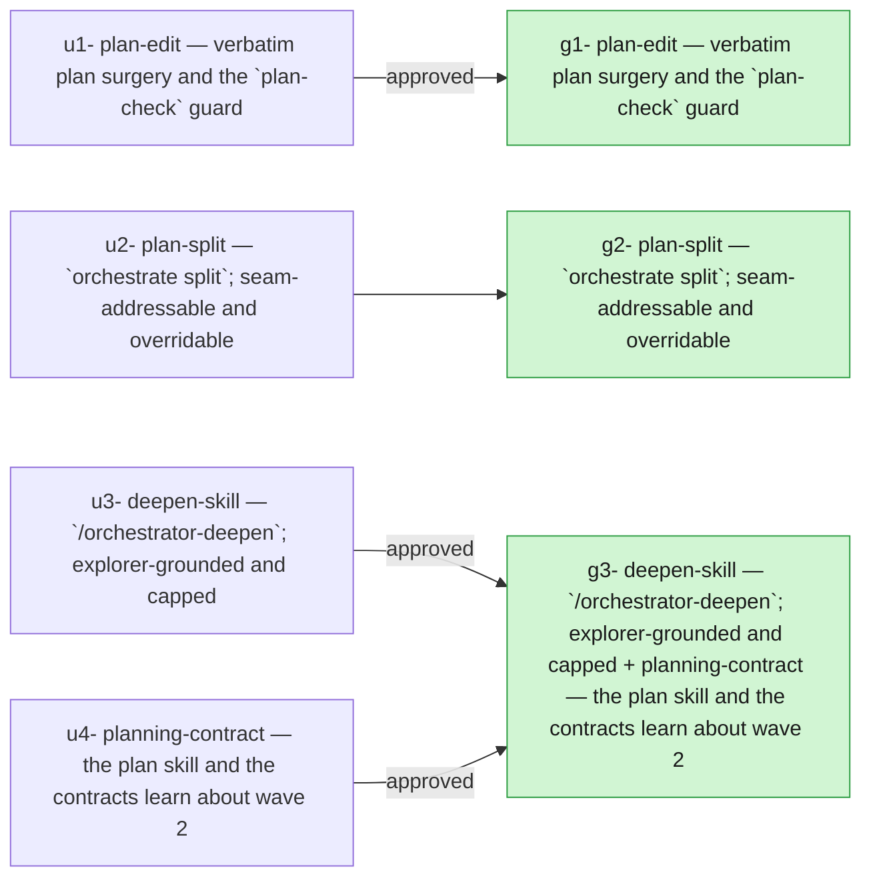

## 2026-08-29 — r20260829-162627 — Mechanical plan split and the deepen skill

- **Outcome**: 3/3 groups completed, 4/4 units landed (`state.json`)
- **Scope**: 13 files changed, +1874/-10 lines (`5eca4f14..a76fec68`)
- **Cost**: 677271 tokens (+20700628 cache-read) across 5 session(s) (sonnet=677271) (`manifest.json`)

### g1: plan-edit — verbatim plan surgery and the `plan-check` guard — state: completed
- **Summary**: Implemented orchestrator/grouping/plan_edit.py as the single verbatim-surgery module: extract_task_map_entries/render_task_map_block for byte-exact task-map entry slicing, split_units for byte-exact unit-section slicing, validate_plan for… (`g1`)
- **Verification**: 5/5 pass (`g1`)
- **Verdict**: approved (`g1`)
- **Surprises**: none recorded (`g1`)
- **Required changes**: none (`g1`)
- **Escalations**: none (`g1`)
- **Tokens**: 262985 tokens (+6106951 cache-read) across 2 session(s) (sonnet=262985) (`g1`)
- **Elapsed**: 12m (`g1`)

| item | status | evidence |
| --- | --- | --- |
| g1-1 | pass | test_all_units_reassembled_yield_byte_identical_map_and_sections + test_real_plan_round_trips_byte_identical (36-unit real plan) |
| g1-2 | pass | test_accepts_added_bullets_inside_a_unit_body, test_rejects_and_names_altered_depends_on_size_hints_and_task_id |
| g1-3 | pass | test_reports_all_three_altered_entries_in_one_call, test_reports_three_separately_altered_entries |
| g1-4 | pass | test_exits_zero_on_well_formed_plan, test_exits_nonzero_naming_offending_unit_missing_section, test_exits_nonzero_naming_offending_unit_missing_map_entry |
| g1-5 | pass | test_completes_under_a_second_on_the_repos_largest_plan (~0.8ms), test_never_touches_codegraph_or_llm |

### g2: plan-split — `orchestrate split`, seam-addressable and overridable — state: completed
- **Summary**: Implemented `orchestrate split`: added `assign_tasks`, `split_plan`, `add_frontmatter_field`, and `add_predecessor_note` to `orchestrator/grouping/plan_edit.py` for verbatim, byte-safe plan partitioning; added `finding_task_groups` to `orchestrator/grouping/advisory.py`… (`g2`)
- **Verification**: 7/7 pass (`g2`)
- **Surprises**: none recorded (`g2`)
- **Required changes**: none (`g2`)
- **Escalations**: none (`g2`)
- **Tokens**: 195802 tokens (+7991832 cache-read) across 1 session(s) (sonnet=195802) (`g2`)
- **Elapsed**: 10m (`g2`)

| item | status | evidence |
| --- | --- | --- |
| g2-1 | pass | Manually verified _print_advisory_report numbers every finding stably across two calls on the same report and prints task_sets (disconnected) or the tasks_before/tasks_after cut (serial). |
| g2-2 | pass | tests/test_plan_split.py::TestSplitPlan::test_two_way_split_is_byte_identical_combined and test_no_unit_lost_or_duplicated verify combined task ids/unit ids equal the original's with no loss/duplication, and each entry's/section's bytes are found verbatim in its document. |
| g2-3 | pass | test_tasks_overrides_seam_when_both_given confirms --tasks wins when both flags are given. |
| g2-4 | pass | assign_tasks raises naming every unassigned and doubly-assigned task id in one error; test_missing_or_double_assigned_tasks_named_and_rejected and TestAssignTasks cover both cases plus combined. |
| g2-5 | pass | test_produced_documents_pass_plan_check and test_produced_documents_price_under_cap run `plan-check` and `group --price` against split output documents. |
| g2-6 | pass | test_serial_seam_writes_predecessor_note_only_on_downstream confirms the note appears only in part2, referencing part1's filename. |
| g2-7 | pass | test_original_plan_text_is_never_mutated and the CLI tests assert the source plan's bytes are unchanged after a split. |

### g3: deepen-skill — `/orchestrator-deepen`, explorer-grounded and capped + planning-contract — the plan skill and the contracts learn about wave 2 — state: completed
- **Summary**: Implemented U3 (deepen-skill) and U4 (planning-contract) for group g3. Confirmed via new tests in tests/test_plan_sections.py that Edge cases/Non-goals/Run:/Pass: bullets already… (`g3`)
- **Verification**: 12/12 pass (`g3`)
- **Verdict**: approved (`g3`)
- **Surprises**: none recorded (`g3`)
- **Required changes**: none (`g3`)
- **Escalations**: none (`g3`)
- **Tokens**: 218484 tokens (+6601845 cache-read) across 2 session(s) (sonnet=218484) (`g3`)
- **Elapsed**: 9m (`g3`)

| item | status | evidence |
| --- | --- | --- |
| g3-1 | pass | test_known_fields_unchanged_by_new_bullets in tests/test_plan_sections.py |
| g3-2 | pass | test_digest_carries_only_tagged_summary_no_edge_case_text and test_new_bullets_appear_verbatim_in_assembled_group_spec |
| g3-3 | pass | TestRunPassVerificationBullet in tests/test_plan_sections.py |
| g3-4 | pass | SKILL.md Phase 3 + Non-negotiable rules |
| g3-5 | pass | SKILL.md Phase 4 + explorer-prompt.md step 5 |
| g3-6 | pass | SKILL.md Phase 4 + Non-negotiable rules |
| g3-7 | pass | explorer-prompt.md step 2 lists all ten categories; step 3 restricts reporting to fired ones |
| g3-8 | pass | grep confirms 'wave-2'/'does not exist yet' sentence removed; Phase 7 now offers split and prints deepen command |
| g3-9 | pass | unit template gains optional Edge cases / Non-goals slots and Run:/Pass: convention note |
| g3-10 | pass | new 'split and plan-check' section in docs/orchestrator-grouping.md |
| g3-11 | pass | new 'Mechanical split' section in docs/orchestrator-task-map.md |
| g3-12 | pass | verified group/run/split/plan-check --help output matches every command/flag named in the three docs |

## Diagrams

### Plan → outcome

## ADR delta

- **ADR delta**: no ADR changes (`5eca4f14..a76fec68`)
