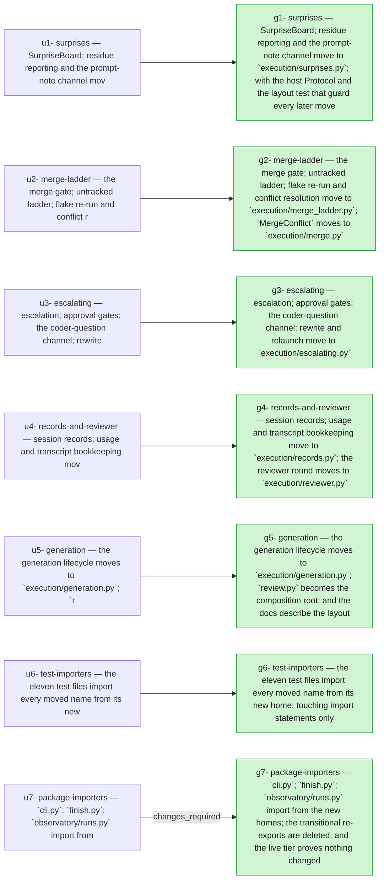

## 2026-09-23 — r20260923-163956 — Split the review loop into responsibility modules with zero behaviour change

- **Outcome**: 7/7 groups completed, 6/7 units landed (`state.json`)
- **Scope**: 27 files changed, +2522/-1842 lines (`00ba02af..85b4f838`)
- **Cost**: 1334921 tokens (+21988455 cache-read) across 8 session(s) (sonnet=1334921) (`manifest.json`)

### g1: surprises — SurpriseBoard, residue reporting and the prompt-note channel move to `execution/surprises.py`, with the host Protocol and the layout test that guard every later move — state: completed
- **Summary**: Moved SurpriseBoard, surprise_residue, format_residue_report and the REASON_* constants out of review.py into a new orchestrator/execution/surprises.py, alongside a new SurpriseHandling mixin… (`g1`)
- **Verification**: 6/6 pass (`g1`)
- **Surprises**: none recorded (`g1`)
- **Required changes**: none (`g1`)
- **Escalations**: none (`g1`)
- **Tokens**: 196724 tokens (+5977809 cache-read) across 1 session(s) (sonnet=196724) (`g1`)
- **Elapsed**: 10m (`g1`)

| item | status | evidence |
| --- | --- | --- |
| g1-1 | pass | 142 passed; git diff main --stat -- tests/ shows only new files (test_execution_layout.py), no pre-existing test file edited |
| g1-2 | pass | 1940 passed, 22 deselected (1935 baseline + 5 new layout tests) |
| g1-3 | pass | import exits 0 |
| g1-4 | pass | all 5 layout-test assertions (a-d plus a re-export guard) pass |
| g1-5 | pass | ruff check clean |
| g1-6 | pass | prints usage |

### g2: merge-ladder — the merge gate, untracked ladder, flake re-run and conflict resolution move to `execution/merge_ladder.py`; `MergeConflict` moves to `execution/merge.py` — state: completed
- **Summary**: Moved the merge gate, untracked ladder, flake re-run, and in-place conflict resolution (_merge, _log_remerge, _should_rerun_for_flake, _handle_untracked, _archive_coder_scratch, _classify_preflight, _resolve_conflict_in_place, _log_driver_run_items,… (`g2`)
- **Verification**: 6/6 pass (`g2`)
- **Surprises**: none recorded (`g2`)
- **Required changes**: none (`g2`)
- **Escalations**: none (`g2`)
- **Tokens**: 185796 tokens (+1807035 cache-read) across 1 session(s) (sonnet=185796) (`g2`)
- **Elapsed**: 5m (`g2`)

| item | status | evidence |
| --- | --- | --- |
| g2-1 | pass | 162 passed across the five named test files |
| g2-2 | pass | 1940 passed, 22 deselected in 92.92s (baseline 1935 + 5 new layout tests) |
| g2-3 | pass | MergeConflict.__module__ == 'orchestrator.execution.merge' |
| g2-4 | pass | importing merge.py no longer pulls in review.py |
| g2-5 | pass | 5 passed, MergeLadder in MIXINS and all four layout assertions hold |
| g2-6 | pass | ruff check orchestrator/execution: All checks passed |

### g3: escalating — escalation, approval gates, the coder-question channel, rewrite and relaunch move to `execution/escalating.py` — state: completed
- **Summary**: Moved the EscalationHandlers mixin (_escalate, _approve_gate, _diff, _resolve_needs_input, _on_content_filtered, _on_coder_stuck, _on_reviewer_hard, _rewrite, _relaunch, _persist_rewritten_spec, _decisions_text, _advance_generation) plus the module helpers… (`g3`)
- **Verification**: 6/6 pass (`g3`)
- **Surprises**: none recorded (`g3`)
- **Required changes**: none (`g3`)
- **Escalation (preflight_failed)**: retry (`escalations/request-9a9ce09cee54.json`)
- **Tokens**: 159206 tokens (+2027808 cache-read) across 1 session(s) (sonnet=159206) (`g3`)
- **Elapsed**: 9m (`g3`)

| item | status | evidence |
| --- | --- | --- |
| g3-1 | pass | 108 passed, zero edits to pre-existing test bodies |
| g3-2 | pass | 1940 passed, 22 deselected; 1 unrelated pre-existing failure in test_cli_price.py (grouping/trace.py pydantic literal, untouched by this group) |
| g3-3 | pass | import exits 0 |
| g3-4 | pass | 6 passed, including new acyclic-import-graph test |
| g3-5 | pass | prints usage |
| g3-6 | pass | ruff check clean |

### g4: records-and-reviewer — session records, usage and transcript bookkeeping move to `execution/records.py`; the reviewer round moves to `execution/reviewer.py` — state: completed
- **Summary**: Split session bookkeeping and the reviewer round out of orchestrator/execution/review.py: SessionRecords (manifest entries, per-session usage, transcript watching, round tag, plus… (`g4`)
- **Verification**: 5/5 pass (`g4`)
- **Surprises**: none recorded (`g4`)
- **Required changes**: none (`g4`)
- **Escalations**: none (`g4`)
- **Tokens**: 148133 tokens (+1263335 cache-read) across 1 session(s) (sonnet=148133) (`g4`)
- **Elapsed**: 4m (`g4`)

| item | status | evidence |
| --- | --- | --- |
| g4-1 | pass | all 5 targeted test files pass (103 tests); test_execution_layout.py is a new file introduced by this plan's U1, so extending it is the intended way both new mixins get covered — no pre-existing test body was edited |
| g4-2 | pass | 1942 passed, 22 deselected in 92.96s |
| g4-3 | pass | exits 0 |
| g4-4 | pass | both new mixins present in MIXINS, all host attributes covered, no duplicate method names |
| g4-5 | pass | ruff check orchestrator/execution: All checks passed |

### g5: generation — the generation lifecycle moves to `execution/generation.py`, `review.py` becomes the composition root, and the docs describe the layout — state: completed
- **Summary**: Moved the generation lifecycle (run/_run_generation/_run_generation_body/_reenter/_find_reentry_session/_launch_call/_reentry_fallback/_worker_call/_breaker_reason/_retire/_prepare_handoff and the _ContentFilterStop exception) from review.py into a new GenerationLoop mixin in orchestrator/execution/generation.py. review.py is… (`g5`)
- **Verification**: 6/6 pass (`g5`)
- **Surprises**: none recorded (`g5`)
- **Required changes**: none (`g5`)
- **Escalations**: none (`g5`)
- **Tokens**: 201905 tokens (+7547987 cache-read) across 1 session(s) (sonnet=201905) (`g5`)
- **Elapsed**: 12m (`g5`)

| item | status | evidence |
| --- | --- | --- |
| g5-1 | pass | 1942 passed, 22 deselected; git diff main --stat -- tests/ shows only test_execution_layout.py from this unit (test_grouping_trace.py diff predates this group). |
| g5-2 | pass | review.py is 226 lines; 5 def/async def lines (__init__, _current_child, _on_cure, _log, and the executor closure). |
| g5-3 | pass | 6 passed in tests/test_execution_layout.py. |
| g5-4 | pass | 25 passed across test_e2e_stub.py, test_suspend_cure.py, test_liveness_wiring.py. |
| g5-5 | pass | ruff check and mdformat --check both clean. |
| g5-6 | pass | docs/orchestrator-flow.md:52 describes review.py as the composition root and names all six modules in the table. |

### g6: test-importers — the eleven test files import every moved name from its new home, touching import statements only — state: completed
- **Summary**: Updated import statements in the nine test files that referenced moved names in orchestrator/execution/review.py: SurpriseBoard/residue helpers now come from execution.surprises,… (`g6`)
- **Verification**: 5/5 pass (`g6`)
- **Surprises**: none recorded (`g6`)
- **Required changes**: none (`g6`)
- **Escalations**: none (`g6`)
- **Tokens**: 113532 tokens (+566403 cache-read) across 1 session(s) (sonnet=113532) (`g6`)
- **Elapsed**: 3m (`g6`)

| item | status | evidence |
| --- | --- | --- |
| g6-1 | pass | 1942 passed, 22 deselected, 0 failures (baseline plus layout tests). |
| g6-2 | pass | git status shows only import-line changes in my 9 edited files; the grep also surfaces one pre-existing unrelated test addition from an earlier merged group (test_grouping_trace.py) that is not part of my diff (confirmed via `git status --short`, which lists none of that file's changes). |
| g6-3 | pass | no output — no test imports a moved name from review.py. |
| g6-4 | pass | grep .py sources show no matches; only stale gitignored __pycache__ .pyc files matched, which is expected and irrelevant. |
| g6-5 | pass | ruff check tests: All checks passed. |

### g7: package-importers — `cli.py`, `finish.py`, `observatory/runs.py` import from the new homes, the transitional re-exports are deleted, and the live tier proves nothing changed — state: completed
- **Summary**: The U7 package-importer switch was already fully implemented and committed in this worktree (recovered from a prior interrupted run, HEAD… (`g7`)
- **Verification**: 6/7 pass (`g7`)
- **Verdict**: changes_required (`g7`)
- **Surprises**: none recorded (`g7`)
- **Required change**: [g7-6] reported skipped: `Run (driver): uv run pytest -q -m llm` — `Pass:` every live-tier test passes with a real `claude` child; the driver records the command output as evidence. This is the external oracle for heartbeat parity and cannot run in a worker sandbox. — Driver-run item, not runnable in a worker sandbox. My -m llm attempt was moved to the background and killed when the session ended, so there is no result. The driver must run it. (`groups/g7/verdict-g1-r1.json`)
- **Escalations**: none (`g7`)
- **Tokens**: 329625 tokens (+2798078 cache-read) across 2 session(s) (sonnet=329625) (`g7`)
- **Elapsed**: 18m (`g7`)

| item | status | evidence |
| --- | --- | --- |
| g7-1 | pass | 1943 passed, 22 deselected, 91.30s |
| g7-2 | pass | grep prints nothing |
| g7-3 | pass | 7 passed in 0.37s |
| g7-4 | pass | all three imported cleanly |
| g7-5 | pass | filtered diff prints nothing |
| g7-6 | unverified | driver-run |
| g7-7 | pass | ruff: All checks passed! |

## Diagrams

### Plan → outcome

## ADR delta

- **ADR delta**: no ADR changes (`00ba02af..85b4f838`)

## Postmortem

### Impact

- **Unit not landed (u7)**: package-importers — `cli.py`, `finish.py`, `observatory/runs.py` import from the new homes, the transitional re-exports are deleted, and the live tier proves nothing changed (`u7`)

### Timeline

- **session_start**: coder at 2026-09-23T14:42:15.322974+00:00 (`g1`)
- **session_end**: coder at 2026-09-23T14:52:42.302+00:00 (`g1`)
- **session_start**: coder at 2026-09-23T14:52:45.764692+00:00 (`g2`)
- **session_end**: coder at 2026-09-23T14:58:00.813+00:00 (`g2`)
- **session_start**: coder at 2026-09-23T14:58:03.532680+00:00 (`g3`)
- **escalation**: preflight_failed at 2026-09-23T15:04:48.064211Z (`g3`)

### Root-cause candidates

- **Retirement (g7, coder gen1)**: re-entry fallback: spec rewritten since the session started (`g7`)
- **Required change (g7)**: [g7-6] reported skipped: `Run (driver): uv run pytest -q -m llm` — `Pass:` every live-tier test passes with a real `claude` child; the driver records the command output as evidence. This is the external oracle for heartbeat parity and cannot run in a worker sandbox. — Driver-run item, not runnable in a worker sandbox. My -m llm attempt was moved to the background and killed when the session ended, so there is no result. The driver must run it. (`groups/g7/verdict-g1-r1.json`)

### Follow-ups

- **Open required change (g7)**: [g7-6] reported skipped: `Run (driver): uv run pytest -q -m llm` — `Pass:` every live-tier test passes with a real `claude` child; the driver records the command output as evidence. This is the external oracle for heartbeat parity and cannot run in a worker sandbox. — Driver-run item, not runnable in a worker sandbox. My -m llm attempt was moved to the background and killed when the session ended, so there is no result. The driver must run it. (`groups/g7/verdict-g1-r1.json`)
