## 2026-09-27 — r20260927-100604 — Research, Evaluate and Optimize — three Unit Recipes and the KPI loop

- **Outcome**: 11/11 groups completed, 15/15 units landed (`state.json`)
- **Scope**: 77 files changed, +6452/-540 lines (`09ab5e02..1cdffdf0`)
- **Cost**: 1974561 tokens (+91208686 cache-read) across 18 session(s) (sonnet=1974561) (`manifest.json`)

### g7: command-runner — lift Run Child launch, poll and re-adoption out of the run executor, zero behaviour change — state: completed
- **Summary**: Lifted Run Child launch, wall-clock polling, cancellation-handling and re-adoption out of _RunExecution into a new reusable CommandRunner class in orchestrator/execution/command_runner.py… (`g7`)
- **Verification**: 4/4 pass (`g7`)
- **Verdict**: approved (`g7`)
- **Surprises**: none recorded (`g7`)
- **Required changes**: none (`g7`)
- **Escalations**: none (`g7`)
- **Tokens**: 259285 tokens (+6920325 cache-read) across 2 session(s) (sonnet=259285) (`g7`)
- **Elapsed**: 19m (`g7`)

| item | status | evidence |
| --- | --- | --- |
| g7-1 | pass | uv run pytest tests/test_run_executor.py tests/test_run_child.py tests/test_run_recipe_model.py -q: 40 passed. |
| g7-2 | pass | uv run pytest tests/test_run_executor.py -q -k "adopt or readopt or resume": 3 passed (re-adoption after simulated crash, retry resume, cancelled-command relaunch) — all going through CommandRunner now. |
| g7-3 | pass | python -c "from orchestrator.execution.command_runner import CommandRunner; print(CommandRunner.run.__doc__)" prints a docstring naming the <n>.state.json / <n>.out / <n>.err / <n>.exit / <n>.cancelled attempt-dir layout. |
| g7-4 | pass | uv run pytest -q: 2098 passed, 31 deselected — identical to the pre-extraction baseline captured before any change. |

### g8: recipe-entry — the registry entry carries worker prompt, extra tools, session role, contract base and a declared-globs merge policy — state: completed
- **Summary**: Extended UnitRecipe with worker_prompt, worker_role, extra_allowed_tools and a callable merge -> MergePolicy(commit_globs | None), replacing the previously-unused Literal merge field… (`g8`)
- **Verification**: 5/5 pass (`g8`)
- **Verdict**: approved (`g8`)
- **Surprises**: none recorded (`g8`)
- **Required changes**: none (`g8`)
- **Escalations**: none (`g8`)
- **Tokens**: 247063 tokens (+13225194 cache-read) across 2 session(s) (sonnet=247063) (`g8`)
- **Elapsed**: 17m (`g8`)

| item | status | evidence |
| --- | --- | --- |
| g8-1 | pass | uv run pytest tests/test_recipe_registry.py -q: 23 passed, including new tests for worker_prompt template existence, worker_role validity, and merge() -> MergePolicy for both code and run |
| g8-2 | pass | CoderReport.model_json_schema() field set, required list and description are identical; verified by generating the schema now and by diffing the class body (renamed) against orchestrator/model.py at launch commit e74293f — only the docstring moved to WorkerReport, no field/type/validator changed |
| g8-3 | pass | uv run smart-mcps-orchestrate group docs/plans/2026-09-24-001-feat-unit-recipes-run-plan.md --price produced sane per-task figures; every task in this plan is recipe:code, whose price_code/code_node_work path is byte-for-byte unchanged, so figures are unaffected by this unit's changes |
| g8-4 | pass | cd ui && npx tsc --noEmit exits 0 with "researcher" added to the SessionRole union |
| g8-5 | pass | uv run pytest tests/test_estimator.py tests/test_cli_price.py tests/test_export.py -q: 57 passed |

### g1: round-hooks — split the code loop's round body into overridable steps, zero behaviour change + recipe-loop — the code loop takes prompt, contract, reviewer, handoff, role and merge policy from the registry — state: completed
- **Summary**: Implemented U1 (round-hooks) and U5 (recipe-loop). U1 split GenerationLoop._run_generation_body into four overridable steps — _first_round, _collect_report, _settle_round, _next_round_prompt — preserving… (`g1`)
- **Verification**: 7/7 pass (`g1`)
- **Verdict**: approved (`g1`)
- **Surprises**: none recorded (`g1`)
- **Required changes**: none (`g1`)
- **Escalations**: none (`g1`)
- **Tokens**: 356611 tokens (+17197859 cache-read) across 2 session(s) (sonnet=356611) (`g1`)
- **Elapsed**: 29m (`g1`)

| item | status | evidence |
| --- | --- | --- |
| g1-1 | pass | 125 passed pre-U5, 118 passed post-commit; git diff --stat -- tests/ empty for these four files throughout |
| g1-2 | pass | full suite: 2106 passed, 31 deselected (baseline for this branch was 2104 before adding 2 new tests in test_recipe_loop.py); no test skipped or removed |
| g1-3 | pass | grep confirms all four def sites in generation.py; each called exactly once per round-path iteration in _run_generation_body |
| g1-4 | pass | tests/test_e2e_stub.py -k 'two_groups or e2e' — 20 passed |
| g1-5 | pass | tests/test_review_loop.py + new tests/test_recipe_loop.py — 91 passed; byte-for-byte prompt equality test and stub-recipe role test both pass |
| g1-6 | pass | tests/test_e2e_stub.py full file — 20 passed; artifact schema is hardcoded 'CoderReport' in merge_ladder.py, untouched by this group's changes |
| g1-7 | pass | full suite green, 2106 passed / 31 deselected, 0 failed |

### g11: keep-or-revert — the pure KPI contract, noise floor, decision function and Attempt Ledger + evaluate-recipe — the `evaluate` Unit Recipe: `run` plus a KPI Contract, a hash-checked harness and a smoke gate — state: completed
- **Summary**: Implemented both units for group g11. U9 (execution/kpi.py): a pure KpiContract/Guard model, signed_delta, noise_floor (MAD over last 5 deltas), decide()… (`g11`)
- **Verification**: 8/8 pass (`g11`)
- **Verdict**: approved (`g11`)
- **Surprises**: none recorded (`g11`)
- **Required changes**: none (`g11`)
- **Escalations**: none (`g11`)
- **Tokens**: 8754 tokens (+1173056 cache-read) across 2 session(s) (sonnet=8754) (`g11`)
- **Elapsed**: 33m (`g11`)

| item | status | evidence |
| --- | --- | --- |
| g11-1 | pass | uv run pytest tests/test_kpi_decision.py -q: 19 passed, covering every outcome, deterministic-history keep, noisy-history promising, guard-regression discard, direction=min flip |
| g11-2 | pass | uv run pytest tests/test_kpi_decision.py -q -k ledger: 4 passed; 30-attempt round-trip byte-equal; render_ledger_table at max_chars=500 ends with '+N earlier rows' and always keeps the newest row |
| g11-3 | pass | KpiContract constructs with one harness path; harness_paths=[] raises pydantic ValidationError (too_short) |
| g11-4 | pass | noise_floor matches the independent stdlib MAD reference over the last five values; printed 0.35 |
| g11-5 | pass | uv run pytest tests/test_evaluate_recipe.py -q: 5 passed — real git repo + real shell harness; kpi_value==3.0 with harness hash recorded; editing the harness between attempts fails naming scripts/score.sh; missing KPI key fails naming 'score'; failing smoke fails with 'smoke failed' and no 1.result.json |
| g11-6 | pass | uv run pytest tests/test_run_executor.py -q: 24 passed unedited — run recipe behaviour unchanged |
| g11-7 | pass | uv run pytest tests/test_executor_dispatch.py -q: 10 passed; 'evaluate' resolves via the parametrized every-registered-recipe test |
| g11-8 | pass | uv run smart-mcps-orchestrate group docs/orchestrator-task-map.md --no-spec exits non-zero (multiple orchestrator-task-map blocks) confirming import sanity; no scratch files left in the worktree |

### g2: optimize-recipe — the `optimize` Unit Recipe: one candidate, one evaluation, one decision per round — state: completed
- **Summary**: Addressed the reviewer's required change: OptimizeRecipeConfig.consecutive_reverts was declared but never consulted. Added a second streak counter in OptimizeExecution (_consecutive_reverts) that… (`g2`)
- **Verification**: 6/7 pass (`g2`)
- **Verdict**: approved (`g2`)
- **Surprises**: none recorded (`g2`)
- **Required change**: `OptimizeRecipeConfig.consecutive_reverts` (orchestrator/config.py:741) is declared but never consulted anywhere — grep across the repo shows only its own definition. The spec's Decisions section ("Patience (4) and the consecutive-revert cap (3) live in `[recipes.optimize]` and raise `CAPS_EXHAUSTED`-style escalations") and U10's own Goal text ("patience or consecutive reverts reached → `_escalate(CAPS_EXHAUSTED, ...)`") both call for two distinct bounded dials, but `_after_candidate` (orchestrator/execution/optimize_executor.py:303) only checks `self._consecutive_non_keep > cfg.patience`; `consecutive_reverts` has no effect if set. Wire a second check (e.g. escalate when a run of consecutive `discard`/`crash` outcomes — as distinct from `inconclusive` — reaches `cfg.consecutive_reverts`) and add a test analogous to `test_patience_exhausted_raises_escalation_with_ledger_and_none_ends_completed` that exercises it, or if the two dials were deliberately merged into one, remove `consecutive_reverts` from the config model and say so — but as shipped it is a silently inert knob. (`groups/g2/verdict-g1-r2.json`)
- **Escalations**: none (`g2`)
- **Tokens**: 549851 tokens (+31934878 cache-read) across 3 session(s) (sonnet=549851) (`g2`)
- **Elapsed**: 53m (`g2`)

| item | status | evidence |
| --- | --- | --- |
| g2-1 | pass | uv run pytest tests/test_optimize_executor.py -q: 9 passed |
| g2-2 | pass | uv run pytest tests/test_optimize_executor.py -q -k "harness or mutable": 3 passed, 6 deselected |
| g2-3 | pass | uv run pytest tests/test_optimize_executor.py -q -k "zero_hit or patience": 3 passed, 6 deselected (includes new consecutive_reverts test, whose name matches 'patience') |
| g2-4 | pass | uv run pytest tests/test_optimize_executor.py -q -k promising: 2 passed, 7 deselected |
| g2-5 | pass | uv run pytest tests/test_recipe_partition.py -q -k optimize_files: 2 passed, 5 deselected |
| g2-6 | pass | uv run pytest tests/test_executor_dispatch.py tests/test_recipe_registry.py tests/test_review_loop.py -q: 123 passed |
| g2-7 | driver-run | driver-run: bash writes to /tmp outside the worktree, denied by sandbox approval on 3 identical retries |

### g4: report-recipes — the run report renders research, evaluate and optimize groups honestly — state: completed
- **Summary**: Extended report/facts.py with ledger_rows/keeps/champion_moved on GroupFacts (read from an optimize group's ledger.json), added a markdown ## Optimization block per optimize… (`g4`)
- **Verification**: 2/3 pass (`g4`)
- **Surprises**: none recorded (`g4`)
- **Required changes**: none (`g4`)
- **Escalations**: none (`g4`)
- **Tokens**: 4095 tokens (+507420 cache-read) across 1 session(s) (sonnet=4095) (`g4`)
- **Elapsed**: 11m (`g4`)

| item | status | evidence |
| --- | --- | --- |
| g4-1 | pass | uv run pytest tests/test_report_facts.py tests/test_report_markdown.py -q: all pass including new tests for a 4-row ledger with one keep, a zero-hit 3-ruled-out ledger, and a researcher-role session in the cost line |
| g4-2 | driver-run | driver-run: r20260924-134934's run data lives outside this worktree (.orchestrator/runs is not present here); running it would require reading outside the sandbox |
| g4-3 | pass | uv run pytest tests/test_report_onepager.py tests/test_report_html.py -q: green (15 tests) |

### g9: recipe-allowlist — every session call can add a recipe's extra allowed tools — state: completed
- **Summary**: SessionRunner.start_worker, start_fork and resume now accept extra_allowed_tools (Sequence[str] = ()), appended to --allowedTools de-duplicated, ahead of worktree_path_rules, and honoured even… (`g9`)
- **Verification**: 3/3 pass (`g9`)
- **Surprises**: none recorded (`g9`)
- **Required changes**: none (`g9`)
- **Escalations**: none (`g9`)
- **Tokens**: 2911 tokens (+341497 cache-read) across 1 session(s) (sonnet=2911) (`g9`)
- **Elapsed**: 21m (`g9`)

| item | status | evidence |
| --- | --- | --- |
| g9-1 | pass | tests/test_recipe_allowlist.py + tests/test_sessions.py: 70 passed |
| g9-2 | pass | tests/test_review_loop.py: 89 passed (StubRunner updated to accept the new kwarg); wiring test added in tests/test_recipe_allowlist.py |
| g9-3 | pass | uv run smart-mcps-orchestrate --help exits 0 |

### g6: merge-policy — the merge ladder enforces a recipe's declared commit globs and registers the recipe's schema + research-recipe — the `research` Unit Recipe: args, findings contract, prompts, pricing and registration — state: completed
- **Summary**: The merge-policy (U15) and research-recipe (U6) implementations were already substantially written in the worktree when I started; I verified them… (`g6`)
- **Verification**: 7/7 pass (`g6`)
- **Verdict**: approved (`g6`)
- **Surprises**: none recorded (`g6`)
- **Required changes**: none (`g6`)
- **Escalations**: none (`g6`)
- **Tokens**: 133489 tokens (+4761436 cache-read) across 2 session(s) (sonnet=133489) (`g6`)
- **Elapsed**: 4h38m (`g6`)

| item | status | evidence |
| --- | --- | --- |
| g6-4 | pass | — |
| g6-5 | pass | — |
| g6-6 | pass | — |
| g6-7 | pass | — |
| g6-1 | pass | — |
| g6-2 | pass | — |
| g6-3 | pass | — |

### g10: spec-refinement — a Findings Artifact refines its declared consumer's spec through the surprise board, without spending a rewrite — state: completed
- **Summary**: Implemented spec_refinement: added the Surprise.kind literal, validated a FindingsReport's spec_refinement.target_task in generation.py's _settle_round against the transitive downstream task set (deps.groups_by_id),… (`g10`)
- **Verification**: 3/4 pass (`g10`)
- **Surprises**: none recorded (`g10`)
- **Required changes**: none (`g10`)
- **Escalations**: none (`g10`)
- **Tokens**: 212209 tokens (+1045127 cache-read) across 1 session(s) (sonnet=212209) (`g10`)
- **Elapsed**: 9h36m (`g10`)

| item | status | evidence |
| --- | --- | --- |
| g10-1 | pass | tests/test_spec_refinement.py -q: 4 passed |
| g10-2 | pass | tests/test_spec_refinement.py -q -k rewrite_not_counted: 2 passed |
| g10-3 | pass | tests/test_surprise_board.py tests/test_informational_surprise.py tests/test_escalation.py -q: 64 passed |
| g10-4 | driver-run | driver-run: .orchestrator/runs/r20260924-134934 does not exist in this worktree, so `export r20260924-134934` has nothing to export against |

### g3: bundle-additive — the Run Bundle carries the ledger and the new roles as optional, additive fields + live-tier — a real research group and a real optimize loop, driver-run — state: completed
- **Summary**: Implemented U11 (bundle-additive): ExportGroup gained a `ledger` field read from `<group_dir>/ledger.json`, omitted from the JSON entirely (not null) when absent… (`g3`)
- **Verification**: 4/7 pass (`g3`)
- **Surprises**: none recorded (`g3`)
- **Required changes**: none (`g3`)
- **Escalations**: none (`g3`)
- **Tokens**: 197703 tokens (+13816001 cache-read) across 1 session(s) (sonnet=197703) (`g3`)
- **Elapsed**: 14m (`g3`)

| item | status | evidence |
| --- | --- | --- |
| g3-1 | pass | uv run pytest tests/test_export.py -q: 29 passed, including 3 new ledger tests covering present/absent/malformed cases; schema_version stays 2. |
| g3-2 | driver-run | Ran `uv run smart-mcps-orchestrate export r20260924-134934` in this worktree (safe: no nested claude, writes stay under .orchestrator/runs/ inside the sandbox). Failed: 'error: no run directory at .../.orchestrator/runs/r20260924-134934' — this worktree has no such run fixture, so the command could not be exercised as specified. |
| g3-3 | pass | grep -c researcher docs/run-bundle-contract.md prints 2. |
| g3-4 | driver-run | driver-run |
| g3-5 | driver-run | driver-run |
| g3-6 | pass | uv run pytest tests/test_recipes_live.py -q: '3 deselected', exit code 5 (0 selected) under the default -m "not llm" — same behavior as tests/test_run_recipe_live.py. |
| g3-7 | pass | ast.parse on tests/test_recipes_live.py exits 0. |

### g5: docs-skills — the task-map contract, the harness contract, and the planning skills know the three recipes — state: completed
- **Summary**: Documented the three new Unit Recipes (research, evaluate, optimize) in docs/orchestrator-task-map.md as v2 examples with their parse-time rules, wrote a… (`g5`)
- **Verification**: 4/4 pass (`g5`)
- **Surprises**: none recorded (`g5`)
- **Required changes**: none (`g5`)
- **Escalations**: none (`g5`)
- **Tokens**: 2590 tokens (+285893 cache-read) across 1 session(s) (sonnet=2590) (`g5`)
- **Elapsed**: 18m (`g5`)

| item | status | evidence |
| --- | --- | --- |
| g5-1 | pass | prints 4 |
| g5-2 | pass | 5 passed |
| g5-3 | pass | 33 matches |
| g5-4 | pass | prints 0.21.0 |

## Diagrams

### Plan → outcome

```mermaid
flowchart LR
    classDef ok fill:#d1f5d3,stroke:#2f9e44,color:#1a1a1a;
    classDef fail fill:#ffd6d6,stroke:#c92a2a,color:#1a1a1a;
    classDef resolved fill:#fff3bf,stroke:#e8a400,color:#1a1a1a;
    u_u1["u1- round-hooks — split the code loop's round body into overridable steps; zero "]
    grp_g1["g1- round-hooks — split the code loop's round body into overridable steps; zero behaviour change + recipe-loop — the code loop takes prompt; contract; reviewer; handoff; role and merge policy from the registry"]
    u_u1 -->|approved| grp_g1
    u_u2["u2- command-runner — lift Run Child launch; poll and re-adoption out of the run "]
    grp_g7["g7- command-runner — lift Run Child launch; poll and re-adoption out of the run executor; zero behaviour change"]
    u_u2 -->|approved| grp_g7
    u_u3["u3- recipe-entry — the registry entry carries worker prompt; extra tools; sessio"]
    grp_g8["g8- recipe-entry — the registry entry carries worker prompt; extra tools; session role; contract base and a declared-globs merge policy"]
    u_u3 -->|approved| grp_g8
    u_u4["u4- recipe-allowlist — every session call can add a recipe's extra allowed tools"]
    grp_g9["g9- recipe-allowlist — every session call can add a recipe's extra allowed tools"]
    u_u4 --> grp_g9
    u_u5["u5- recipe-loop — the code loop takes prompt; contract; reviewer; handoff; role "]
    u_u5 -->|approved| grp_g1
    u_u6["u6- research-recipe — the `research` Unit Recipe- args; findings contract; promp"]
    grp_g6["g6- merge-policy — the merge ladder enforces a recipe's declared commit globs and registers the recipe's schema + research-recipe — the `research` Unit Recipe- args; findings contract; prompts; pricing and registration"]
    u_u6 -->|approved| grp_g6
    u_u7["u7- spec-refinement — a Findings Artifact refines its declared consumer's spec t"]
    grp_g10["g10- spec-refinement — a Findings Artifact refines its declared consumer's spec through the surprise board; without spending a rewrite"]
    u_u7 --> grp_g10
    u_u8["u8- evaluate-recipe — the `evaluate` Unit Recipe- `run` plus a KPI Contract; a h"]
    grp_g11["g11- keep-or-revert — the pure KPI contract; noise floor; decision function and Attempt Ledger + evaluate-recipe — the `evaluate` Unit Recipe- `run` plus a KPI Contract; a hash-checked harness and a smoke gate"]
    u_u8 -->|approved| grp_g11
    u_u9["u9- keep-or-revert — the pure KPI contract; noise floor; decision function and A"]
    u_u9 -->|approved| grp_g11
    u_u10["u10- optimize-recipe — the `optimize` Unit Recipe- one candidate; one evaluation"]
    grp_g2["g2- optimize-recipe — the `optimize` Unit Recipe- one candidate; one evaluation; one decision per round"]
    u_u10 -->|approved| grp_g2
    u_u11["u11- bundle-additive — the Run Bundle carries the ledger and the new roles as op"]
    grp_g3["g3- bundle-additive — the Run Bundle carries the ledger and the new roles as optional; additive fields + live-tier — a real research group and a real optimize loop; driver-run"]
    u_u11 --> grp_g3
    u_u12["u12- report-recipes — the run report renders research; evaluate and optimize gro"]
    grp_g4["g4- report-recipes — the run report renders research; evaluate and optimize groups honestly"]
    u_u12 --> grp_g4
    u_u13["u13- docs-skills — the task-map contract; the harness contract; and the planning"]
    grp_g5["g5- docs-skills — the task-map contract; the harness contract; and the planning skills know the three recipes"]
    u_u13 --> grp_g5
    u_u14["u14- live-tier — a real research group and a real optimize loop; driver-run"]
    u_u14 --> grp_g3
    u_u15["u15- merge-policy — the merge ladder enforces a recipe's declared commit globs a"]
    u_u15 -->|approved| grp_g6
    grp_g7:::ok
    grp_g8:::ok
    grp_g1:::ok
    grp_g11:::ok
    grp_g2:::ok
    grp_g4:::ok
    grp_g9:::ok
    grp_g6:::ok
    grp_g10:::ok
    grp_g3:::ok
    grp_g5:::ok
```

## ADR delta

- **ADR delta**: no ADR changes (`09ab5e02..1cdffdf0`)

## Postmortem

### Impact

- **Requirement not met (R12)**: unmet (`R12`)

### Timeline

- **session_start**: coder at 2026-09-27T08:08:59.141446+00:00 (`g7`)
- **session_end**: coder at 2026-09-27T08:25:40.017716+00:00 (`g7`)
- **session_start**: reviewer at 2026-09-27T08:25:40.017716+00:00 (`g7`)
- **session_end**: reviewer at 2026-09-27T08:28:23.078+00:00 (`g7`)
- **session_start**: coder at 2026-09-27T08:28:25.723093+00:00 (`g8`)
- **session_end**: coder at 2026-09-27T08:42:40.029563+00:00 (`g8`)

### Root-cause candidates

- **Retirement (g2, coder gen1)**: re-entry fallback: spec rewritten since the session started (`g2`)
- **Required change (g2)**: `OptimizeRecipeConfig.consecutive_reverts` (orchestrator/config.py:741) is declared but never consulted anywhere — grep across the repo shows only its own definition. The spec's Decisions section ("Patience (4) and the consecutive-revert cap (3) live in `[recipes.optimize]` and raise `CAPS_EXHAUSTED`-style escalations") and U10's own Goal text ("patience or consecutive reverts reached → `_escalate(CAPS_EXHAUSTED, ...)`") both call for two distinct bounded dials, but `_after_candidate` (orchestrator/execution/optimize_executor.py:303) only checks `self._consecutive_non_keep > cfg.patience`; `consecutive_reverts` has no effect if set. Wire a second check (e.g. escalate when a run of consecutive `discard`/`crash` outcomes — as distinct from `inconclusive` — reaches `cfg.consecutive_reverts`) and add a test analogous to `test_patience_exhausted_raises_escalation_with_ledger_and_none_ends_completed` that exercises it, or if the two dials were deliberately merged into one, remove `consecutive_reverts` from the config model and say so — but as shipped it is a silently inert knob. (`groups/g2/verdict-g1-r2.json`)

### Follow-ups

- **Open required change (g2)**: `OptimizeRecipeConfig.consecutive_reverts` (orchestrator/config.py:741) is declared but never consulted anywhere — grep across the repo shows only its own definition. The spec's Decisions section ("Patience (4) and the consecutive-revert cap (3) live in `[recipes.optimize]` and raise `CAPS_EXHAUSTED`-style escalations") and U10's own Goal text ("patience or consecutive reverts reached → `_escalate(CAPS_EXHAUSTED, ...)`") both call for two distinct bounded dials, but `_after_candidate` (orchestrator/execution/optimize_executor.py:303) only checks `self._consecutive_non_keep > cfg.patience`; `consecutive_reverts` has no effect if set. Wire a second check (e.g. escalate when a run of consecutive `discard`/`crash` outcomes — as distinct from `inconclusive` — reaches `cfg.consecutive_reverts`) and add a test analogous to `test_patience_exhausted_raises_escalation_with_ledger_and_none_ends_completed` that exercises it, or if the two dials were deliberately merged into one, remove `consecutive_reverts` from the config model and say so — but as shipped it is a silently inert knob. (`groups/g2/verdict-g1-r2.json`)
