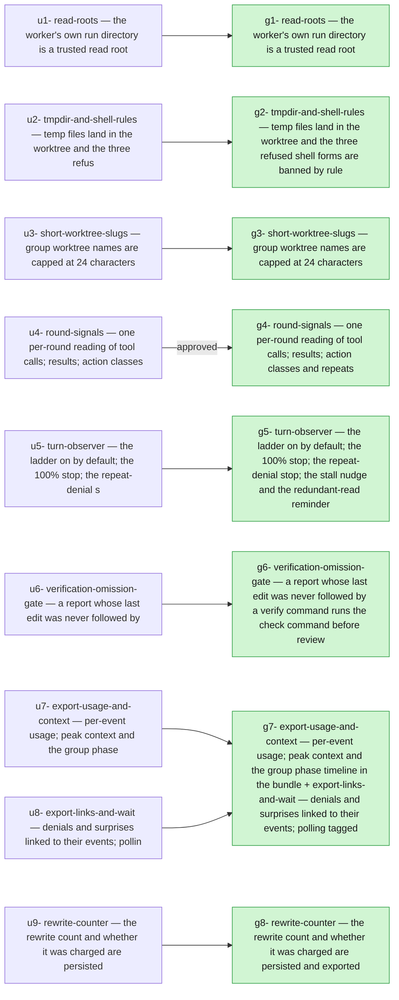

## 2026-10-06 — r20261006-115802 — Worker friction, live breakers and the export the analyses need

- **Outcome**: 8/8 groups completed, 9/9 units landed (`state.json`)
- **Scope**: 37 files changed, +1709/-46 lines (`89faf361..bdfa2977`)
- **Cost**: 790330 tokens (+12137746 cache-read) across 9 session(s) (sonnet=790330) (`manifest.json`)

### g1: read-roots — the worker's own run directory is a trusted read root — state: completed
- **Summary**: Added add_dirs to SessionRunner.start_worker/start_fork/resume (emitting one --add-dir per entry after the allowlist flags), passed [deps.store.paths.run_dir] at every coder, reviewer and… (`g1`)
- **Verification**: 2/3 pass (`g1`)
- **Surprises**: none recorded (`g1`)
- **Required changes**: none (`g1`)
- **Escalations**: none (`g1`)
- **Tokens**: 108391 tokens (+3197458 cache-read) across 1 session(s) (sonnet=108391) (`g1`)
- **Elapsed**: 11m (`g1`)

| item | status | evidence |
| --- | --- | --- |
| g1-1 | pass | uv run pytest tests/test_read_roots.py -q: 4 passed; stub CLI argv has exactly one --add-dir equal to the run dir, none when add_dirs=(). |
| g1-2 | driver-run | driver-run: `uv run pytest tests/test_read_roots.py -m llm -q --basetemp=.orchestrator/live-u1` spawns a nested real `claude`, so I did not run it (no error produced). The live test is written and deselected by default. |
| g1-3 | pass | uv run ruff check on the three named files plus reviewer.py: All checks passed. |

### g2: tmpdir-and-shell-rules — temp files land in the worktree and the three refused shell forms are banned by rule — state: completed
- **Summary**: launch_env now sets TMPDIR and TMP to <cwd>/.coder-scratch, creating it if absent. The ground rules gained bullets for git -C,… (`g2`)
- **Verification**: 2/3 pass (`g2`)
- **Surprises**: none recorded (`g2`)
- **Required changes**: none (`g2`)
- **Escalations**: none (`g2`)
- **Tokens**: 55835 tokens (+332412 cache-read) across 1 session(s) (sonnet=55835) (`g2`)
- **Elapsed**: 3m (`g2`)

| item | status | evidence |
| --- | --- | --- |
| g2-1 | pass | 3 passed: TMPDIR == TMP == <cwd>/.coder-scratch, base unmodified, and the ground-rules template contains 'git -C', 'simple_expansion' and 'never from a diff'. |
| g2-2 | driver-run | driver-run. It needs `-m llm`, which spawns a nested claude, so I did not run it. |
| g2-3 | pass | ruff: All checks passed. |

### g3: short-worktree-slugs — group worktree names are capped at 24 characters — state: completed
- **Summary**: Added WORKTREE_SLUG_MAX_LEN = 24 and used it in worktree_path (integration path unchanged; legacy path helper keeps the old 40 cap… (`g3`)
- **Verification**: 3/3 pass (`g3`)
- **Surprises**: none recorded (`g3`)
- **Required changes**: none (`g3`)
- **Escalations**: none (`g3`)
- **Tokens**: 52018 tokens (+260023 cache-read) across 1 session(s) (sonnet=52018) (`g3`)
- **Elapsed**: 3m (`g3`)

| item | status | evidence |
| --- | --- | --- |
| g3-1 | pass | 13 passed |
| g3-2 | pass | printed /r/.worktrees/r1/g2-evidence-run-the-report |
| g3-3 | pass | ruff: All checks passed |

### g4: round-signals — one per-round reading of tool calls, results, action classes and repeats — state: completed
- **Summary**: Added orchestrator/execution/round_signals.py (RoundSignals: paired tool calls/results, action classes, identical_denials, stall_window, redundant_read, last_edit_unverified, turn_index), an on_tool_event hook on StreamingProcess (exceptions swallowed),… (`g4`)
- **Verification**: 3/3 pass (`g4`)
- **Verdict**: approved (`g4`)
- **Surprises**: none recorded (`g4`)
- **Required changes**: none (`g4`)
- **Escalations**: none (`g4`)
- **Tokens**: 139520 tokens (+787032 cache-read) across 2 session(s) (sonnet=139520) (`g4`)
- **Elapsed**: 5m (`g4`)

| item | status | evidence |
| --- | --- | --- |
| g4-1 | pass | tests/test_round_signals.py green |
| g4-2 | pass | tests/test_streaming.py green incl. two new on_tool_event cases against fake claude |
| g4-3 | pass | ruff check clean |

### g5: turn-observer — the ladder on by default, the 100% stop, the repeat-denial stop, the stall nudge and the redundant-read reminder — state: completed
- **Summary**: Implemented the turn observer: context ladder on by default; new stall_window_k and repeat_denial_cap; four prompt renderers and templates; end_round wiring… (`g5`)
- **Verification**: 4/4 pass (`g5`)
- **Surprises**: none recorded (`g5`)
- **Required changes**: none (`g5`)
- **Escalations**: none (`g5`)
- **Tokens**: 115488 tokens (+1990350 cache-read) across 1 session(s) (sonnet=115488) (`g5`)
- **Elapsed**: 9m (`g5`)

| item | status | evidence |
| --- | --- | --- |
| g5-1 | pass | tests/test_turn_observer.py: 8 passed, covering the 100% stop and closed stdin, repeat-denial (3 yes, 2 no), stall nudge at 8 and 16, redundant read once, run.log lines, and a real SessionRunner+fake_claude end_round/signals round trip. |
| g5-2 | pass | 13 ladder/context tests pass after updating expectations for the default flip and the extra stop follow-up; a test asserts config false disables every prompt. |
| g5-3 | pass | Printed: True 8 3 |
| g5-4 | pass | ruff: All checks passed |

### g6: verification-omission-gate — a report whose last edit was never followed by a verify command runs the check command before review — state: completed
- **Summary**: Added the verification-omission gate in generation.py (_verification_omission_verdict, called from _settle_round before _review_round). Added ReviewDeps.preflight_config (default None = gate off) and… (`g6`)
- **Verification**: 3/3 pass (`g6`)
- **Surprises**: none recorded (`g6`)
- **Required changes**: none (`g6`)
- **Escalations**: none (`g6`)
- **Tokens**: 116112 tokens (+2188137 cache-read) across 1 session(s) (sonnet=116112) (`g6`)
- **Elapsed**: 5m (`g6`)

| item | status | evidence |
| --- | --- | --- |
| g6-1 | pass | 3 passed |
| g6-2 | pass | Vacuous: the -k filter 'settle or approved' deselected all 92 tests in tests/test_review_loop.py. I ran the whole tests/test_review_loop.py and tests/test_cli.py instead: 211 passed. |
| g6-3 | pass | ruff check clean on generation.py and the new test file (one unused import auto-fixed) |

### g7: export-usage-and-context — per-event usage, peak context and the group phase timeline in the bundle + export-links-and-wait — denials and surprises linked to their events, polling tagged — state: completed
- **Summary**: Implemented export bundle v3. NeutralEvent gained usage and tags, with wait tags from the shared WAIT_COMMAND_RE. SessionEntry and the observatory… (`g7`)
- **Verification**: 8/8 pass (`g7`)
- **Surprises**: none recorded (`g7`)
- **Required changes**: none (`g7`)
- **Escalation (preflight_failed)**: retry (`escalations/request-898941bcac83.json`)
- **Tokens**: 105528 tokens (+1619400 cache-read) across 1 session(s) (sonnet=105528) (`g7`)
- **Elapsed**: 10m (`g7`)

| item | status | evidence |
| --- | --- | --- |
| g7-1 | pass | pytest -k usage green |
| g7-2 | pass | pytest -k phases green over the fixture run |
| g7-3 | pass | printed 3 and three phase names each for g1 and g3 from the fixture run.log |
| g7-4 | pass | tests/test_export.py green after updating one hardcoded schema_version==2 to SCHEMA_VERSION |
| g7-5 | pass | ruff clean |
| g7-6 | pass | pytest -k denial/wait/surprise green |
| g7-7 | pass | printed [True, True, False, True, False] |
| g7-8 | pass | ruff clean |

### g8: rewrite-counter — the rewrite count and whether it was charged are persisted and exported — state: completed
- **Summary**: Added rewrites/last_rewrite_counted (plus an internal rewrites_charged so resumed cap checks ignore spec refinements) to GroupRunState; _rewrite persists every rewrite via… (`g8`)
- **Verification**: 4/4 pass (`g8`)
- **Surprises**: none recorded (`g8`)
- **Required changes**: none (`g8`)
- **Escalations**: none (`g8`)
- **Tokens**: 97438 tokens (+1762934 cache-read) across 1 session(s) (sonnet=97438) (`g8`)
- **Elapsed**: 11m (`g8`)

| item | status | evidence |
| --- | --- | --- |
| g8-1 | pass | tests/test_rewrite_counter.py green: blocked report -> rewrites 1/True; refinement-only -> 1/False; resume seeds self.rewrites=1; export rewrite_count verified on a fixture state. |
| g8-2 | pass | test_rewrite_observability and test_spec_refinement green, unchanged. |
| g8-3 | pass | test_status_prints_rewrites_line runs the real CLI as a subprocess over a copy of r20260828-220035 with g1 set to rewrites=2/False; asserts the line for g1 and none for g2. |
| g8-4 | pass | ruff check clean on the four named files (and cli.py, review.py). |

## Diagrams

### Plan → outcome

## ADR delta

- **ADR delta**: no ADR changes (`89faf361..bdfa2977`)

## Postmortem

### Impact

- **Impact**: every unit landed despite the trouble below (`r20261006-115802`)

### Timeline

- **session_start**: coder at 2026-10-06T10:01:33.141547+00:00 (`g1`)
- **session_end**: coder at 2026-10-06T10:12:35.640+00:00 (`g1`)
- **session_start**: coder at 2026-10-06T10:12:38.290447+00:00 (`g2`)
- **session_end**: coder at 2026-10-06T10:16:33.812+00:00 (`g2`)
- **session_start**: coder at 2026-10-06T10:16:36.407351+00:00 (`g3`)
- **session_end**: coder at 2026-10-06T10:20:22.714+00:00 (`g3`)

### Root-cause candidates

### Follow-ups

- **Follow-ups**: none open (`r20261006-115802`)
