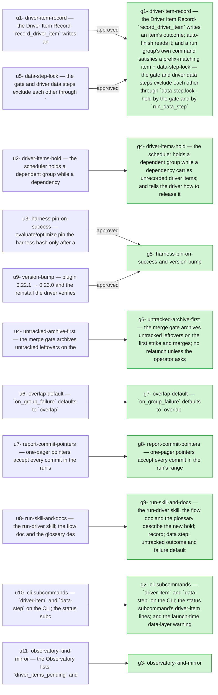

## 2026-10-10 — r20261010-134127 — Fixes from run r20261007-100412 — driver-item hold, harness pin on success, untracked archive-first, data-step lock, overlap default, report commit pointers

- **Outcome**: 9/9 groups completed, 10/11 units landed (`state.json`)
- **Scope**: 50 files changed, +2044/-156 lines (`3a73cd96..8e1a7c48`)
- **Cost**: 1144355 tokens (+15298652 cache-read) across 13 session(s) (sonnet=1144355) (`manifest.json`)

### g1: driver-item-record — the Driver Item Record: `record_driver_item` writes an item's outcome, auto-finish reads it, and a run group's own command satisfies a prefix-matching item + data-step-lock — the gate and driver data steps exclude each other through `data-step.lock`, held by the gate and by `run_data_step` — state: completed
- **Summary**: Implemented the driver item record (record/read/pending functions, driver_items_path, finish delegation, argv-prefix matching with a runner-only guard) and the data-step lock… (`g1`)
- **Verification**: 8/9 pass (`g1`)
- **Verdict**: approved (`g1`)
- **Surprises**: none recorded (`g1`)
- **Required changes**: none (`g1`)
- **Escalations**: none (`g1`)
- **Tokens**: 215279 tokens (+2408047 cache-read) across 2 session(s) (sonnet=215279) (`g1`)
- **Elapsed**: 12m (`g1`)

| item | status | evidence |
| --- | --- | --- |
| g1-1 | pass | tests/test_driver_item_record.py green |
| g1-2 | pass | tests/test_finish.py green |
| g1-3 | pass | test_run_recipe_model.py and test_driver_run_items.py green, both cases asserted |
| g1-4 | pass | tests/test_run_executor.py green |
| g1-5 | pass | runner-only test in test_run_recipe_model.py green |
| g1-6 | pass | tests/test_data_step.py green, with subprocess-held lock in both orders |
| g1-7 | pass | tests/test_merge.py green |
| g1-8 | driver-run | driver-run |
| g1-9 | pass | reminder test green: one waiting line, 2+ still-waiting lines carrying the cmd |

### g2: cli-subcommands — `driver-item` and `data-step` on the CLI, the status subcommand's driver-item lines, and the launch-time data-layer warning — state: completed
- **Summary**: Added driver-item and data-step subcommands to orchestrator/cli.py (thin wrappers over record_driver_item and run_data_step), a status 'driver items:' line, and the… (`g2`)
- **Verification**: 6/6 pass (`g2`)
- **Surprises**: none recorded (`g2`)
- **Required changes**: none (`g2`)
- **Escalations**: none (`g2`)
- **Tokens**: 113080 tokens (+3202643 cache-read) across 1 session(s) (sonnet=113080) (`g2`)
- **Elapsed**: 9m (`g2`)

| item | status | evidence |
| --- | --- | --- |
| g2-1 | pass | uv run pytest tests/test_cli_driver_steps.py -q: 9 passed |
| g2-2 | pass | driver-item --help exits 0 listing --status, --notes, --notes-file |
| g2-3 | pass | data-step --help exits 0 showing run_id and cmd |
| g2-4 | pass | -k warning: stub-tier runs log the line once with data_dirs and never without |
| g2-5 | pass | tests/test_cli.py green (128 passed together with the new tests) |
| g2-6 | pass | -k quoting: cmd and cwd recorded in data-step.json, finished line in run.log |

### g4: driver-items-hold — the scheduler holds a dependent group while a dependency carries unrecorded driver items, and tells the driver how to release it — state: completed
- **Summary**: Added HoldReason.DRIVER_ITEMS and EscalationKind.DRIVER_ITEMS_PENDING (in_stuck/interactive tiers). The scheduler holds dependents of a COMPLETED/RESOLVED group with unrecorded driver items, logs the… (`g4`)
- **Verification**: 3/4 pass (`g4`)
- **Surprise (interface_mismatch)**: tests/test_observatory_model_drift.py::test_every_escalation_kind_is_known_to_the_ui[driver_items_pending] fails until ui/src/types.ts lists driver_items_pending (u11 / g3 work). Not edited here because the UI files are outside this group's Files. (`groups/g4/report-g1-r1.json`)
- **Required changes**: none (`g4`)
- **Escalation (preflight_failed)**: retry (`escalations/request-006a7b155a75.json`)
- **Tokens**: 119436 tokens (+1752783 cache-read) across 1 session(s) (sonnet=119436) (`g4`)
- **Elapsed**: 13m (`g4`)

| item | status | evidence |
| --- | --- | --- |
| g4-1 | pass | uv run pytest tests/test_driver_items_hold.py -q green |
| g4-2 | pass | tests/test_driver_items_hold.py + tests/test_escalation.py: 43 passed |
| g4-3 | pass | tests/test_scheduler.py: 72 passed |
| g4-4 | driver-run | driver-run |

### g3: observatory-kind-mirror — state: completed
- **Summary**: The types.ts literal and EscalationPanel label already existed on the base (commit 85165b9), so I only added the label-map drift… (`g3`)
- **Verification**: 5/5 pass (`g3`)
- **Surprises**: none recorded (`g3`)
- **Required changes**: none (`g3`)
- **Escalations**: none (`g3`)
- **Tokens**: 59478 tokens (+288585 cache-read) across 1 session(s) (sonnet=59478) (`g3`)
- **Elapsed**: 4m (`g3`)

| item | status | evidence |
| --- | --- | --- |
| g3-types-union | pass | Both the literal and the label are present on the base (85165b9); I did not run the item's one-liner, the pytest label test and the UI build above cover the same content. |
| g3-model-drift-green | pass | 63 passed, no skips, including the driver_items_pending case. |
| g3-1 | pass | Green on the real file; failed for driver_items_pending when its label was temporarily broken; no duplicate of the types.ts assertion. |
| g3-2 | pass | npm --prefix ui run build exited 0. |
| g3-files-scope | pass | Only tests/test_observatory_escalations.py changed in HEAD~1..HEAD. |

### g6: untracked-archive-first — the merge gate archives untracked leftovers on the first strike and merges; no relaunch unless the operator asks — state: completed
- **Summary**: Reworked _handle_untracked so the first untracked-only gate failure commits declared files, archives the rest to groups/<gid>/untracked/, spreads an informational surprise… (`g6`)
- **Verification**: 4/5 pass (`g6`)
- **Surprises**: none recorded (`g6`)
- **Required changes**: none (`g6`)
- **Escalation (preflight_failed)**: retry (`escalations/request-047184290ce2.json`)
- **Tokens**: 95389 tokens (+867188 cache-read) across 1 session(s) (sonnet=95389) (`g6`)
- **Elapsed**: 10m (`g6`)

| item | status | evidence |
| --- | --- | --- |
| g6-1 | pass | uv run pytest tests/test_merge_gate_triage.py -q -k untracked: first-strike archive+merge, retry-no-text re-run, and retry-with-text relaunch (git mv, no delete) all green. |
| g6-2 | pass | tests/test_merge_gate_triage.py + tests/test_review_loop.py: 109 passed. |
| g6-3 | pass | grep check exit 0, printed []. |
| g6-4 | driver-run | driver-run |
| g6-5 | pass | test_declared_untracked_file_is_committed_and_the_rest_archived: tests/test_x.py committed on the branch, stray.log archived, merge in the same generation. |

### g7: overlap-default — `on_group_failure` defaults to `overlap` — state: completed
- **Summary**: Flipped ExecutionConfig.on_group_failure default to overlap, updated the config comment and a stale docstring, made the five test_halt_* scheduler tests (plus… (`g7`)
- **Verification**: 3/3 pass (`g7`)
- **Surprises**: none recorded (`g7`)
- **Required changes**: none (`g7`)
- **Escalations**: none (`g7`)
- **Tokens**: 67717 tokens (+446626 cache-read) across 1 session(s) (sonnet=67717) (`g7`)
- **Elapsed**: 4m (`g7`)

| item | status | evidence |
| --- | --- | --- |
| g7-1 | pass | prints overlap |
| g7-2 | pass | 200 passed |
| g7-3 | pass | 2 passed with -k on_group_failure after renaming tests to match the selector |

### g8: report-commit-pointers — one-pager pointers accept every commit in the run's range — state: completed
- **Summary**: Added GitRangeFacts.commits (base plus rev-list base..tip prefixes, oldest first, empty when range unavailable), included it in _valid_pointers (so the scaffold… (`g8`)
- **Verification**: 2/2 pass (`g8`)
- **Surprises**: none recorded (`g8`)
- **Required changes**: none (`g8`)
- **Escalations**: none (`g8`)
- **Tokens**: 75464 tokens (+765273 cache-read) across 1 session(s) (sonnet=75464) (`g8`)
- **Elapsed**: 4m (`g8`)

| item | status | evidence |
| --- | --- | --- |
| g8-1 | pass | uv run pytest tests/test_report_onepager.py -q green; includes intermediate-prefix-valid and outside-sha-unknown tests |
| g8-2 | pass | uv run pytest tests/test_report_facts.py -q -k commits: 1 passed; real git repo, commits length 3 |

### g9: run-skill-and-docs — the run-driver skill, the flow doc and the glossary describe the new hold, record, data step, untracked outcome and failure default — state: completed
- **Summary**: Updated the orchestrator-run SKILL.md (Monitor timed-out condition, new anchors, untracked/preflight rows, driver_items_pending row, new driver-items/data-step section, finish step 4), triage-guide.md… (`g9`)
- **Verification**: 4/4 pass (`g9`)
- **Surprise (other)**: No 'harness pin reset by retry' log line exists in orchestrator/execution/retry.py on this branch; the SKILL anchor row assumes the harness-pin unit logs that text. (`groups/g9/report-g1-r1.json`)
- **Required changes**: none (`g9`)
- **Escalations**: none (`g9`)
- **Tokens**: 82052 tokens (+900460 cache-read) across 1 session(s) (sonnet=82052) (`g9`)
- **Elapsed**: 8m (`g9`)

| item | status | evidence |
| --- | --- | --- |
| g9-1 | pass | driver-item --help exits 0; lists --status {pass,fail,skipped} and --notes-file |
| g9-2 | pass | data-step --help exits 0; usage shows run_id and cmd remainder |
| g9-3 | pass | python check exited 0 |
| g9-4 | pass | python check exited 0 |

### g5: harness-pin-on-success-and-version-bump — state: completed
- **Summary**: Fixed the reviewer item: _reset_harness_pin in retry.py now handles both the evaluate pin (groups/<gid>/run/eval/harness.sha256) and the optimize pin (groups/<gid>/eval/harness.sha256), logging… (`g5`)
- **Verification**: 4/7 pass (`g5`)
- **Verdict**: approved (`g5`)
- **Surprise (other)**: tests/test_preflight_baseline.py::test_capture_records_command_sha_and_one_entry_per_test and ::test_clean_check_command_records_empty_failing_set_not_absence fail whenever pytest's basetemp is inside the repo tree (as in orchestrator worktrees, basetemp under .coder-scratch), because the inner sample project's rootdir resolves to the outer repo via its pyproject [tool.pytest.ini_options]. Fix would be passing --rootdir / a pytest.ini in _pytest_project. Pre-existing, so every group's gate may trip on it. (`groups/g5/report-g1-r2.json`)
- **Required change**: [g5-v7] reported fail: The whole suite is green with the unit-tier changes. Run: `uv run pytest -q` Pass: green. — uv run pytest -q: 2338 passed, 2 failed (tests/test_preflight_baseline.py::test_capture_records_command_sha_and_one_entry_per_test and ::test_clean_check_command_records_empty_failing_set_not_absence). Both fail because the pytest tmp dir sits under .coder-scratch inside the worktree, so junit ids carry a path prefix. I did not touch that file and did not run it on the base commit. (`groups/g5/verdict-g1-r1.json`)
- **Required change**: [g5-v7] reported fail: The whole suite is green with the unit-tier changes. Run: `uv run pytest -q` Pass: green. — 2338 passed, 2 failed (tests/test_preflight_baseline.py x2). The same 2 fail on HEAD~2, before my commits. The cause is pytest tmp placement under .coder-scratch inside the worktree, so the inner project's rootdir resolves to the worktree. Not caused by this group; passes when tmp is outside the repo tree. (`groups/g5/verdict-g1-r2.json`)
- **Required change**: Fix the retry pin reset for optimize groups. OptimizeExecution._eval_dir() is groups/<gid>/eval, so its pin is groups/<gid>/eval/harness.sha256. _reset_harness_pin in orchestrator/execution/retry.py only checks groups/<gid>/run/eval/harness.sha256, so retry on a failed optimize group leaves a stale pin. Make _reset_harness_pin handle both locations, or make the optimize pin live under run/eval. Keep the log line 'group <gid>: harness pin reset by retry (was <combined[:12]>)' verbatim. (`groups/g5/verdict-g1-r3.json`)
- **Required change**: Add a tests/test_retry.py case where the pin sits at groups/<gid>/eval/harness.sha256 and retry deletes it and logs the line. (`groups/g5/verdict-g1-r3.json`)
- **Escalations**: none (`g5`)
- **Tokens**: 316460 tokens (+4667047 cache-read) across 4 session(s) (sonnet=316460) (`g5`)
- **Elapsed**: 25m (`g5`)

| item | status | evidence |
| --- | --- | --- |
| g5-1 | pass | tests/test_evaluate_recipe.py green |
| g5-2 | pass | optimize harness tests green |
| g5-3 | pass | retry pin tests green incl. new optimize-location case |
| g5-4 | driver-run | driver-run |
| g5-5 | pass | 0.23.0; HEAD ce73f5e touches only .claude-plugin/plugin.json; pyproject untouched |
| g5-6 | unverified | — |
| g5-7 | driver-run | driver-run |

## Diagrams

### Plan → outcome

## ADR delta

- **ADR delta**: no ADR changes (`3a73cd96..8e1a7c48`)

## Postmortem

### Impact

- **Unit not landed (u9)**: version-bump — plugin 0.22.1 → 0.23.0 and the reinstall the driver verifies from outside the repo (`u9`)

### Timeline

- **session_start**: coder at 2026-10-10T11:45:09.721756+00:00 (`g1`)
- **session_end**: coder at 2026-10-10T11:53:52.616367+00:00 (`g1`)
- **session_start**: reviewer at 2026-10-10T11:53:52.616367+00:00 (`g1`)
- **session_end**: reviewer at 2026-10-10T11:57:26.481+00:00 (`g1`)
- **session_start**: coder at 2026-10-10T11:57:29.146987+00:00 (`g2`)
- **session_end**: coder at 2026-10-10T12:06:45.063+00:00 (`g2`)

### Root-cause candidates

- **Surprise (g4, interface_mismatch)**: tests/test_observatory_model_drift.py::test_every_escalation_kind_is_known_to_the_ui[driver_items_pending] fails until ui/src/types.ts lists driver_items_pending (u11 / g3 work). Not edited here because the UI files are outside this group's Files. (`groups/g4/report-g1-r1.json`)
- **Surprise (g9, other)**: No 'harness pin reset by retry' log line exists in orchestrator/execution/retry.py on this branch; the SKILL anchor row assumes the harness-pin unit logs that text. (`groups/g9/report-g1-r1.json`)
- **Retirement (g5, coder gen1)**: round threshold reached (3 rounds this generation) (`g5`)
- **Required change (g5)**: [g5-v7] reported fail: The whole suite is green with the unit-tier changes. Run: `uv run pytest -q` Pass: green. — uv run pytest -q: 2338 passed, 2 failed (tests/test_preflight_baseline.py::test_capture_records_command_sha_and_one_entry_per_test and ::test_clean_check_command_records_empty_failing_set_not_absence). Both fail because the pytest tmp dir sits under .coder-scratch inside the worktree, so junit ids carry a path prefix. I did not touch that file and did not run it on the base commit. (`groups/g5/verdict-g1-r1.json`)
- **Required change (g5)**: [g5-v7] reported fail: The whole suite is green with the unit-tier changes. Run: `uv run pytest -q` Pass: green. — 2338 passed, 2 failed (tests/test_preflight_baseline.py x2). The same 2 fail on HEAD~2, before my commits. The cause is pytest tmp placement under .coder-scratch inside the worktree, so the inner project's rootdir resolves to the worktree. Not caused by this group; passes when tmp is outside the repo tree. (`groups/g5/verdict-g1-r2.json`)
- **Required change (g5)**: Fix the retry pin reset for optimize groups. OptimizeExecution._eval_dir() is groups/<gid>/eval, so its pin is groups/<gid>/eval/harness.sha256. _reset_harness_pin in orchestrator/execution/retry.py only checks groups/<gid>/run/eval/harness.sha256, so retry on a failed optimize group leaves a stale pin. Make _reset_harness_pin handle both locations, or make the optimize pin live under run/eval. Keep the log line 'group <gid>: harness pin reset by retry (was <combined[:12]>)' verbatim. (`groups/g5/verdict-g1-r3.json`)
- **Required change (g5)**: Add a tests/test_retry.py case where the pin sits at groups/<gid>/eval/harness.sha256 and retry deletes it and logs the line. (`groups/g5/verdict-g1-r3.json`)
- **Surprise (g5, other)**: tests/test_preflight_baseline.py::test_capture_records_command_sha_and_one_entry_per_test and ::test_clean_check_command_records_empty_failing_set_not_absence fail whenever pytest's basetemp is inside the repo tree (as in orchestrator worktrees, basetemp under .coder-scratch), because the inner sample project's rootdir resolves to the outer repo via its pyproject [tool.pytest.ini_options]. Fix would be passing --rootdir / a pytest.ini in _pytest_project. Pre-existing, so every group's gate may trip on it. (`groups/g5/report-g1-r2.json`)

### Follow-ups

- **Open required change (g5)**: [g5-v7] reported fail: The whole suite is green with the unit-tier changes. Run: `uv run pytest -q` Pass: green. — uv run pytest -q: 2338 passed, 2 failed (tests/test_preflight_baseline.py::test_capture_records_command_sha_and_one_entry_per_test and ::test_clean_check_command_records_empty_failing_set_not_absence). Both fail because the pytest tmp dir sits under .coder-scratch inside the worktree, so junit ids carry a path prefix. I did not touch that file and did not run it on the base commit. (`groups/g5/verdict-g1-r1.json`)
- **Open required change (g5)**: [g5-v7] reported fail: The whole suite is green with the unit-tier changes. Run: `uv run pytest -q` Pass: green. — 2338 passed, 2 failed (tests/test_preflight_baseline.py x2). The same 2 fail on HEAD~2, before my commits. The cause is pytest tmp placement under .coder-scratch inside the worktree, so the inner project's rootdir resolves to the worktree. Not caused by this group; passes when tmp is outside the repo tree. (`groups/g5/verdict-g1-r2.json`)
- **Open required change (g5)**: Fix the retry pin reset for optimize groups. OptimizeExecution._eval_dir() is groups/<gid>/eval, so its pin is groups/<gid>/eval/harness.sha256. _reset_harness_pin in orchestrator/execution/retry.py only checks groups/<gid>/run/eval/harness.sha256, so retry on a failed optimize group leaves a stale pin. Make _reset_harness_pin handle both locations, or make the optimize pin live under run/eval. Keep the log line 'group <gid>: harness pin reset by retry (was <combined[:12]>)' verbatim. (`groups/g5/verdict-g1-r3.json`)
- **Open required change (g5)**: Add a tests/test_retry.py case where the pin sits at groups/<gid>/eval/harness.sha256 and retry deletes it and logs the line. (`groups/g5/verdict-g1-r3.json`)
